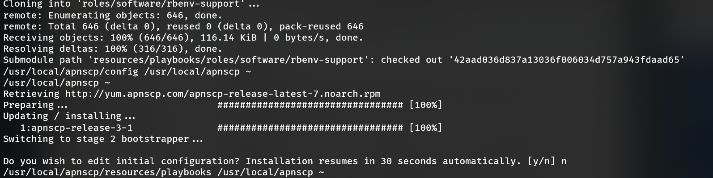
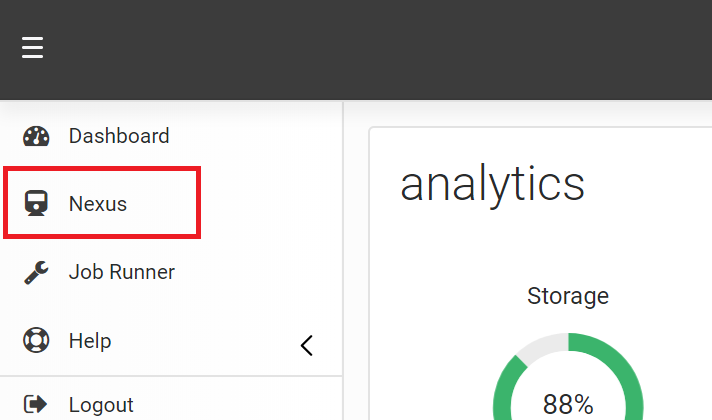

# Installation

## Requirements
* 2 GB RAM
* 20 GB storage
* 1 CPU
* RHEL/CentOS 7.4+
* Best with Linode, DigitalOcean, Vultr, AWS, or CloudFlare for DNS
* Containers are not supported (Virtuozzo, OpenVZ)

## Bootstrapping
Install the bootstrap utility. This can be downloaded from the [GitHub](https://github.com/apisnetworks/apnscp-bootstrapper) repository.

```bash
curl https://raw.githubusercontent.com/apisnetworks/apnscp-bootstrapper/master/bootstrap.sh | bash
```

This arms apnscp with a 15 day license (60 day for development releases). If you have purchased a license via [my.apiscp.com](https://my.apiscp.com), then the license may be provided at install by providing the token:

```bash
curl https://raw.githubusercontent.com/apisnetworks/apnscp-bootstrapper/master/bootstrap.sh | bash -s - <api token>
```

Before the bootstrap utility kicks off [stage 2](https://github.com/apisnetworks/apnscp-playbooks), you are given an opportunity to pause to edit variables. This is optional, but will allow you to immediately configure SSL. These values can be changed later with `scope:set` in the panel.



## Server provision

[Bootstrapper](https://github.com/apisnetworks/apnscp-playbooks) is an idempotent tool to continuously update and correct your server. If things drift, Bootstrapper is designed to provide the **minimal set** of enforcing changes to make your server work. You will always have free rein of your server as long as it doesn't impede upon the responsibility of apnscp.

Bootstrapping takes between 60 - 120 minutes depending upon provider capacity. Generally lower figures indicate a less oversold provider, but times can change as clients are housed on the server. Once installed, be sure to log out of the server and log back in or load a new shell with the correct apnscp environment,

```bash
exec $SHELL -i
```

### Recommended configuration settings

Bootstrapper can run without any changes to `/root/apnscp-vars.yml`. The following changes are recommended to make setup seamless. These settings are configured when the bootstrap utility pauses:

- **apnscp_admin_email**: (email address) used to set the admin contact. Notified when apnscp is installed (FQDN required) as well as monthly maintenance notifications. This email address is also used as your Let's Encrypt admin contact.
- **ssl_hostnames**: (list or string) hostnames that resolve to this server that should be considered for Let's Encrypt SSL issuance. 
  - Examples: 
    - ['apiscp.com','hq.apiscp.com','nexus.apiscp.com'] 
    - apiscp.com

#### Optional settings

- **has_low_memory**: (true/false) disables auxiliary services for 2 GB instances. See [low-memory mode](#low-memory-mode) below.
- **user_daemons**: (true/false) opens up ports 40000-49999/tcp + udp on the server for accounts that want to run a service. If you're running strictly PHP/Node/Python/Ruby services, turn this off for added security.
- **mail_enabled**: (true/false) if using GMail or a third-party email provider disables IMAP/POP3 + ESMTPA. Mail can still originate from the server (PHP [mail()](http://php.net/manual/en/function.mail.php)), but blocks ingress.
- **passenger_enabled**: (true/false) disable building Passenger + accompanying Ruby/Python interpreters if running a purely PHP mix. Node/npm/yarn is still available, but can't serve websites.
- **mysqld_per_account_innodb**: (true/false) places tables + data in an aggregate InnoDB pool for higher performance or per account for resource enforcement. An account over quota can cause a cyclic crash in MySQL/MariaDB 5.0+ on recovery. **You have been warned**. Ensure [Argos](https://hq.apiscp.com/monitoring-with-monit-argos/) is setup if enabled.
- **data_center_mode**: (true/false) ensure all resources that apnscp can account for are accounted. Also enables the pernicious bastard `mysqld_per_account_innodb`!

### Setting FQDN for SSL/Email

All servers should have a fully-qualified domain name ([FQDN](https://en.wikipedia.org/wiki/Fully_qualified_domain_name)). Failure to have one will cause email to fail, including the installation notice. Moreover, Let's Encrypt will fail issuance. A FQDN must at least contain 1 dot:

- ✅ apiscp.com
- ✅ cdn.bootstrap.org
- ✅ x.y.z.abc.co.uk
- ❌ centos-s-1vcpu-2gb-nyc1-01 (no period/dot)

Set your hostname with,

```bash
hostnamectl set-hostname MYHOSTNAME
```

Where *MYHOSTNAME* is your hostname for the machine. For consistency reasons, it is required that this hostname resolves to the IP address of the machine and vice-versa with [FCrDNS](https://en.wikipedia.org/wiki/Forward-confirmed_reverse_DNS). Check with your DNS provider to establish this relationship.

Once apnscp is setup it can be reconfigured anytime with, 

```bash
scope:set net.hostname MYHOSTNAME
```

SSL will automatically reissue as well as impacted services restart.

### Low-memory mode
apnscp is designed to work on 2 GB+ machines, but can work on 1 GB machines with minor finagling. Enabling `has_low_memory` scrubs non-essential services. It converts the job daemon to a single worker; disables Passenger, including support for Python, Ruby, Node, and Meteor applications; and removes vscanner, which is a combination of mod_security + ClamAV to scrub uploads. This frees up ~700 MB of memory. 

If no mail services are required, setting `mail_enabled` to *false* also disables Dovecot and haproxy freeing up an additional 60 MB. Setting `rspamd_enabled` to *false* (policy milter, outbound spam filtering, DKIM/ARC signing) will free a further 125 MB if rspamd is used for mail filtering (see `spamfilter` setting).

### Headless mode
apnscp can run in headless mode, that is to say without a front-end UI. This can further save on memory requirements and keep your site secure.

Set `panel_headless` to *true* to activate headless mode. In headless mode, you are limited to CLI helpers - `cpcmd`, `AddDomain`, `EditDomain`, `DeleteDomain`. Fear not though! Anything that can be done through the panel can be done from CLI as the API is 100% reflected.

This mode can be quickly toggled after setup using a [configuration scope](admin/Scopes.md): `cpcmd config:set apnscp.headless true`.

### Provisioning failures
In the event of failure, Bootstrapper can be easily restarted from the command-line,

```bash
cd /usr/local/apnscp/resources/playbooks
ansible-playbook bootstrap.yml
```

#### Network failures

Network connectivity is a common failure that can be caused by transient errors either in DNS resolution, which is unreliable by UDP protocol design, or network congestion. Network tasks use a built-in retry/wait algorithm to reduce the risk of failure - up to 3 retries with a 5 second wait in between attempts. Even this pragmatic approach to handling network interruptions can fail.

> TASK [software/rbenv : Add GEM_HOME pathing support] ***************************
2019-03-05 12:42:19,129 p=8833 u=root |  FAILED - RETRYING: Add GEM_HOME pathing support (3 retries left).
2019-03-05 12:46:38,839 p=8833 u=root |  FAILED - RETRYING: Add GEM_HOME pathing support (2 retries left).
2019-03-05 12:50:58,550 p=8833 u=root |  FAILED - RETRYING: Add GEM_HOME pathing support (1 retries left).
2019-03-05 12:55:18,270 p=8833 u=root |  fatal: [localhost]: FAILED! => ...

The above fragment failed to download a repository off GitHub indicating possible DNS issues with the resolver configured on the machine. Replace the configured resolver with a reliable public DNS resolver (Google, Level3, Cloudflare)  by editing `/etc/resolv.conf`. Remove all instances of `nameserver` and change the DNS timeout which defaults at 5 seconds. When using multiple nameservers, `rotate` in the `options` directive will round-robin resolvers to distribute lookups across all nameservers.

As of v3.0.29, apnscp automatically replaces the machine's nameservers with CloudFlare, which consistently performs in the [top tier](https://www.dnsperf.com/#!dns-resolvers) of reliability and speed. This feature may be disabled with `use_robust_dns`. Alternate nameservers may be defined via `dns_robust_nameservers `, a list (see *apnscp-internals.yml*).

##### List of public DNS servers

| Provider   | Server        |
| ---------- | ------------- |
| Google     | 8.8.8.8       |
|            | 8.8.4.4       |
| Cloudflare | 1.1.1.1       |
|            | 1.0.0.1       |
| Level3     | 4.2.2.2       |
|            | 4.2.2.1       |
| Quad9      | 9.9.9.9       |
| Dyn        | 216.146.35.35 |
|            | 216.146.36.36 |

*Original /etc/resolv.conf*

```
# Generated by NetworkManager
search apisnetworks.com
nameserver 64.22.68.59
nameserver 64.22.68.60
```

*Revised /etc/resolv.conf*
```
# Generated by NetworkManager
search apisnetworks.com
options timeout:30 rotate
nameserver 1.1.1.1
nameserver 8.8.8.8
```

# After Bootstrap

Domains that have a properly qualified FQDN will receive notification once apnscp is installed. If not, the admin username/password/contact can be reconfigured at anytime using apnscp's API helper.

```bash
cpcmd auth_change_username NEWUSER
cpcmd auth_change_password NEWPASSWORD
cpcmd common_set_email NEW@EMAIL.COM
```

Setting all 3 will allow you to login to your new panel at http://IPADDRESS:2082/. If SSL has been setup, or you can trust a bespoke certificate, then use https://IPADDRESS:2083/. When logging in as admin, leave the domain field blank. 

# Adding your first domain

## Within apnscp

After logging into the panel as admin, visit **Nexus**. Services can be reconfigured within Nexus or from the command-line.



## From command-line

`AddDomain` creates a site from command-line. Multiple parameters can be provided to alter the services assigned to an account. Nexus within the Administrative panel is a frontend for this utility. `admin_add_site` is the backend API [call](https://api.apiscp.com/class-Admin_Module.html#_add_site) for this command-line utility.

### Basic usage

```
AddDomain -c siteinfo,domain=mydomain.com -c siteinfo,admin_user=myadmin
```

> Creates a new domain named *mydomain.com* with an administrative user *myadmin*. The email address defaults to [blackhole@apiscp.com](mailto:blackhole@apiscp.com) and password is randomly generated.


## Editing domains
### From apnscp
Domains may be edited by clicking the _SELECT_ button in Nexus.
### From command-line
EditDomain is a helper to change account state without removing it. You can toggle services and make changes in-place in a non-destructive manner. More advanced usage is available in the blog post, [Working with CLI helpers](https://hq.apiscp.com/working-with-cli-helpers/).

**Rename domain**
A simple, common situation is to alter the primary domain of an account. Simply changing the domain attribute under the siteinfo service will accomplish this.

```bash
EditDomain -c siteinfo,domain=newdomain.com mydomain.com
```

**Changing password**
Changing the password is another common operation:

```bash
EditDomain -c auth,tpasswd=newpasswd site12
```

## Logging into services

apnscp uses *username*@*domain* notation to log into all services. This allows for multiple domains to share the same username without conflict. The only restriction is that the primary account username *must be unique*.

Unless the domain is explicitly required, such as when logging into the control panel or accessing MySQL remotely use `@` or `#` to join the username + domain. For example, when logging into SSH as user `foo` on `example.com`, all are acceptable variations of ssh:

```
ssh -l foo@bar.com bar.com
ssh foo@bar.com@bar.com
ssh -l foo#bar.com bar.com
ssh foo#bar.com@bar.com
```

This can be further simplified by creating a file called `config` in `~/.ssh`with the following lines,

```
Host bar
    HostName bar.com
    User foo#bar.com
```

Then, `ssh bar` will login to "bar.com" using the login "foo#bar.com".

As a second example, consider FTP. With the username `myadmin` + domain `mydomain.com`, the following configuration will allow access to the FTP server using [explicit SSL](https://en.wikipedia.org/wiki/FTPS) (FTPES).


SFTP is supported if SSH is enabled for the account. ftp.*DOMAIN* is by convention, but using too the server name, server IP address, or domain name is also acceptable.


# Updating apnscp

apnscp can be configured to automatically update itself every night using `scope:set`

```bash
cpcmd scope:set apnscp.nightly-update 1
```

Alternatively apnscp can be updated manually with`upcp`. Playbooks can be run unconditionally using `upcp -b` or `upcp -a` if `resources/playbooks` has changed since last update.

# Further reading

* apnscp TR [release notes](https://hq.apiscp.com/apnscp-pre-alpha-technical-release/) - initial usage information
* [hq.apiscp.com](https://hq.apiscp.com) - apnscp blog, periodic how-tos are posted
* [docs.apiscp.com](https://docs.apiscp.com) - apnscp documentation

