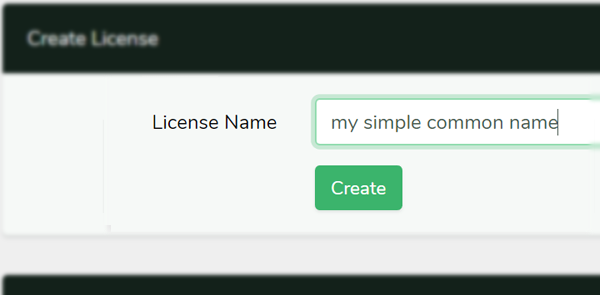
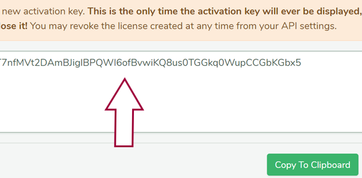
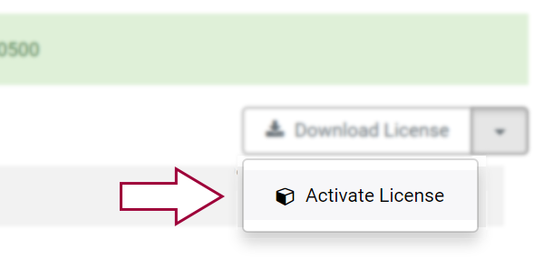
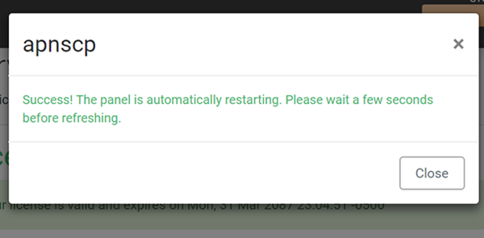

# License management

apnscp may be installed with a trial license using the [customization helper](https://apiscp.com/#customizer) on apiscp.com. Trial licenses are armed for 30 days and allow you to modify a system or reinstall to your preference. A lifetime paid license **cannot be reset nor reclaimed at this time**; therefore, it is recommended to install with a trial license then perform an upgrade in the panel once you're satisfied with the system.

Trial and paid versions of apnscp are functionally identical.

## Creating a license upgrade

1. Create a new license within the **Settings** > **Activation Keys** section of [my.apiscp.com](https://my.apiscp.com). "License Name" will be the nickname for the license that it uses to identify itself as. This name may be up to 64 bytes long and will be associated with the license forever.
    
2. Creating a new license request generates a 60-character activation key. Activation keys are one-time use and may not be reused once activated. Copy this value to the clipboard and proceed to your copy of apnscp for upgrade.
    

## Upgrading from GUI

1. Login to apnscp as the administrative user. 

2. Visit **License**
    

3. Select **Activate License** from the dropdown actions
    

4. Enter your license activation key generated from *Creating a license upgrade* above.
    

    Once the license has been successfully acquired, apnscp will restart in the background.

# Managing licenses

## Backing up a license

Licenses are stored in `/usr/local/apnscp/config/license.pem`. The file may either be copied, downloaded from the control panel under **License** > **Download License**, or exported using the CLI utility under `scripts/` discussed below.

## Restoring license from command-line

A license that has been previously backed up may be restored to an apnscp install. Licenses may be active on one machine at a time. Replace `/usr/local/apnscp/config/license.pem` with the backed up license, then restart apnscp: `systemctl restart apnscp`. apnscp will use the new license following restart. Its usage may be confirmed within the panel via **License** app. 

Alternatively the CLI tool may be used to streamline these steps.

## Command-line helper

`/usr/local/apnscp/bin/scripts/license.php` is a helper to activate, backup, and restore licenses. 

> ```
> Usage: license.php MODE  
> Available modes:
>
> issue CODE CN           : issue a new license using activation CODE, optional common name (CN)  
> backup FILENAME         : save license at FILENAME  
> restore FILENAME        : restore x509 license from FILENAME  
> renew                   : renew license if appropriate  
> info                    : license information  
> ```

For example, to upgrade a trial license to a paid license `license.php ACTIVATION-CODE "some nickname"`.
