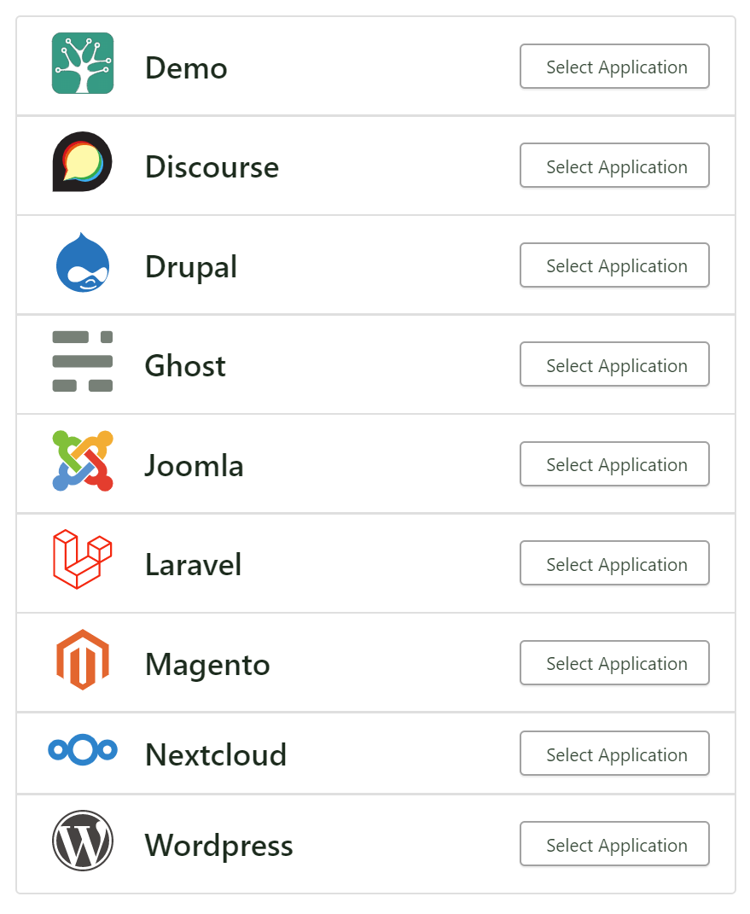
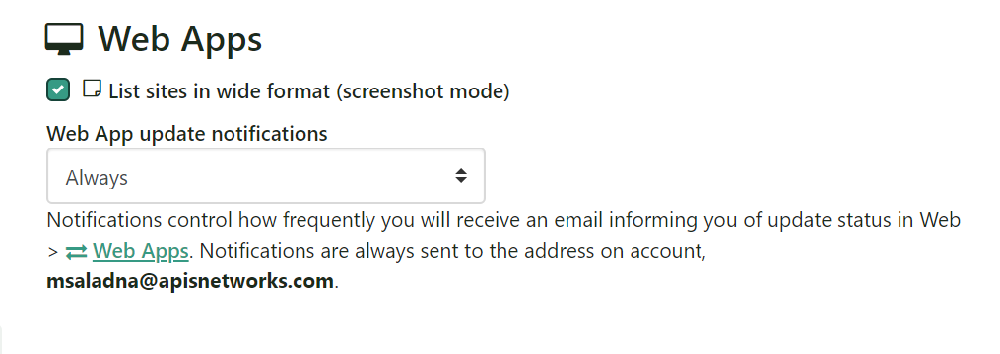
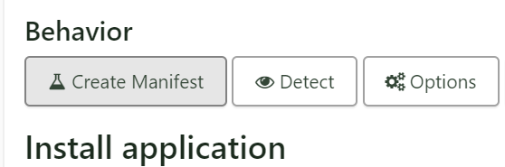
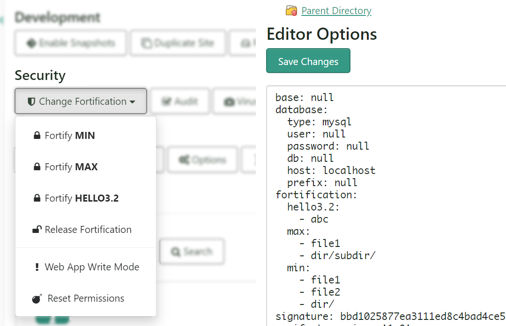
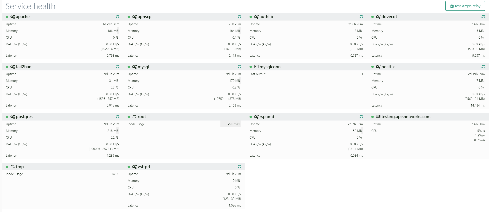
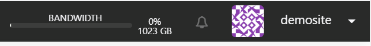

[3.2 has been released](https://gitlab.com/apisnetworks/apnscp/-/tags/v3.2.0)! 3.2 is a rewrite of the Web App subsytem that adds a wealth of new features including:

- 1-click support for Nextcloud with enhanced security through [Fortification](https://docs.apiscp.com/admin/Fortification/)
- general `webapp` module for agnostic Web App interfacing
- Web App [manifests](https://docs.apiscp.com/admin/WebApps/#ad-hoc-apps) for extending base features
- an AST parser for powerful WordPress integration
- 1-click cloning/renaming support for WordPress
- [third-party](https://docs.apiscp.com/admin/webapps/Custom/) Web App support
- Argos glance
- notification tray
- DNS providers for [Katapult](https://katapult.io/) and [Hetzner](https://www.hetzner.com/dns-console) services.

Let's walk through some of the newer features, beyond just a much needed facelift.



## Nextcloud support


It's no surprise that Nextcloud is establishing itself as an indomitable all-in-one solution for managing all things yours. We've brought Nextcloud to ApisCP as a 1-click and enhanced its security with our [Fortification](admin/Fortification.md) subsystem. By default, Nextcloud is installed without the ability to manage its own apps, but this may be easily changed by going to **Web** > **Web Apps** > **Select domain** > **Fortification** > **Fortify (MIN)**. It's recommended to enable **MAX** Fortification once you've installed the apps you want.

For added peace of mind, Nextcloud automatically updates whenever a new release comes out. You'll always get an email whenever an update happens unless you've configured otherwise via **Account** > **Settings** > **App Settings**.



## Web App enhancements

Web Apps are smarter and more powerful than ever before. ApisCP 3.2 now includes an agnostic module `webapp` that queries the right module API. Don't know what's under mydomain.com, but want to update it? `webapp:update-all("mydomain.com")`. ApisCP will look at its stored metadata and direct the API call accordingly. Likewise `webapp:discover($domain, $path = '')` will enumerate each known Web App to determine if it's a match, then update its internal records.

### Manifests

Web Apps have also extended to permit user-defined behavior with Fortification and database management through [manifests](admin/WebApps.md#ad-hoc-apps). Manifests are a remarkable addition that can redefine tasks. `db_config()`, `fortify()`, and `unfortify()` are supported with plans to expand to encompass all `webapp()` API functions.

Manifests require two-factor authentication to use, first panel authorization then end-user acknowledgement to resign the manifest if its content changes from the signature.

Creating a manifest under **Web** > **Web Apps**

Manifests follow an intuitive YAML format, which require signage after editing under the **Behavior** > **Manifest** section.



### WordPress enhancements

ApisCP began as a hosting platform for WordPress, among other PHP applications, in the early 2000s. Platform design evolved in response to bolster security from a proliferation of bad code that impacted [not only WordPress](https://wpvulndb.com/) but [other](https://www.cvedetails.com/vulnerability-list/vendor_id-1529/Phpbb.html) [PHP](https://www.cvedetails.com/vulnerability-list/vendor_id-8142/Vbulletin.html) [applications](https://www.cvedetails.com/vulnerability-list/vendor_id-1873/product_id-3191/Phpnuke-Php-nuke.html) [over](https://www.cvedetails.com/vulnerability-list/vendor_id-930/product_id-1599/Gallery-Project-Gallery.html) [the](https://www.cvedetails.com/vulnerability-list/vendor_id-3496/product_id-16499/Joomla-Joomla-.html) [last](https://www.cvedetails.com/vulnerability-list/vendor_id-1437/product_id-2485/Oscommerce-Oscommerce.html) [20](https://www.cvedetails.com/vulnerability-list/vendor_id-4407/product_id-10187/Mybb-Mybb.html) [years](https://www.cvedetails.com/vulnerability-list/vendor_id-3206/Cmsmadesimple.html). Security can and should be pushed to the center of attention not only because it reduces administrative burden but also keeps one attentive to new goals.

WordPress is here to stay. It's come a long way from its humble origins of Matt Mullenweg stumbling across his [misplaced $500,000 investment check](https://medium.com/@OFFRCRD/matt-mullenweg-on-off-rcrd-transcript-18df2ae00892). ApisCP has continued to adapt to new trends helping site owners stay ahead of emergent threats, striking a superb balance between protection and performance. We're improving Fortification integration by *adding a powerful AST parser that can reconfigure wp-config.php with a flick of the switch, quite literally.*

3.1 added a latent feature, `FS_METHOD`, on new installs. Today we're leveraging this feature to communicate with WordPress how it should expect to handle your files in a reliably programmatic way. Whenever `wordpress:fortify()` is called, ApisCP looks for `define('FS_METHOD', XXX);` and replaces *XXX* with the typed property. Have some older imports from cPanel you'd like to enroll in this facility? Use an [API hook](admin/Hooks.md#api-hooks) to add them:

```php
<?php
        \a23r::registerCallback('wordpress', 'valid', function ($ret, $args) {
        if (!$ret) {
            return;
        }

        $approot = $args[0];

        if ($approot[0] !== '/') {
            // passed as $hostname, $path
            $approot = $this->getAppRoot($args[0], $args[1] ?? '');
        }

        $pairs = [
            'FS_METHOD'           => false,
            'FTP_USER'            => $this->username . '@' . $this->domain,
            'FTP_HOST'            => 'localhost'
        ];

        return $this->updateConfiguration($approot, $pairs);
    });
```

via config/custom/boot.php

`wordpress:valid()` is triggered during plugin/theme enumeration as part of periodic updates. Running a manual update would update all valid WordPress installs with the new configuration:

```bash
cpcmd admin:update-webapps '[type:wordpress,assets:true]'
```

#### Site clone/rename

With nearly 2,500 API commands and growing, there's something for everyone. One of the lesser known features introduced in [cPanel migrations](admin/Migrations - cPanel.md) is piped import/export operations for both PostgreSQL and MySQL. Mix the above AST parser with a copy operation and we've got a robust cloning mechanism 😊.

> ICYMI, next release will be 3.2.0 that brings some incredible improvements to Web Apps. WordPress, for example, can now reconfigure its site_url and rewrite all embedded posts with a click of the mouse. [pic.twitter.com/coMYNYXEwW](https://t.co/coMYNYXEwW)
>
> — Apis Networks (@apisnetworks)
>
>  
>
> August 2, 2020

### Demo Web App

There's a new home for Web Apps, `config/custom/webapps`. A sample web app is available via [@apisnetworks/apiscp-webapp-demo](https://github.com/apisnetworks/apiscp-webapp-demo) that introduces an irregular API module and accompanying Web App handler. This feature is still very nascent, although if you have any questions feel free to pop into [chat for assistance](https://discord.gg/wDBTz6V). Storyboards help build stronger products.


## Argos glance

Argos is a comprehensive [monitoring suite](admin/Monitoring.md) for ApisCP, which even has the ability to forward events to your mobile device. It's a great way to both passively and actively monitor your servers for extraordinary events. 3.2 brings Argos to the administrative Dashboard for faster recognition of issues.



## Notifications

Notifications will be expanding in 3.2 to include Web App installs. It's still in RFC stage. More details will be provided via [docs.apiscp.com](https://docs.apiscp.com) and announced via [@apisnetworks](https://twitter.com/apisnetworks) when available. Feedback is always appreciated — ApisCP would never be where it is today without its users.



## Katapult + Hetzner providers

Lastly, the DNS family has grown to include [Katapult](https://github.com/apisnetworks/apiscp-dns-katapult) and [Hetzner](https://github.com/apisnetworks/apiscp-dns-hetzner). Katapult is a new VPS service from Krystal Hosting. Hetzner has expanded their services to include public DNS, which is an excellent alternative to [Cloudflare](https://github.com/apisnetworks/apiscp-dns-cloudflare).

## 3.3 horizon

rspamd multimap, Postfix ccerts, {admin,site}:bless, WPScan feature, Plesk/DirectAdmin migration. Stay tuned 😄

## Changelog

### 3.2 release 🎉

*Web Apps facility rewrite, significant improvements to functionality.*

**NEW**

- [Bootstrapper] BSARGS= environment variable for passing off --extra-vars=$BSARGS to ansible-playbook, e.g. `env BSARGS="--force=yes" upcp -sb`
- [CLI] "serialize" output/input format added. Uses builtin PHP serialization to pass objects around unadulterated.
- [Dashbord] add Argos glance.
- [DNS] Katapult, Hetzner DNS providers. Katapult is an upcoming premium VPS, Hetzner provides free DNS service.
- [dns] verify(), verified(), challenges() API calls for third-party DNS providers that require additional challenges.
- [git] add_ignore(), list_ignored_files()- manage ignored files for git repository.
- [web] get_all_hostnames_from_path()- given a docroot, find all hostnames that serve from this base location.
- [webapp] general purpose Web App module. Don't know the web app installed under a document root, but want to update it? cpcmd -d mydomain.com webapp:update mydomain.com. All family methods are exposed through this module except install().
- [webapp] get_reconfigurable()- get a reconfigurable value either transient or fixture.
- [Web Apps] learn, write, release are now callable from API. wordpress:fortify("mydomain.com","","learn", [10]);
- [Web Apps] fortification_modes()- list all Fortification modes available to an app.
- [Web Apps] Nextcloud 1-click support.
- [Web Apps] Manifests. Bolt on Fortification and database snapshot/rollback support to any document root on your account. Manifest Fortification may define additional modes in addition to an app's base modes.
- [Web Apps] notification controls via Account > Settings.
- [Web Apps] third-party support. See @apisnetworks/apiscp-webapp-demo for a sample application.
- [WordPress] AST parser allows for tighter integration with wp-config.php. Changing Fortification to "write" mode for example rewrite FS_METHOD to 'direct' automatically. May be used in hooks as well (see WordPress.md).
- [WordPress] Site duplication and rename support. Easily migrate a WP site from staging to production with one click!

**FIXED**

- [file] stat calls could report an invalid user if the user were removed and recreated with the same site ID/user ID combination.
- [DeleteDomain] flush global error log prior to deletion. Epehemeral account generation may erroneously report failure if global state is error prior to deletion.
- [Migrations] update IPv6 on migration
- [Web Apps] corrupted sites during update will no longer terminate an update batch.

**CHANGED**

- [Core] bump PHP to 7.4.
- [Datastream] support 2^22 PIDs, which allows for worker pinning when PID exceeds 65536.
- [Let's Encrypt] disable wildcard SSL if null driver is used.
- [Laravel] Update Laravel to 6/LTS, Horizon to 3.
- [mysql, pgsql] clone() may now duplicate a database into an empty destination.
- [mysql, pgsql] export() may now export a database onto an empty file.
- [PHP] libsodium always enabled for PHP 7.2+.
- [Postfix] CentOS 8/systemd sendmail compatibility. RestrictAddressFamilies requires AF_NETLINK support. Setting PrivateDevices or RestrictAddressFamilies, in addition to other directives, irrevocably enables NoNewPrivileges=yes, which prevents postdrop setgid helper from temporarily granting the invoking process "postdrop" membership. This requires either opening /var/spool/postfix/maildrop to world or using ACLs to grant apache user write/execute permissions to directory. Pursuing this route blocks future developments in multi-user pools as well as running pool same-user (cPanel compatibility mode), leaving supplementary group addition the only appropriate route.
- [PostgreSQL] PostGIS install-time option via `pgsql_has_postgis`.
- [PowerDNS] pdns server no longer explicitly enabled if using PowerDNS provider unless `powerdns_enabled` is set to true.
- [Rampart] disabling FTP/mail services disables respective log monitoring profiles.
- [UI] convert collapse to flyout menu. Minor UI tweaks.
- [UI] "search" promoted into reusable component.
- [Web Apps] report Fortification mode in meta gutter.


