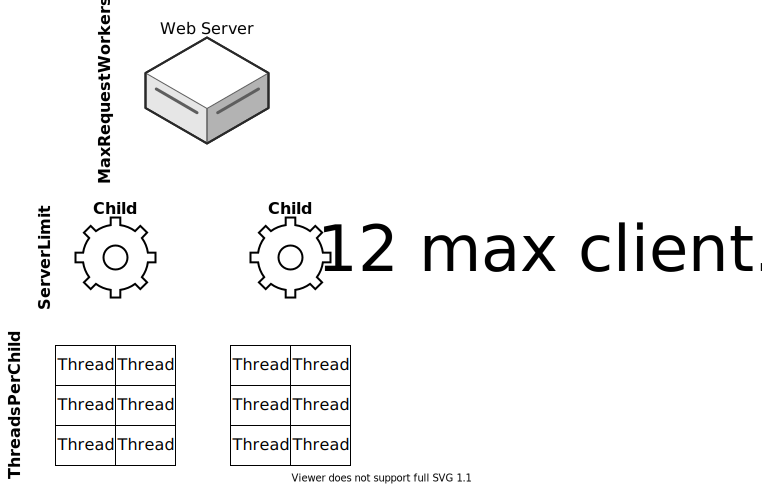

# Apache

[Apache](https://httpd.apache.org) is an established web server that provides a variety of related tasks to serving pages for a web site including SSL termination, request rate-limiting, proxying, forwarding, document root resolving, and redirection. ApisCP uses Event MPM, a threaded, event-driven processing module that reduces overhead and puts performance on par with NGINX in most workloads. NGINX is slightly faster by 1-2 ms from separate testing, but represents less than 1% of typical processing overhead.

## Configuration

A variety of locations exist under */etc/httpd*. Some locations may be freely altered. The table summarizes locations within /etc/httpd, whether they may be modified, and intention. 

:::tip
After making changes run `htrebuild` to rebuild and test configuration. Apache will restart once the configuration is validated.
:::

| Modifiable? | File                           | Purpose                                                      |
| ----------- | ------------------------------ | ------------------------------------------------------------ |
| No          | conf/httpd.conf                | Standardized system configuration.                           |
| Yes         | conf.d/                        | Addin modules. See separate table below for additional information. |
| Yes         | conf/httpd-custom.conf         | User overrides. See special remarks below for specific stanzas set by Bootstrapper. |
| No          | conf/apnscp-httpd-rewrite.conf | Inheritable base rules applied to webmail redirections, addon domains, and subdomains. |
| Maybe       | siteXX/                        | Per-module configurations. If a module name exists now, do not touch. If a file name does not exist now, it may exist in the future. |
| Yes         | siteXX/custom                  | A reserved location for per-site overrides. This will never be overwritten. |
| Yes         | siteXX/custom.raw              | A reserved location for per-site overrides. This will never be overwritten. Does not substitute fst/ with shadow/. |
| Maybe       | siteXX.ssl/                    | Similar to siteXX/. Only applies when site is served over SSL. |
| Yes         | siteXX.ssl/custom              | Similar to siteXX/custom. Only applies when site is served over SSL. |
| No          | conf/virtual-*                 | Monolithic files compiled down by `htrebuild` command. Used by Apache to improve recovery time. |
| No          | conf/virtual-*.bad             | If a failed rebuild occurs, the offending file is saved to this location. |
| No          | conf.d/mod_security.conf       | mod_security configuration distributed as part of ApisCP distribution. |

::: tip Shadow-layer substitutions
ApisCP will replace all occurrences of `fst/` with the direct [data layer](Filesystem.md) `shadow/` when including drop-in configuration under siteXX during `htrebuild`. Suffix a file with `.raw` to prevent this substitution if for example matching a path verbatim as with `<Directory /home/virtual/siteXX/fst/var/www/html>`.
:::

## Scopes

[Scope](Scopes.md) provide a generalized interface to manage system internals. Apache ships with several Scopes to allow adjusting Apache configuration without getting lost in internals.

```bash
# List all Apache Scopes
cpcmd scope:list 'apache:*'
```

We'll cover a few below.

### Tolerating invalid configuration

Invalid configuration may occur when transitioning between Apache platforms with different modules. Default behavior is to fail, returning a 550 Internal Server Error. This behavior can be changed using `apache.strict-mode`. 

::: warning
Strict mode does not change behavior of invalid directives inside `/etc/httpd`, only in `.htaccess` files. An invalid directive in `httpd.conf` or `siteXX/` will cause any reload requests to fail as well as prevent Apache from starting up.
::: 

```bash
# Allow invalid directives to exist in .htaccess
cpcmd scope:set apache.strict-mode false
```

### Changing ports

A Scope is provided to facilitate changing the ports SSL and non-SSL communication reside on. A non-SSL port must always be available, but SSL may be turned off for example if haproxy or Varnish were to sit in front of Apache to terminate SSL requests. 

```bash
# Move HTTP to port 81, disable SSL
cpcmd scope:set apache.ports '[81,false]'
# Update configuration on all accounts
EditDomain --reconfig --all
```

### Setting upstream cache

Apache's integrated cache can be activated on the fly using `apache.cache`.

```bash
# Enable memory-backed caching in Apache
cpcmd scope:set apache.cache memory
# Require sites to opt-in with "UnsetEnv no-cache"
cpcmd scope:set apache.cachetype explicit
```

## Site templates

Each site created generates its HTTP configuration from the template service path, `resources/templates/apache/`.  Templates may be overrode by creating the corresponding structure in `config/custom` (see [Customization.md](Customization.md)). 

Run `EditDomain --rebuild --all` after making changes to update configuration for all sites.

### Reload delays

Apache configuration is delayed by 2 minutes to allow for successive calls to \*Domain helpers to merge into a single call. Doing so reduces the risk of a self-induced denial of service attack when performing a bulk edit. Behavior may be adjusted via *[httpd]* => *reload_delay* [Tuneable](Tuneables.md).

`cpcmd scope:set cp.config httpd reload_delay now` disables this elision window.

::: details
Reloads collapse all configuration into a monolithic file to drastically improve responsiveness. Instead of reading each modular configuration, a monolithic configuration, /etc/httpd/conf/virtual-httpd-built, is read whenever the web server must reload or restart.
:::

## Threat deterrence

Several features are provided to discourage abusive bots. All behaviors may be toggled either globally on an account-by-account basis.

### HTTP/1.0

Bots are sloppy and do not implement appropriate protocol standards. One such standard is HTTP/1.1 usage. In its absence, HTTP/1.0 is assumed, which allows very poor protocol implementations to return a response. For example,

```bash
nc google.com 80
GET /
```

No browser sends a protocol-less request, especially those behind SSL. A typical, appropriate request would be,

```bash
nc google.com 80
GET / HTTP/1.1
Host: google.com
```

Denying HTTP/1.0 requests provided added protection against low-hanging fruit. 

#### Disabling HTTP/1.0 blocks

Blocks may be disabled per hostname in the panel.

1.  Visit **Web** > **Web Apps**
2. Select the hostname
3. Under **Options** > **Disable HTTP/1.0 Blocks**

Alternatively HTTP/1.0 blocks may be removed server-wide via `cpcmd scope:set apache.block10 false`.

### Request throttling

mod_evasive monitors requests per IP address over a window. Requests beyond the threshold emit a log entry to Rampart, which bans the IP address. Specifics, including customizing, is discussed in [Evasive.md](Evasive.md).

### Slowloris mitigation

Slowloris is of a family of low bandwidth starvation attacks that slowly send a HTTP request over an extended duration, For example, instead of sending "GET / HTTP/1.1" at once, a Slowloris attack sends G followed by a 5 second wait, then E followed by another 5 second wait... These attacks are highly effective when not mitigated.

[mod_reqtimeout](https://httpd.apache.org/docs/2.4/mod/mod_reqtimeout.html) is enabled to mandate bandwidth minimums. Requests that do not complete within the window are closed thus freeing up a connection slot.

Limits may be overriden on a per-site basis by setting `RequestReadTimeout` in */etc/httpd/conf/siteXX/* then running `htrebuild`.

### Resource monopolization

cgroups are an optional service to enforce [resource limits](Resource%20enforcements.md). Limits may be imposed by setting **cgroup**,**enabled**=1. CPU, memory, PID, and IO limits are tracked. Resource limits provide a secondary effect by stymying DDoS attacks that may fall under the threshold of [mod_evasive](Evasive.md). For example, consider a distributed attack of over 10,000 machines each sending 2 requests per second - 20,000 requests per second will quickly swamp a server without necessarily triggering Evasive limits.

Resource enforcement, when applied, prevent a site from creating excessive PHP-FPM workers to cope with swells or monopolizing CPU time slices thus making the server more egalitarian and sometimes too, allowing other reactive protection to act.

## Security changes

### FollowSymLinks => SymLinksIfOwnerMatch

Symbolic links redirect one file resource to another. Three behaviors exist for following redirections:
- Do not follow
- Follow unconditionally when FollowSymLinks is present
- Follow conditionally if the link and referent have same ownership

Symlink traversal is necessary for [mod_rewrite](https://httpd.apache.org/docs/current/mod/mod_rewrite.html) to operate, a cornerstone of site redirections and pretty-print URLs. Disabling symlink traversal would create catastrophic consequences for many Web Apps, WordPress included, by disabling mod_rewrite usage. Symlinks are always followed, but an extra check is performed unconditionally to ensure the *link* and *referent* have the **same owner**.

::: details
Internally, `FollowSymLinks` is aliased to `SymLinksIfOwnerMatch` through a [patch](https://github.com/apisnetworks/httpd-apache/blob/master/SOURCES/httpd-2.4-force-symlinks-owner.patch) to Apache's engine. This results in one additional stat() syscall that is cached by the operating system with negligible overhead.
:::

### Removal mod_includes

Server-side includes were a feature in the early web to allow static HTML pages to include other static resources in a crude form of templating. Languages like PHP, Node, Python, Ruby can template much more efficiently and thus there is little need for server-side includes ("SSI") in mod_includes. mod_includes permits a very ugly deflection attack on protected assets if the attacker knows the file name (for example, "wp-config.php"). This attack is discussed in detail in [SECURITY.md](../SECURITY.md). 

In general there is little benefit from enabling mod_includes other than supporting old, insecure web sites.

## App compatibility

### Non-standard index pages

An abbreviated list of index names are checked when a location is accessed without specifying a filename. For example,

Accessing https://example.com queries all `DirectoryIndex` files within the document root for example.com returning the first found file in the set index.html, index.php, index.cgi. If other index names are desired, such as *index.htm*, add to `httpd-custom.conf`:

`DirectoryIndex index.htm` - this will append to the list of directory indexes. Before returning a 403 Forbidden error (or listing directory contents), all filenames are tried. 

### Default index page order
Setting `DirectoryIndex index.htm` will set the order in a `.htaccess` file but append to the list if added to `httpd-custom.conf` due to an unknown context rule in [DirectoryIndex parsing](https://httpd.apache.org/docs/2.4/mod/mod_dir.html#directoryindex):

> Note: Multiple DirectoryIndex directives within the same context will add to the list of resources to look for rather than replace:

If the default order of `index.html index.php index.cgi` is to be changed, perhaps placing index.php in front (*this order is determined for historical reasons*), then the index list must first be disabled, then set in `httpd-custom.conf`:

```
DirectoryIndex disabled
DirectoryIndex index.php index.html index.php4 index.php3 default.html
```

Run `htrebuild` after making changes.

### Disabling index negotiation

`DirectoryIndex disabled` disables index negotiation for a directory. Disabling negotiation is necessary when passing all content to a backend proxy, such as with Passenger.

### Proxying content

Apache's `ProxyPass` directive sends requests to a standalone service, e.g. a PowerDNS API service or even Node web service. Placing a service behind a proxy protects it from direct, outside access through [firewalld](../FIREWALL.md) and confers benefits of typical website protection in ApisCP: end-to-end SSL encryption, brute-force protection by [mod_evasive](https://github.com/apisnetworks/mod_evasive), request logging, and connection/resource limiting. 

Two alternatives exist for proxying content, either as a standalone site or a location in an existing site.

#### Standalone proxy

A standalone setup maps all requests for a domain to the proxy service. For example, say a service, [Jenkins](https://jenkins.io/), is running on port 8080 and we'd like to place it on a subdomain called "pipeline.mydomain.com".

Create a new account named "pipeline.mydomain.com". If mydomain.com also exists on the server, relocate "pipeline.mydomain.com" it to a higher priority (see *Troubleshooting* => "*Stacking domains*" section below). From there, add the following to [siteXX/custom](Apache#configuration) in /etc/httpd/conf.

```text
ProxyPass http://127.0.0.1:8080/
ProxyPassReverse http://127.0.0.1:8080/
```
::: warning
Trailing "/" is significant when setting this configuration.
:::

Run `htrebuild` and now all requests for pipeline.mydomain.com will be sent to http://127.0.0.1:8080/. 

#### Location-based proxy

Taking the above example, what if we want to make the Jenkins service available on *mydomain.com/ci*? A `<Location>` block can accomplish this.

In [siteXX/custom](Apache#configurationApache#configuration), the setup is the similar as with **Standalone proxy** above:

```
<Location /ci>
ProxyPass http://127.0.0.1:8080/
ProxyPassReverse http://127.0.0.1:8080/
</Location>
```


## Technical details

Apache is a custom build available through [apisnetworks/httpd-apache](https://github.com/apisnetworks/httpd-apache). Nonportable atomics are enabled as well as mod_systemd backported from Apache 2.5 development to facilitate lightweight service reports. Latest APR and APR Utility releases are bundled to maximize efficiency. Compilation targets x86-64 machines using default compile flags.

Overrides are disabled below typical document root locations, siteXX/fst/home/user and siteXX/fst/var/www to reduce the number of recursive htaccess checks. Apache walks the filesystem when `SymLinksIfOwnerMatch` is enabled, which requires Apache to walk the filesystem to ensure all components are owned by the same user to defeat symlink deflection attacks.

```strace
[pid 19214] lstat("/home", {st_mode=S_IFDIR|0755, st_size=48, ...}) = 0
[pid 19214] lstat("/home/virtual", {st_mode=S_IFDIR|0711, st_size=12288, ...}) = 0
[pid 19214] lstat("/home/virtual/site32", {st_mode=S_IFDIR|0711, st_size=43, ...}) = 0
[pid 19214] lstat("/home/virtual/site32/fst", {st_mode=S_IFDIR|0751, st_size=95, ...}) = 0
[pid 19214] lstat("/home/virtual/site32/fst/var", {st_mode=S_IFDIR|S_ISGID|S_ISVTX|0777, st_size=104, ...}) = 0
[pid 19214] lstat("/home/virtual/site32/fst/var/www", {st_mode=S_IFDIR|0755, st_size=270, ...}) = 0
[pid 19214] open("/home/virtual/site32/fst/var/www/.htaccess", O_RDONLY|O_CLOEXEC) = -1 ENOENT (No such file or directory)
[pid 19214] lstat("/home/virtual/site32/fst/var/www/domain.com", {st_mode=S_IFDIR|0755, st_size=4096, ...}) = 0
[pid 19214] open("/home/virtual/site32/fst/var/www/domain.com/.htaccess", O_RDONLY|O_CLOEXEC) = 421

```

Failure to enable `SymLinksIfOwnerMatch` opens a system to attack. Details of the attacks are covered in [SECURITY.md](../SECURITY.md). This behavior is mandatory, but ameliorated greatly by SSD and NVMe-backed storage.

A posixsem mutex is used to serialize accept() requests. This has been determined to result in the fewest zombie/deadlock processes in the event of a service disruption.  

Log buffering is enabled to reduce the amount of I/O requests. [Buffered logs](http://httpd.apache.org/docs/current/mod/mod_log_config.html#bufferedlogs) will enqueue full records up to the in-memory limit, 4 KB. If a record exceeds the buffer length, the buffer is flushed prior to recording the new entry. Buffering may be disabled using the `apache.buffered-logs` [Scope](Scopes.md).

## Tuning

In Event MPM, a single child process can handle multiple requests concurrently. By default, a very conservative number of threads (20) is created per process. At most a child process can handle 20 concurrent connections. Active requests beyond this threshold spawn a new child process.



The above scenario would be represented in the following configuration.

```
MaxRequestWorkers 12
ServerLimit 2
ThreadsPerChild 6
```

Threads may be tuned to decrease the number of processes spawned without changing the maximum number of concurrent connections (**MaxRequestWorkers**).

```text
ThreadLimit 128
MaxRequestsPerChild 10240
ThreadsPerChild 100
ThreadStackSize 2097152
```

Tuning threads will reduce memory overhead a variable amount, but a good rule of thumb is each "VirtualHost" container is 256 KB. A site that has an SSL and non-SSL version thus would require 512 KB to operate in each Apache process. 5 Apache processes at 20 **ThreadsPerChild** with a 100 connection **ServerLimit**. 

Increasing **ThreadsPerChild**, which decreases **ServerLimit** decreases the memory burden, but at the potential risk of segmentation faults.

Check `/var/log/httpd/error_log` to assess stability.
```bash
# Check both error_log and error_log.1
grep 'Segmentation' /var/log/httpd/error_log{,.1}
# 1 segmentation fault - instability!
[core:notice] [pid 11468:tid 140192329971584] AH00052: child pid 18271 exit signal Segmentation fault (11)
```

### PHP tuning

See [PHP-FPM.md](PHP-FPM.md).

## Troubleshooting

### Stacking domains and subdomains as separate accounts

Given *domain.com* and *sub.domain.com* as 2 separate accounts with *domain.com* assigned site10 and *sub.domain.com* assigned site12, when configuration is compiled into a single file, `/etc/httpd/conf/virtual-httpd-built`, the domain/subdomain configuration for *domain.com* will take precedence as it is lexicographically lower.

Configuration for site12 will not show as the [ServerAlias](https://httpd.apache.org/docs/2.4/vhosts/name-based.html) setting, \*.domain.com matches first. A quick fix is to relocate `site12` configuration to higher priority by renaming such that it is ordered before `site10`.

```bash
cd /etc/httpd/conf/virtual
mv site12 priority-site12
ln -s priority-site12 site12
htrebuild
```

:::details
`site12` is renamed to `priority-site12` thus ensuring it comes `site10`. A symbolic link is created to `site12` to allow future panel edits to update the configuration now in `priority-site12`.  `htrebuild` will skip any symbolic links in `/etc/httpd/conf/virtual-built` as well. Deletion will delete both the regular file and symbolic link if encountered.
:::

### AH03490: scoreboard is full, not at MaxRequestWorkers.Increase ServerLimit.

Apache uses a mutex to serialize requests when polling with `select()` (there are intractable scalability problems with `select()` vs `epoll()`/`kqueue()` beyond the scope of this document). `posixsem` is used by default, which has the highest throughput, ~15% more than the next best option: `pthread`. Likewise `pthread` is approximately 12% faster than `sysvsem`. Depending upon architecture, `posixsem` may cause spurious lockups evidenced in `/var/log/httpd/error_log`. If this is the case, then change the mutex model to `pthread` or `sysvsem` by using the `apache.mutex` [Scope](Scopes.md):

```
cpcmd scope:set apache.mutex pthread
```

Apache will automatically reload after 2 minutes.

### BDB0004 fop_read_meta: /etc/httpd/conf/http10: unexpected file type of format

Map files are stored as sdbm, an open implementation of [ndbm](https://en.wikipedia.org/wiki/DBM_(computing)). When no HTTP/1.0 bypasses are configured and a client accesses the web server using HTTP/1.0 protcol - almost always a bot - Apache logs this informative message in the error log.

To bypass this message, add at least 1 hostname to the map file. This can be accomplished from the [command-line helper](CLI.md#cpcmd) as `cpcmd -d domain.com web:allow-protocol domain.com http10`. Otherwise the message is purely diagnostic and has no effect on service.

## See also

For supporting documentation, see also 
- [PHP-FPM](PHP-FPM.md) - PHP
- [Passenger](webapps/Passenger.md) - Node, Ruby, Python, and Go

