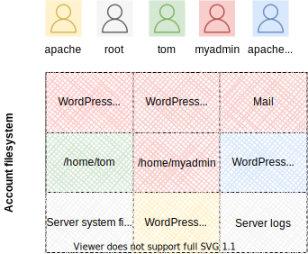
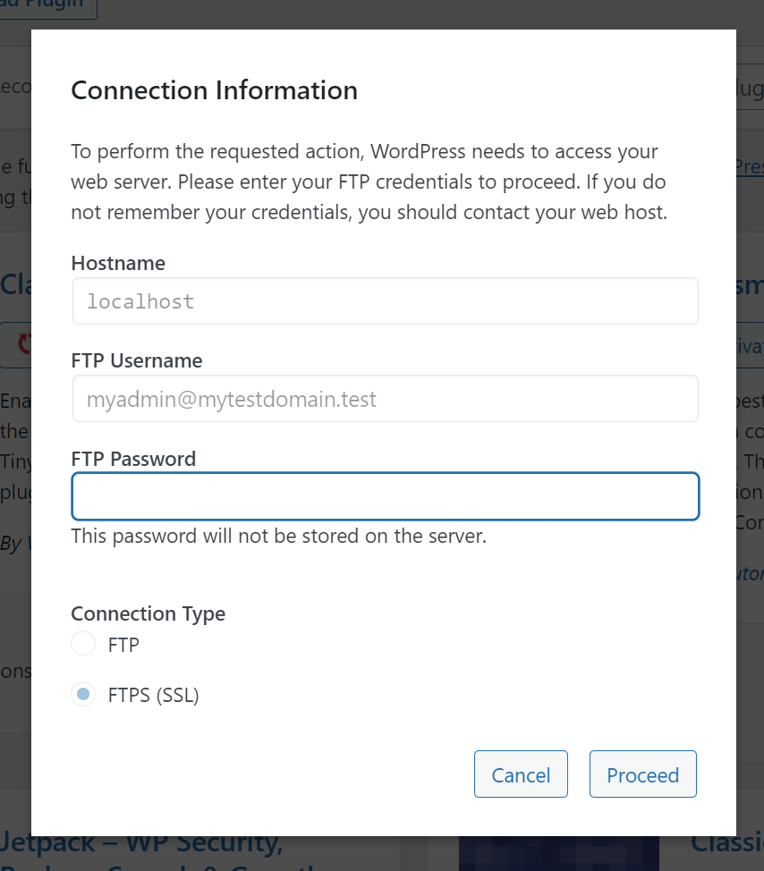

# Audits

[Fortification](Fortification.md) runs PHP as its own user. Keeping a separate, non-privileged system user provides several benefits over same-user operation which is common in competing control panels.

A separate user is created when the [service parameter]() `apache`,`webuser` is a value other than `None` or the account username (`siteinfo`,`admin_user`). ApisCP only supports two values at this time, `apache` and `None`.

Assume a two-user account consisting of `myadmin`, and `tom`. `myadmin` is the primary user. `root` represents protected system files. `apache` is the web user. Following recommended defaults in a Fortification profile, a filesystem may contain the following ownership.



Such a setup can be created with the following commands:

```bash
AddDomain -c siteinfo,domain=mytestdomain.test -c siteinfo,admin_user=myadmin -c apache,webuser=apache -c dns,provider=null
cpcmd -d mytestdomain.test user:add tom 'some-sample-password-123'
cpcmd -d mytestdomain.test wordpress:install mytestdomain.test '' '[ssl:0]'
```

Plugins may be installed from WordPress' GUI or using the API. When presented with an **FTP dialog**, **Fortification is active**. This is akin to [UAC](https://docs.microsoft.com/en-us/windows/security/identity-protection/user-account-control/how-user-account-control-works) in Windows or sudo in Linux/macOS. Files created within WordPress will be owned by *myadmin* and may not be written to by WordPress, which runs as user *apache*.



For ease of comprehension, ApisCP's API will be used.

Install a plugin, [classic-editor](https://wordpress.org/plugins/classic-editor/) as user *myadmin*.

```bash
cpcmd -d mytestdomain.test wordpress:plugin-install mytestdomain.test '' classic-editor
```

Next, disable Fortification to allow plugin installation in the GUI.

```bash
 cpcmd -d mytestdomain.test webapp:fortify mytestdomain.test '' min
```

[classic-widgets]() will install without prompting for FTP authentication. Ownership is *apache*, which is the PHP pool owner.


`lstree` can quickly identify permissions within the filesystem. Note the ownership difference between `wp-content/plugins/classic-editor` and `wp-content/plugins-classic-widgets`.

```bash
cd /var/www/html
tree wp-content/ -L 2 -u -F

# wp-content/
# |-- [myadmin ]  cache/
# |-- [myadmin ]  index.php*
# |-- [myadmin ]  plugins/
# |   |-- [myadmin ]  akismet/
# |   |-- [myadmin ]  classic-editor/
# |   |-- [apache  ]  classic-widgets/
# |   |-- [myadmin ]  hello.php*
# |   |-- [myadmin ]  index.php*
# |   `-- [myadmin ]  wp-cli-login-server/
# |-- [myadmin ]  themes/
# |   |-- [myadmin ]  index.php*
# |   |-- [myadmin ]  twentynineteen/
# |   |-- [myadmin ]  twentytwenty/
# |   `-- [myadmin ]  twentytwentyone/
# |-- [myadmin ]  upgrade/
# `-- [myadmin ]  uploads/
#     `-- [myadmin ]  2022/

```

## Generation                                      

Audit generation looks for files or directories that PHP-FPM, running as *apache*, may modify. Files that are owned by user *myadmin* or lack [write permissions](https://kb.apiscp.com/guides/permissions-overview/) by user *apache* are not reported in audit generation. Audits are generated in the GUI under **Web** > **Web Apps** > *Security* > **Audit** or using `file:audit`.

[API Signature](https://api.apiscp.com/class-File_Module.html#_audit): `file:audit(string $path,[array $requirements = [],[bool $union = true]])`

```bash
cpcmd -d mytestdomain.test file:audit /var/www/html ['user':apache,'perm':'o+w'] false

# - wp-content/plugins/classic-widgets
# - wp-content/plugins/classic-widgets/classic-widgets.php
# - wp-content/plugins/classic-widgets/LICENSE.md
# - wp-content/plugins/classic-widgets/readme.txt
# - wp-admin/includes/file.php
```

This report is inconclusive to whether a file has been tampered but reports *if* it could be. To parameterize the above command, `web:get-docroot` and `php:pool-get-user` may be used.

```bash
audit() { 
	cpcmd -d "$1" file:audit "$(cpcmd -d "$1" web:get-docroot mytestdomain.test)" ['user':"$(cpcmd -d "$1" php:pool-owner mytestdomain.test)",'perm':'o+w'] false
}

# Call as "audit mytestdomain.test"
```

In the case of WordPress, [verify-checksums](https://developer.wordpress.org/cli/commands/core/verify-checksums/) helps to rapidly ferret out changes knowing from the audit results above which files require further scrutiny and too, which files have an irregular checksum.

```bash
cd /var/www/html
echo foo >> wp-admin/includes/file.php
# Now verify the checksum
wp-cli core verify-checksums
# Warning: File doesn't verify against checksum: wp-admin/includes/file.php
# Error: WordPress installation doesn't verify against checksums.
```

::: tip "wp-cli core" only checks system files
Plugins and themes should also be validated. These commands are `wp-cli plugin verify-checksum --all` and `wp-cli theme verify-checksum --all` respectively.
:::

## Resetting auditable files

`webapp:fortify` also accepts a "reset" mode. This removes all write access from the document root restoring it to the Web App owner listed in **Web** > **Web Apps** > *Options* > **Owner**. 

```bash
cpcmd -d mytestdomain.test webapp:fortify mytestdomain.test '' reset
# Reports 1, success
cpcmd -d mytestdomain.test file:audit /var/www/html ['user':apache,'perm':'o+w'] false
# Reports an empty result
```

Any changes made by PHP will be undetectable on successive calls to file:audit, so use this feature with care or at least make judicious use of `verify-checksum` if using WordPress.
