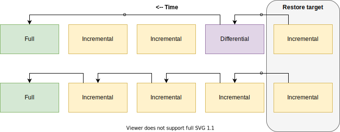

ApisCP presently supports two backup clients as third-party addins, [Bacula](./backups/Bacula.md) and [Duplicity](./backups/Duplicity.md); [JetBackup](https://request.jetapps.com/topic/546-support-for-apiscp-control-panel) support is under consideration. 

Bacula supports full, differential, and incremental backups while Duplicity supports full and incremental. Relying solely on incremental and full backups requires replaying *all* preceding backups before a file may be restored. Differential allows skipping of incremental backups that exist in previous intervals prior to the *most recent* differential. On small servers this difference is negligible. On large servers consisting of millions of inodes, the effects are far more pronounced.



## Client-level backups

Users may manually request a filesystem backup in **Files** > **File Manager**. Navigate to the account root, "/", then select **Download Directory**. Likewise snapshots backed by [git](https://git-scm.com/) are available under **Web** > **Web Apps** > **Enable Snapshots**. When snapshots are enabled for a detected Web App, [Update Assurance](../WebApps.md#update-assurance) is automatically enabled. Update Assurance serves as a pre-update backup and post-update confirmation hook.

## Custom methods

Backups aren't limited to just Bacula and Duplicity. Any backup software that supports storing files with extended attributes will work. Extended attributes encode ACL data that forms the backbone of [Fortification](../Fortification.md). 

When backing up a system the following locations are required:

| Location                   | Purpose                                   |
| -------------------------- | ----------------------------------------- |
| /home/virtual/site*/shadow | [Account data](../Filesystem.md#shadow)   |
| /home/virtual/site*/info   | [Account metadata](../Filesystem.md#info) |

Additional locations are recommended to quickly ameliorate crises:

| Location                     | Purpose           |
| ---------------------------- | ----------------- |
| /var/log/mailer_table*       | Mailbox maps      |
| /var/lib/mysql/mysql-grants* | MySQL grants      |
| /var/lib/pgsql/*/backups     | PostgreSQL grants |

### Triggering database backups

Database backups run automatically every night as part of anacron tasks in `/etc/cron.daily`. anacron may export a database after a nighty backup has run, which would result in desynchronous database backups. To disable backups in anacron, use the *backups.automatic-database-exports* [Scope](../Scopes.md). It would be the responsibility of the backup script to call `bin/scripts/backup_dbs.php` within `/usr/local/apnscp` to perform database exports.

```bash
# Disable nightly exports
cpcmd scope:set backups.automatic-database-exports false
# Manually dump all client databases
/usr/local/apnscp/bin/scripts/backup_dbs.php
```

::: warning Direct file-level backups are dangerous!
You may be tempted to backup /var/lib/mysql and /var/lib/pgsql directly. These operations cannot guarantee atomicity, thus doing so runs the risk of corruption by backing up half-written records. Logical exports are the most comprehensive way to backup this data.

*A [topical question](https://stackoverflow.com/questions/56823591/mysql-innodb-differences-between-wal-double-write-buffer-log-buffer-redo-log) results in a deep dive of MySQL internals that does an excellent job diagramming its complex architecture, for the intrepid reader.*
:::
