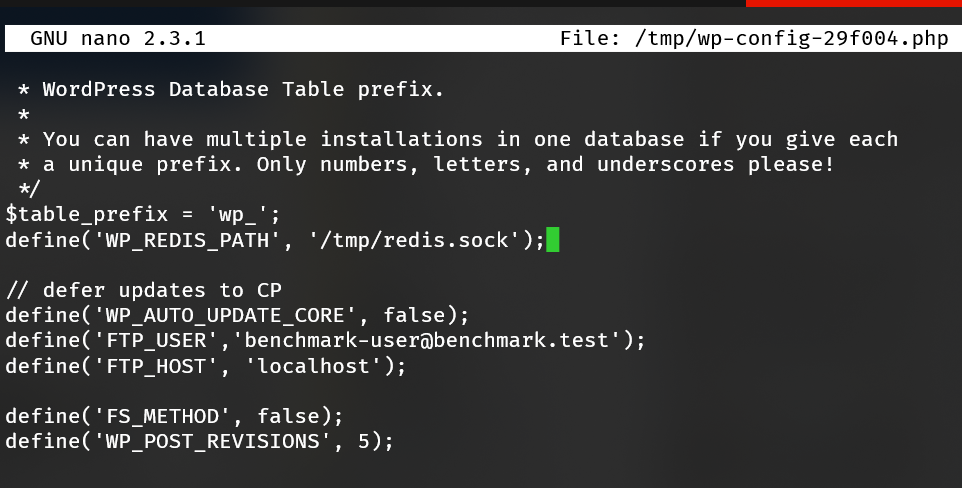
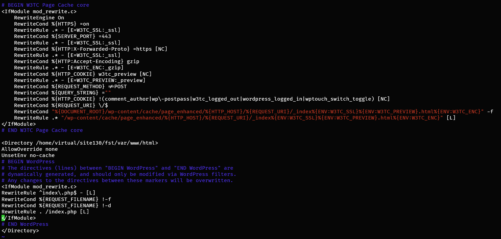

# Benchmarking

## Installation
[Bootstrapper](https://github.com/apisnetworks/apnscp-bootstrapper#provider-stats) includes a standardized release to evaluate build performance across hosting providers. 

```bash
curl https://raw.githubusercontent.com/apisnetworks/apnscp-bootstrapper/master/bootstrap.sh | env RELEASE=benchmark bash
```

Check back in ~2 hours once [installation](../INSTALL.md) completes, then run the following command:

```bash
IFS=$'\n' ; DATES=($((tail -n 1 /root/apnscp-bootstrapper.log | grep failed=0 ; grep -m 1 -P '^\d{4}-.*[u|p]=root' /root/apnscp-bootstrapper.log ) | awk '{print $1, $2}')) ; [[ ${#DATES[@]} -eq 2 ]] && python -c 'from datetime import datetime; import sys; format="%Y-%m-%d %H:%M:%S,%f";print datetime.strptime(sys.argv[1], format)-datetime.strptime(sys.argv[2], format)' "${DATES[0]}" "${DATES[1]}" || (echo -e "\n>>> Unable to verify Bootstrapper completed - is Ansible still running or did it fail? Last 10 lines follow" && tail -n 10 /root/apnscp-bootstrapper.log)
```

A duration will appear or the last 10 lines of /root/apnscp-bootstrapper.log if it failed. This duration tests network/IO/CPU.

A second test of backend performance once apnscp is setup gives the baseline performance between frontend/backend communication to a single vCPU. This can be tested as follows.

First update the shell with helpers from .bashrc,

```bash
exec $SHELL -i
# Then run the cpcmd helper
cpcmd scope:set cp.debug true  ; sleep 5 ; cpcmd test_backend_performance ; cpcmd scope:set cp.debug false
```

Enabling debug mode opens up the [test module](../DEBUGGING.md) for instrumentation utilities.

### Converting to production
A server provisioned using the *benchmark* branch can be converted to a normal build without resetting the server. Use cpcmd to set any [apnscp-vars.yml](https://github.com/apisnetworks/apnscp-playbooks/blob/master/apnscp-vars.yml) value; use the [Customization Utility](https://apnscp.com/#customize) on ApisCP as cross-reference.

```bash
# Launch new bash shell with apnscp helper functions
exec $SHELL -i
cd /usr/local/apnscp
# Save remote URL, should be gitlab.com/apisnetworks/apnscp.git
REMOTE="$(git config --get remote.origin.url)"
git remote remove origin
git remote add -f -t master origin "$REMOTE"
git reset --hard origin/master
cpcmd scope:set cp.bootstrapper populate_filesystem_template true
# Set any other Bootstrapper values from apnscp-vars.yml...
# cpcmd config_set apnscp.bootstrapper varname varval
upcp -sb
# After Bootstrapper completes - it will take 5-30 minutes to do so
cpcmd scope:set cp.bootstrapper populate_filesystem_template auto
cpcmd auth:change-password newadminpassword
cpcmd common:set-email your@email.address
```

`populate_filesystem_template` must be enabled to update any packages that have been added/removed in ApisCP. Once everything is done, access [ApisCP's interface](https://docs.apiscp.com/INSTALL/#after-bootstrap) to get started.

Bootstrapper project on GitHub contains a reference for [provider performance](https://github.com/apisnetworks/apnscp-bootstrapper#provider-stats). Not all providers are created equal and often times a "CPU" on VPS is shared n-ways sometimes with very noisy neighbors.

## HTTP
Before evaluating HTTP performance, it is necessary to disable [Evasive](Evasive.md)'s HTTP request protection. Disabling HTTP/1.0 protection may also be necessary depending upon the benchmark utility, such as `ab`, which sends requests using HTTP/1.0. 

By default, a 2 minute delay is imposed before applying configuration changes to the HTTP server. This may be changed by adjusting *[httpd]* => *reload_delay* (see [Apache.md](Apache.md)). For example, a value of "now" disables any reload delay, but may expose a server to unintended DoS attacks during bulk account edits.

```bash
cpcmd scope:set apache.evasive enabled false
cpcmd scope:set apache.block10 false
# Now benchmark a site
ab -n 1000 -c 1 http://mydomain.com/
```

### Fast WordPress benchmark
Creating a test account to benchmark WordPress is simple with a few CLI commands. Once your done benchmarking, run `DeleteDomain benchmark.test` to remove it (or keep it around for a rainy day).

```bash
AddDomain -c siteinfo,domain=benchmark.test -c crontab,enabled=1 -c crontab,permit=1 -c ssh,enabled=1 -c dns,provider=null -c mail,provider=null -c siteinfo,admin_user=benchmark-user
grep -Eq "benchmark.test\b" /etc/hosts || (echo "$(cpcmd -d benchmark.test site:ip-address) benchmark.test" >> /etc/hosts)
cpcmd -d benchmark.test wordpress:install benchmark.test
cpcmd scope:set apache.evasive enabled false
cpcmd scope:set apache.block10 false
sleep 120
ab -k -n 1000 -c 1 http://benchmark.test/
```

::: details
Run the following commands to create a new domain named "benchmark.test". DNS and email will be disabled for the domain. Install WordPress, disable Evasive and HTTP/1.0 protection on the account. Sleep for 2 minutes for *[httpd]* => *reload_delay* to expire (`at -l` shows pending jobs), then run 1000 requests in serial against the domain.
:::

::: tip
Overriding your [hosts file](https://kb.apnscp.com/dns/previewing-your-domain/) would allow you to access the WordPress administrative portal as if it were a real, resolvable domain. Use the IP from `cpcmd -d benchmark.test site:ip-address`.
:::

#### Extending

Let's take this one step further, configuring a WP Redis object cache. Use `redis:create` to create a new Redis instance for the account, then `wp-cli` to install a Redis cache plugin. 

```bash
# Create a new Redis instance for benchmark.test named "wp-test" listening on /tmp/redis.sock
cpcmd -d benchmark.test crontab:toggle-status 1
cpcmd -d benchmark.test redis:create wp-test '[unixsocket:/tmp/redis.sock]'
# Switch to benchmark.test account to configure plugin
su benchmark.test
cd /var/www/html
# Install Redis object cache plugin
wp-cli plugin install --activate redis-cache
# Define Redis path
wp-cli config set WP_REDIS_PATH /tmp/redis.sock
```



Activate Redis cache and you're set!

```bash
wp-cli redis enable
# Verify it is running
wp-cli redis status
```

::: warning Bug in 2.0.12
wp-cli redis status will throw an error in 2.0.12. Add the following to `wp-content/plugins/redis-cache/includes/ui/diagnostics.php` after `global $wp_object_cache;`:

```php
$roc = \Rhubarb\RedisCache\Plugin::instance();
```
:::

Exit out of the subshell, run as an unrestricted user, then verify data is cached:

```bash
exit
ab -n 10 -c 1 http://benchmark.test/
echo "KEYS *" | redis-cli -s /home/virtual/benchmark.test/tmp/redis.sock
```

#### Output cache
*5 ms* may be fast, but what if we want to make WordPress faster? A simple solution is to reuse previously rendered output. We can easily accomplish this using [Apache](Apache.md#setting-upstream-cache)'s builtin cache. Moreover, we can serve optimized content that has passed through [Google Pagespeed](https://developers.google.com/speed/pagespeed/module).

Any caching plugin will work adequately for this task. We'll use W3TC as it provides additional WP-CLI commands. In continuation from the above Redis example, let's enable caching in Apache, then switch back to *benchmark.test* to install/configure W3TC:.

```bash
# Enable memory-backed caching
cpcmd scope:set apache.cache memory
# Require sites to opt-in with "UnsetEnv no-cache"
cpcmd scope:set apache.cachetype explicit
```
Now switch to benchmark.test account,

```bash
su benchmark.test
cd /var/www/html
wp-cli plugin install --activate w3-total-cache
wp-cli w3-total-cache fix_environment
wp-cli w3-total-cache option set pgcache.enabled true --type=boolean
```

Exit back out and reapply Fortification so `wp-content/cache` permissions are corrected as needed. Note if [Fortification](Fortification.md) was set to min, this operation is unnecessary.

```bash
cpcmd -d benchmark.test wordpress:fortify benchmark.test
```

Then run `ab` against the site. Note it's expected to encounter some transient response size anomalies while Pagespeed optimizes the content. From a simple testing dual-core server, page throughput jumped from **116 req/second to 3782 req/second**.

```bash
ab  -k -n 1000 -c 4 http://benchmark.test/
```

#### Trimming .htaccess

One last thing we can do is put the `.htaccess` on a diet. Remove all of the superfluous `AddType` directives. These are negotiated automatically by [TypesConfig](https://httpd.apache.org/docs/2.4/mod/mod_mime.html#typesconfig) in the server configuration. Remember, for each page request Apache must enumerate all rules in .htaccess. Shaving 250 lines can greatly improve throughput!

After removing the unnecessary directives, .htaccess shrunk by 32.8% (8960 bytes to 6014 bytes). Page throughput likewise improved to **4224.36 req/second**, a gain of 11.6% just by removing superfluous directives. 

<center><b>.htaccess size matters</b></center>

#### Removing .htaccess

Apache's biggest strength is too its biggest weakness: flexibility. Because users may override settings in `.htaccess` at their discretion, Apache must backtrack and check all previous directories before reaching a verdict. With SSD and NVMe SSD, the overhead of these stat() checks is greatly ameliorated, but we can achieve higher throughput in the name of benchmarks.

Taking the .htaccess one step further, let's remove it from the equation entirely and convert it to startup directives saved in memory whenever Apache boots much like NGINX. Assume that `get_site_id benchmark.test` returns "130" in the following example.

Copy your .htaccess from `/home/virtual/benchmark.test/var/www/html/` into `/etc/httpd/conf/site130/`. Next, we'll change the dispatcher location and disable overrides.

```bash
cp /home/virtual/benchmark.test/var/www/html/.htaccess /etc/httpd/conf/site130/wp-test
```

Edit wp-test surrounding the dispatcher rules in a \<Directory>... \</Directory> clause adding `AllowOverride none` and `UnsetEnv no-cache`  inside the clause as depicted in the screenshot. 

::: tip CacheQuickHandler
Optionally, add `CacheQuickHandler on` outside \<Directory>...\</Directory> to bypass additional axis processing. This will further improve processing times to the values arrived at in this article *at the expense of brute-force protection*. CacheQuickHandler usage blocks the effects of [mod_evasive](Evasive.md), but static content has nothing to interact with. Regardless, use at your own risk.
:::



Run `htrebuild`, then benchmark. Performance skyrocketed from **4224 req/second to a blistering 15271 req/second**! 

*We've switched from 4 to 8 core concurrency to ensure proper saturation. At `-c4` output is ~13583 req/second. At `-c8` output saturates at 15271 req/second.*

### Concurrency

Benchmarks are designed to model real-world scenarios with artificial, deterministic usage patterns. It's an oxymoron to believe any such correlation exists between benchmarks and typical usage scenarios, but what benchmarks provide is the theoretical peak throughput. *It's all downhill from there!*

When evaluating the peak throughput do not run more than NPROC+1 instances. Linux has an intelligent scheduling algorithm to interleave parcels of work (threads). If for example a site is handling 5 concurrent requests over 250 ms, the processing is rarely contiguous due to network latency/output buffering. Benchmarking locally removes this barrier. 

Let's assume a WordPress site on a two-core machine. Following this logic, benchmark figures should begin to stabilize after 3 concurrent requests. All requests are generated using `ab` as outlined above. The PHP-FPM pool was reconfigured from **ondemand** to **static** and the total worker count (`pm.max_children`) changed from **3** to **20** to 

| Concurrency | Throughput (req/sec) |    % Δ | Time per req (ms) |     % Δ |
| :---------: | -------------------: | -----: | ----------------: | ------: |
|      1      |                83.18 |      — |            12.022 |       — |
|      2      |               163.01 | 95.97% |             6.135 | -48.97% |
|      3      |               169.12 |  3.75% |             5.913 |  -3.63% |
|      4      |               174.86 |  3.39% |             5.719 |  -3.28% |
|      5      |               174.61 | -0.14% |             5.727 |   0.14% |
|      6      |               175.53 |  0.53% |             5.697 |  -0.52% |
|      7      |               174.73 | -0.46% |             5.723 |   0.46% |
|      8      |               176.24 |  0.86% |             5.674 |  -0.86% |
|      9      |               175.65 | -0.33% |             5.693 |   0.33% |
|     10      |               177.18 |  0.87% |             5.644 |  -0.86% |
|     15      |               175.89 | -0.73% |             5.685 |   0.73% |
|     20      |               177.87 |  1.23% |             5.622 |  -1.11% |

ApisCP uses NPROC + 2 workers per site. Typically this is sufficient for optimal throughput except in high latency environments. PHP requests operate synchronously, which means the workers is only freed to handle a new request at the conclusion of the previous request. Theoretically, in the above benchmark, PHP could serve ~170 concurrent users per second with 4 PHP-FPM workers assuming a uniform distribution or 14.6 million pageviews per day. Often these figures are much lower in real-world, hampered by network latency both on the request and response.
