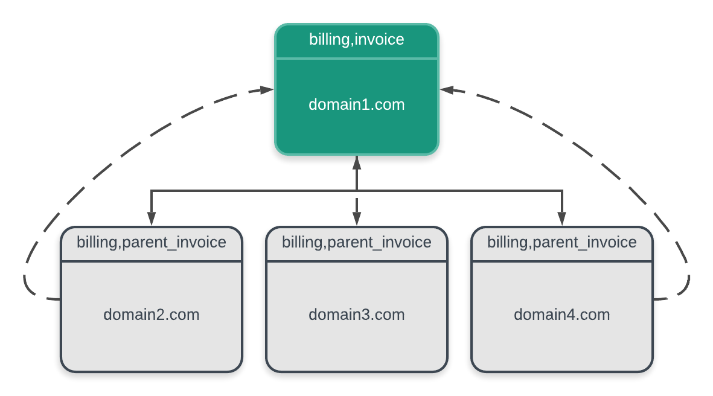
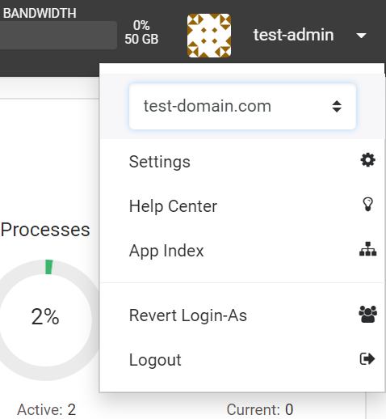

# Billing integration

ApisCP is designed to work with the following third-party billing platforms out of the box,

- [Blesta](https://docs.blesta.com/display/user/APNSCP) as of 4.8.0
- [Clientexec](https://github.com/clientexec/apiscp-server) as of 6.3.0
- [HostBill](https://hostbillapp.com/products-services/apiscp/) as of 2021/06/28
- [WISECP](https://docs.wisecp.com/en/kb/apiscp) as of 2.3
- [WHMCS](https://github.com/LithiumHosting/apnscp-whmcs)

The scope of this documentation is for developers to build custom integration modules for ApisCP.

## Custom integration

A billing framework is provided to facilitate integration into third-party services. ApisCP tracks sites by its "billing invoice", a service value within the billing class named "invoice". Subordinate sites are parented to the same master account when its *billing*,*parent_invoice* service value matches the parent. 

### Account groups

Sites may be grouped by invoice with the following operations: edit, delete, suspend, activate, transfer.

As a simple example, let's create 3 sites: test-domain.com, test-domain-child1.com, and test-domain-child2.com using the invoice "master-invoice-123".

```bash
AddDomain -c siteinfo,domain=test-domain.com -c siteinfo,admin_user=test-admin -c billing,invoice=master-invoice-123
AddDomain -c siteinfo,domain=test-domain-child1.com -c siteinfo,admin_user=test-child-1 -c billing,parent_invoice=master-invoice-123
AddDomain -c siteinfo,domain=test-domain-child2.com -c siteinfo,admin_user=test-child-2 -c billing,parent_invoice=master-invoice-123
```

Let's first use `admin:collect()` to gather all domains that match the parent.

```bash
cpcmd admin:collect '[siteinfo.domain,diskquota.quota,ssh.enabled]' '[billing.parent_invoice:master-invoice-123]'

# dot notation keeps this terse and disambiguates interpretation
# the following forms are equivalent
# cpcmd admin:collect '[siteinfo.domain,diskquota.quota,ssh.enabled]' '["billing,parent_invoice":master-invoice-123]'
# cpcmd admin:collect '[siteinfo.domain,diskquota.quota,ssh.enabled]' '[billing:[parent_invoice:master-invoice-123]]'
```

Apply a transformation to boost storage quota to 5000 for all sites that have the billing invoice (or parent invoice) matching master-invoice-123. Use `admin:collect` to filter subordinate sites.

```bash
EditDomain -c diskquota,quota=5000 master-invoice-123
```

And confirm that storage is reflected on sibling (and master accounts):

```bash
cpcmd admin:collect '[siteinfo.domain,diskquota.quota,ssh.enabled]' '[billing:[parent_invoice:master-invoice-123]]'
# Sample response:
# site146:
#   siteinfo: { domain: test-domain-child1.com }
#   diskquota: { quota: 5000 }
#   ssh: { enabled: 1 }
#   active: true
#   domain: test-domain-child1.com
# site156:
#   siteinfo: { domain: test-domain-child2.com }
#   diskquota: { quota: 5000 }
#   ssh: { enabled: 1 }
#   active: true
#   domain: test-domain-child2.com

cpcmd admin:collect '[siteinfo.domain,diskquota.quota,ssh.enabled]' '[billing:[invoice:master-invoice-123]]'
# Sample response:
# site143:
#  siteinfo: { domain: test-domain.com }
#  diskquota: { quota: 5000 }
#  ssh: { enabled: 1 }
#  active: true
#  domain: test-domain.com
```

`jq` is a structured tool to extract data from JSON, which takes guesswork out of slicing and dicing with traditional shell scripts.

```bash
yum install -y jq
cpcmd -o json admin:collect '[]' '[billing:[parent_invoice:master-invoice-123]]' | jq -r 'keys[]' | while read -r SITE ; do
   EditDomain -c diskquota,quota=5000 $SITE
done
```

The above acts similarly except that it does not alter quota for the primary site, just its siblings.

#### SSO compatibility

SSO is enabled by default. Domains that are subordinate to the master domain (where billing,parent_invoice = billing,invoice) *may not* transition to the parent domain. Only the parent may transition to subordinate accounts and back. ApisCP does not provide lateral transitions between subordinates at this time.



A domain may be transitioned into at any time using the user dropdown menu. The previously viewed app will be restored.


Behavior may be disabled within config.ini by changing *[auth]* => *subordinate_site_sso*.

```bash
cpcmd scope:set cp.config auth subordinate_site_sso false
```

### Account state

Extending this process further, `SuspendDomain` and `ActivateDomain` can be used in a similar fashion:

```bash
SuspendDomain master-invoice-123
cpcmd admin:collect '[]' '[billing:[parent_invoice:master-invoice-123]]'
# site146:
#   siteinfo: { email: blackhole@apiscp.com, admin_user: test-child-1 }
#   aliases: { aliases: {  } }
#   billing: { invoice: null, parent_invoice: master-invoice-123 }
#   active: false
#   domain: test-domain-child1.com
# site156:
#   siteinfo: { email: blackhole@apiscp.com, admin_user: test-child-2 }
#   aliases: { aliases: {  } }
#   billing: { invoice: null, parent_invoice: master-invoice-123 }
#   active: false
#   domain: test-domain-child2.com
```

Note how "active" is false. Active state may also be fetched through negating `auth:is-inactive()`.

```bash
cpcmd -d test-domain-child2.com auth:is-inactive
# Returns "1" signaling it is suspended
```

Likewise `ActivateDomain` takes a domain out of the inactive state.

Extra precaution is necessary with `DeleteDomain`. In its basic usage, `DeleteDomain` will delete all domains that bear the invoice. `--since=now` deletes only suspended domains off a server:

```bash
DeleteDomain --dry-run master-invoice-123
# INFO    : site157 (test-domain.com; no suspension date) will be deleted
# INFO    : site158 (test-domain-child1.com; no suspension date) will be deleted
# INFO    : site159 (test-domain-child2.com; no suspension date) will be deleted
SuspendDomain test-domain-child2.com
DeleteDomain --dry-run --since=now master-invoice-123
# INFO    : site159 (test-domain-child2.com; suspension date 2019-12-16) will be deleted
```

Configuring periodic clean-ups via `opcenter.account-cleanup` Scope is recommended.

```bash
# Purge accounts in a suspended state 30 days or older
cpcmd scope:set opcenter.account-cleanup '30 days'
```

### Programming

[PROGRAMMING.md](../PROGRAMMING.md) provides basic information on extending ApisCP's codebase. This section focuses on specific API calls for various scenarios.

A full module index is available either via lib/modules/ or via [api.apiscp.com](https://api.apiscp.com/namespace-none.html). ApisCP includes a SOAP API to interact from afar; lib/Util/API.php is a stub SOAP client that provides excellent foundation. SOAP keys are created within **Dev** > **API Keys**. Error sensitivity can be ratcheted up by sending an "*Abort-On*" header that may facilitate development. By default only fatal()/exceptions generate an immediate abort.

```php
$client = \Util_API::create_client(
    $key,
    null,
    null,
    [
        'stream_context' => stream_context_create([
             'http' => [
                  'header' => 'Abort-On: error'
             ]
         ])
     ]
);
```

A billing surrogate allows integration of billing metrics into the Dashboard. For example, the following module always reports the account is 1 year old.

```php
<?php declare(strict_types=1);

class Billing_Module_Surrogate extends Billing_Module {

 /**
  * @inheritDoc
  */
 public function get_customer_since()
 {
  return strtotime('last year');
 }

}
```

#### Administrative SSO

`admin:hijack(string $site, string $user = null, string $gate = null)` allows for the administrator to request an authenticated session with new credentials. If `$user` is omitted, the site administrator is assumed. If `$gate` is omitted, the same authentication gate in which the request arrived will be used. When communicating over API, it will be "SOAP". All gates are available under lib/Auth/.

Once an account has been hijacked, for SOAP usage for example, subsequent queries can send the session ID to the panel to perform commands as that user such as `rampart:is-banned(string $ip, string $jail)` to check if the IP is banned from any service and `rampart:unban(string $ip, string $jail)`.

Some commands, such as `rampart:is-banned` may be invoked as either administrator or site administrator. As a recommendation, perform what you can limiting role privileges when appropriate.

#### Managing accounts

`admin:edit-site(string $site, array $opts)` alters account metadata. Metadata is broken down into services and service parameters. `AddDomain --help` gives an overview of features. These map to concrete implementations in lib/Opcenter/Service/Validators.

Specifying *siteinfo*,*plan* applies a preconfigured plan to the site. `admin:list-plans()` produces all plans available on the server, `admin:get-plan(string $name)` gets the plan information. A plan that doesn't override a feature explicitly inherits from the base plan in resources/templates/plans/.skeleton.

### Resellers

There is no intention to provide reseller support directly into apnscp. This is the domain of billing software, which among many things should be responsible for allowing an admin to create accounts, suspend accounts, and edit accounts. By extension, this power can be granted to site administrators in a controlled environment that has a close association with billing.
