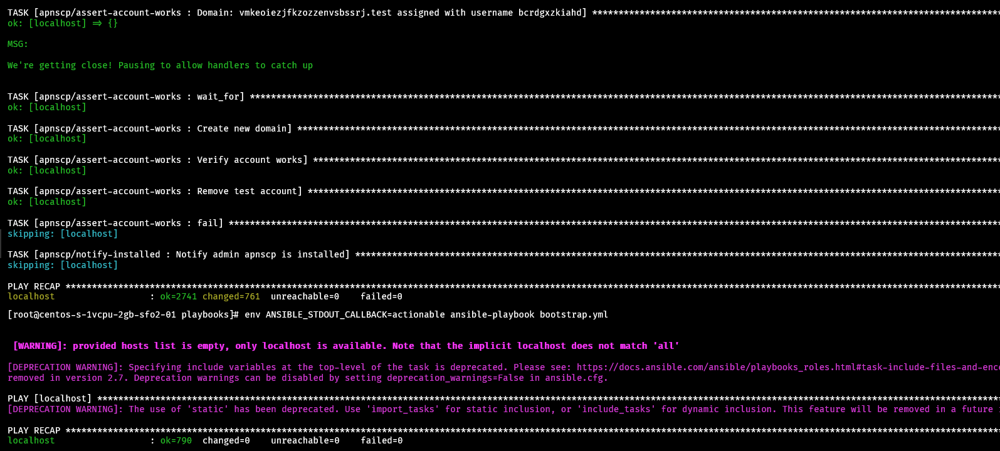

# Bootstrapper

Bootstrapper forms the platform management backbone of ApisCP. It's powered by [Ansible](https://ansible.com) instead of messy shell scripts prone to [maladies](https://mywiki.wooledge.org/BashPitfalls). Ansible is a declarative platform management software that encourages structured programming. Best of all, its operations are always idempotent when implemented correctly!

Idempotence is a quality that no matter how many times an operation is applied, the resultant won't change beyond its initial application. For example, if I have a light switch that should be ON and it is OFF, then I flip it ON through an ACTION; this completes the task. Revisiting the task while the light switch is ON will result in NO ACTION as the initial outcome - LIGHT SWITCH ON - has been completed. If I turn the switch OFF, however, then redo the task it will have changed from OFF to ON through the ACTION that is physically toggling its switch. If an ACTION is necessary to effect an outcome and an action *alters* the state, we can model it as:

```
LIGHT SWITCH OFF -> -> LIGHT SWITCH ON
LIGHT SWITCH ON -> -> LIGHT SWITCH ON
```

We're interested in only performing the ACTION when necessary and reporting whenever such an ACTION is performed. NO ACTION? No problem!

Bootstrapper provides platform consistency checks as well as installation tasks using the same process. Consistency checks simply reapply installation to a platform to reconcile any configuration drifts that may occur during normal operation. Once ApisCP is present on a server, there is never a reason to uninstall/reinstall the platform as Bootstrapper will correct any configuration drifts that render a platform inoperable.

## Usage

Bootstrapper may be invoked from a functional install using [upcp](../UPGRADING.md).

```bash
upcp -sb
```

A repeated invocation will apply the same tasks only reporting items that have changed since last invocation. 



Alternatively, the long form may be used as well which reports all checks not just changes.

```bash
cd /usr/local/apnscp/resources/playbooks
ansible-playbook bootstrap.yml
```

::: tip
upcp -sb skips panel updates (-s) and invokes Bootstrapper (-b). This is the quickest way to run parts of Bootstrapper. [Scopes](Scopes.md) provide guided entrypoints into Bootstrapper. If a Scope exists to manage a server, then use that first. See [Scopes index](Scopes-list.md) for a list of all available Scopes. 
:::

Components of Bootstrapper may be provided as additional arguments. For example, to scrub Postfix configuration as well as rspamd and SpamAssassin,

```bash
upcp -sb mail/configure-postfix mail/rspamd mail/spamassassin
```

[bootstrap.yml](https://gitlab.com/apisnetworks/apnscp/-/blob/master/resources/playbooks/bootstrap.yml) provides a list of all available Bootstrapper stages.

### Output callbacks

To view only tasks that have changed, specify actionable as your callback plugin either in ansible.cfg or ANSIBLE_STDOUT_CALLBACK. It's easy from the command-line: `env ANSIBLE_STDOUT_CALLBACK=actionable ansible-playbook bootstrap.yml`. Callbacks are provided in [Ansible's documentation](https://docs.ansible.com/ansible/latest/plugins/callback.html). For example, the "profile_roles" callback may be used to evaluate role performance.

## Configuration

[Scopes](Scopes.md) are the preferred method of managing system administration, which provide additional checks beyond modifying a variable to ensure ApisCP will be in a consistent state after Bootstrapper completes. Bootstrapper may also be modified manually by hand or through the *cp.bootstrapper* Scope.

```bash
# Get a list of all changed configuration 
cpcmd scope:get cp.bootstrapper
# Get a list of default configuration + changed variables for a tag
env YAML_INLINE=4 cpcmd scope:get cp.bootstrapper mail/rspamd
```

::: tip
`YAML_INLINE` controls folding characteristics of cpcmd. To ease readability, increase the nested depth from the default 2 to a larger value.
:::

To make changes to a particular variable, for example to put the panel into headless mode which disables panel access, an excellent mode for security.

```bash
cpcmd scope:set cp.bootstrapper panel_headless true
upcp -sb
```

::: tip
Using a Scope is much faster. `cpcmd scope:set cp.headless true` is the equivalent command, which runs a reduced set of commands in the background.
:::

## Advanced configuration
Bootstrapper allows passing off variables to determine how a set of tasks (called "roles") will respond. The primary usage is with installing [PHP](PHP-FPM.md) modules, which allows the platform to step through resolving, compilation, and installation in a coherent, fail-safe process.

```bash
cd /usr/local/apnscp
ansible-playbook --tags=php/install-pecl-module --extra-vars 'pecl_extensions="igbinary"' bootstrap.yml
# Alternatively, more complex
ansible-playbook --tags=php/install-pecl-module --extra-vars 'pecl_extensions=["mailparse","https://github.com/php-memcached-dev/php-memcached.git","https://pecl.php.net/get/inotify-2.0.0.tgz"]' bootstrap.yml
```

## Injecting hooks
ApisCP provides a few hooks during bootstrapping:

- `custom/preflight`: before running any play
- `custom/bootstrapped`: after admin account is created, before filesystem template populated
- `custom/validate-account`: before setting up an account with AddDomain
installed: she's done!
- `custom/installed`: panel installed

## Migrating changes
Copying `/root/apnscp-vars-runtime.yml` and `/root/apnscp-vars.yml` to a new server will provide identical server configuration. A lookover is recommended as node-specific configuration may be copied over in the process.

## See also
- [Ansible for DevOps](https://www.ansiblefordevops.com/) - excellent book on understanding Ansible
- [Ansible documentation](https://docs.ansible.com/)
- [r/ansible](https://reddit.com/r/ansible) - community help
