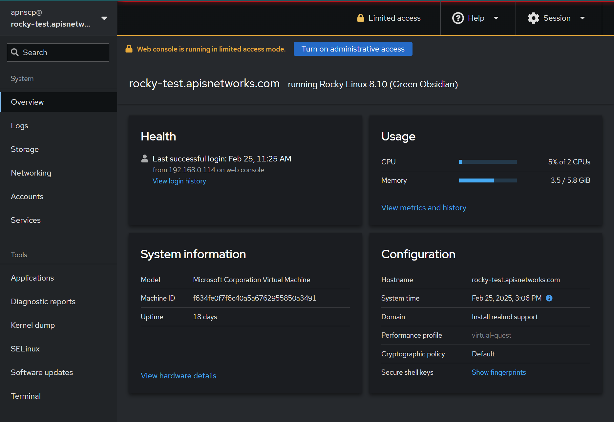

**New in 3.2.46**
[Cockpit](https://cockpit-project.org/) is a standalone UI to facilitate system management on any Linux distro. ApisCP includes Cockpit integration on AlmaLinux/Rocky Linux 8+ installs.



## Enabling Cockpit

[TOTP](../SECURITY.md#totp) is mandatory for this feature. A [Scope](Scopes.md) is provided to toggle within the `cockpit` namespace. SSO may be enabled with `cockpit.sso` Scope.

Login when SSO is disabled utilizes the password for user `root`. When SSO is enabled, a limited role is created named `cockpit-user`. This user may only login from local sources and its password is the same password used to login to the panel (*NB: this may not be the same as the password for user `root`*).

```bash 
# Login/password is root/<ROOT PASSWORD>
cpcmd scope:set cockpit.enabled true

# Enable SSO
# Password to elevate "limited access mode" is panel password
cpcmd scope:set cockpit.sso true
```

SSO user may be override by changing `cockpit_sso_user` within `cp.bootstrapper` Scope, then running `software/cockpit` role. In multi-admin setups, this password will match the first user, which is decided at install.

```bash
cpcmd scope:set cp.bootstrapper cockpit_sso_user somenewuser
upcp -sb software/cockpit
```

