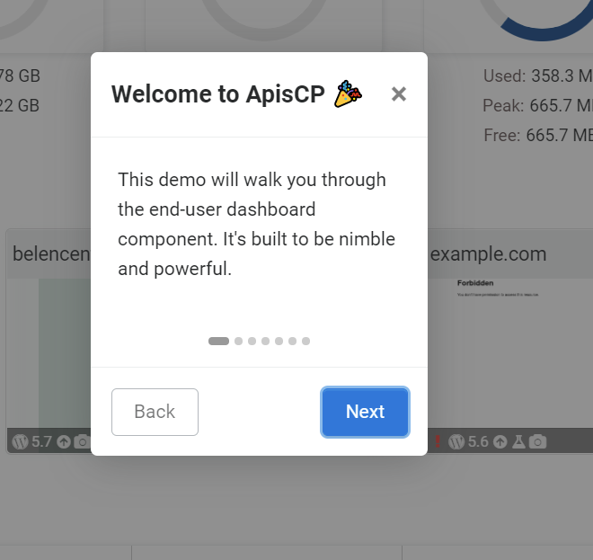

ApisCP provides a variety of means to customize your environment. Each service is different and the means to configure it varies. Many services have files that are verboten, don't touch under any circumstance. They are periodically overwritten and the primary means to ensure what you run is what is developed. 

[CP_ROOT](../DEBUGGING.md#log-locations) is the panel home, typically either /usr/local/apnscp or /usr/local/apiscp.

## Apache

**⚠️ DO NOT TOUCH**: /etc/httpd/conf/httpd.conf  
**Customization file**: /etc/httpd/conf/httpd-custom.conf  

Additionally, module configuration may be inserted in `/etc/httpd/conf.d` to load or modify existing modules. Per-site configuration is located in `/etc/httpd/conf/siteXX` or `/etc/httpd/conf/siteXX.ssl` for SSL-specific context. By convention customizations are placed in a file named `custom` in these directories. To get the site ID of a domain use the [helper](CLI.md#get-site-id) command, `get_site_id`.

After making changes, `htrebuild` will compile Apache's modular configuration followed by `systemctl reload httpd` to reload the web server.

### Placeholder page
A placeholder page is created whenever an account, addon domain, or subdomain is created. Placeholders are always named "index.html" and reside in the respective [document root](https://kb.apnscp.com/web-content/where-is-site-content-served-from/). Content is generated from a Blade file, which allows for customization prior to rendering of the placeholder.

Copy `/usr/local/apnscp/resources/templates/apache/placeholder.blade.php` to `/usr/local/apnscp/config/custom/resources/templates/apache/placeholder.blade.php` creating parent directories as needed. index.html may not be updated once written.

### Suspension page
All suspended accounts via [SuspendDomain](Plans#suspenddomain) redirect to `/var/www/html/suspended.html`. A suspension page is not provided by default in ApisCP but may be created by the admin. Suspension rules may be modified by adjusting the rewrite rules.

Copy `/usr/local/apnscp/resources/templates/apache/suspend-rules.blade.php` to `/usr/local/apnscp/config/custom/resources/templates/apache/suspend-rules.blade.php` creating parent directories as needed.

A site once suspended will compile these rules into `/etc/httpd/conf/siteXX/00-suspend`. Rules will not be updated unless suspended again. `admin:collect()` provides a convenient way to do this.

```bash
yum install -y jq
cpcmd -o json admin:collect '[]' '[active:false]' | jq -r 'keys[]' | while read -r SITE ; do SuspendDomain $SITE ; done
```
### Evasive
**⚠️ DO NOT TOUCH**: n/aa  
**Customization file**: /etc/httpd/conf.d/evasive.conf or httpd-custom.conf

Alternatively consider the apache.evasive [Scope](Scopes.md), which provides error checking.

### mod_security
**⚠️ DO NOT TOUCH**: /etc/httpd/conf.d/mod_security.conf  
**⚠️ DO NOT TOUCH**: /etc/httpd/modsecurity.d/activated_rules/clamav.conf  
**Customization file**: /etc/httpd/modsecurity.d/ or httpd-custom.conf

### PageSpeed
**⚠️ DO NOT TOUCH**: /etc/httpd/conf.d/pagespeed.conf MANAGED BLOCK (#BEGIN/#END)  
**Customization file**: /etc/httpd/conf.d/pagespeed.conf or httpd-custom.conf

## ApisCP

**⚠️ DO NOT TOUCH:** /usr/local/apnscp/config/*  
**Customization file:** /usr/local/apnscp/config/custom/*  

ApisCP supports overriding views, apps, modules, and configuration. Modification is covered in detail in [PROGRAMMING.md](../PROGRAMMING.md).

::: tip
ApisCP was originally called APNSCP. Internally, in many places, the panel is still referred to as APNSCP. ApisCP is a bit easier to pronounce.
:::

### View overrides

All views may be copied into `CP_ROOT/config/custom/resources/views/<path>` from `CP_ROOT/config/custom/resources/views/<path>`. Custom views take precedence, including all mail templates. Overriding `layout.blade.php` allows customization to the skeleton of all apps in ApisCP.

::: warning Updating configuration first time
ApisCP compiles configuration on each start to provide the best possible performance. When creating resource overrides in `CP_ROOT/config/custom/resources/view` or `CP_ROOT/config/custom/resources/templates` the first time restart ApisCP so it knows to look in these directories. Prior to making this change, these locations are compiled out on boot.

`systemctl restart apiscp`
:::

#### Layout

A master layout named "layout" is provided in `CP_ROOT/config/custom/resources/views/`. As with all templates suffixed "blade.php", it utilizes [Blade](https://laravel.com/docs/5.6/blade). A theme-specific blade may override the master layout by creating an eponymous template in `CP_ROOT/config/custom/resources/views/`. For example, to override the "apnscp" theme, create a file named `CP_ROOT/config/custom/resources/views/apnscp.blade.php`. Inheritance is supported via `@extends("layout")` in addition to section injection.

### App overrides

Apps may be completely overridden or on a file-per-file basis (such as replacing `application.yml`). 

To override the app entirely, copy it from `CP_ROOT/apps/<name>` to `CP_ROOT/config/custom/apps/<name>`.  To override a specific file, create the corresponding directory structure in `CP_ROOT/config/custom/apps/<name>`, then copy the file over.

Role menus, i.e.  what is loaded when a corresponding user type logs in (admin, site, user) may be overridden as well. Menus are based on code under `lib/html/templateconfig-<role>.php`. Additional includes may be located under `CP_ROOT/config/custom/templates/<role>.php`. This is a sample extension for ApisCP when a billing module is configured to allow clients direct access to manage billing:

`CP_ROOT/config/custom/templates/site.php`:

```php
<?php

$templateClass->create_link(
        'Billing History',          /* application title */
        '/apps/billinghistory',     /* application URL */
        cmd('billing_configured'),  /* conditions to show application */
        null,                       /* optional application icon */
        'account'                   /* optional category name */
);

$templateClass->create_link(
        'Change Billing',
        '/apps/changebilling',
        cmd('billing_configured'),
        null,
        'account'
);

$templateClass->create_link(
        'Client Referrals',
        '/apps/referrals',
        cmd('billing_configured'),
        null,
        'account'
);
```

### Onboarding tours

**New in 3.2.22**



Users may be introduced to a brief demo on the first app view or on demand when `\Page_Renderer::show_tutorial();` is called (see `CP_ROOT/config/custom/apps/template/template.php` for sample invocation). Steps are loaded from `application.yml` bundled in `CP_ROOT/config/custom/apps/APP NAME/`. As with all application data, this file may be individually overridden by copying `apps/APP NAME/application.yml` to `CP_ROOT/config/custom/apps/APP NAME/application.yml`. 

`application.yml` does not support inheritance; thus, the overrode file is what is used for application metadata. Parsed metadata remains cached for 24 hours unless the panel is in [debug mode](../DEBUGGING.md#debugging).

```yaml
# Sample tour data from dashboard/application.yml
tour:
  - title: "Welcome to {{ PANEL_BRAND }} 🎉"
    content: "This demo will walk you through the end-user dashboard component. It's built to be nimble and powerful."
  - selector: '.usage-gauges > div'
    title: "Resource usage"
    content: "A variety of metrics relating to resource consumption lets you know how much you've used."
  - selector: '#cpu-gauge'
    title: "CPU usage"
    content: "CPU resets every 24 hours measuring both system and user time."
    when: "{{ !\\UCard::get()->is('admin') }}"
  - selector: "#rampartMarker"
    title: "Firewall"
    content: >-
      Firewall stats are available within the dashboard. See <a class='ui-action-label ui-action-visit-site-tab ui-action'
      target='apiscp-docs' href='https://docs.apiscp.com/FIREWALL'>FIREWALL.md</a> for advanced usage.
    when: "{{ \\UCard::get()->is('admin') }}"
```

`tour` contains all onboarding steps. Each step may optionally present a `title` field that sets the modal title, an optional `selector` highlights callouts. `content` is required. `when` must evaluate to a truthy condition (1, "1", "true", true, "non-empty string") to display. All fields support Blade templating.

::: warning Evaluation at page load
Onboarding binds to the DOM at page load. Any elements replaced after page load will not receive callout treatment.
:::

#### Hiding/removing existing apps

Apps populated as part of ApisCP may be hidden or removed from view using `hide()` and `remove()` respectively. Application ID is the basename from the URI path, i.e. for /apps/foo the application ID is "foo" and likewise "quuz" is the application ID for /apps/quuz.

`CP_ROOT/config/custom/templates/admin.php`:

```php
<?php
    // remove Nexus app from admin
    $templateClass->getApplicationFromId('nexus')->remove();
    // allow Dashboard access, but remove from side menu
    $templateClass->getApplicationFromId('dashboard')->hide();
    // remove "foo" app. Note if this does not exist it is a no-op
    $templateClass->getApplicationFromId('foo')->hide();
    // alternatively to check if "foo" exists
    if ($templateClass->getApplicationFromId('foo')->exists()) {
        // do something
    }
```

#### Menu reset
**New in 3.2.18**

When working with custom configurations, it may be desired to reset all menu items. `clear()` empties all menu and statistics.

```php
<?php
	$templateClass->clear();
	// Enable only the Dashboard
	$templateClass->create_link(
		'Dashboard',
		'/apps/dashboard',
		true,
		null,
		''
	);
```

::: warning Dashboard required
`/apps/dashboard` must be a valid URI in all menus as this serves as the default destination after login. This may be changed by modifying the [entry app](#changing-entry-app) below. Once changed, it's no longer necessary to include the "Dashboard" app.
:::

#### Plan-specific menu
**New in 3.2.18**

Per-plan menus may be used following the naming scheme `ROLE`-`PLAN`. For example, to use a custom menu layout for the plan "dns-only" that applies to Site Administrators, create the following file `CP_ROOT/config/custom/templates/site-dns-only.php`.  If found, this menu will be used instead of `CP_ROOT/custom/templates/site.php`.

Plan-specific menus behave otherwise the same as a custom menu. To clear all menu items use `clear()`.

```php
<?php
	$templateClass->clear();
	// create a DNS-only layout
	$templateClass->create_link(
		'Dashboard',
		'/apps/dashboard',
		true,
		null,
		''
	);
	$templateClass->create_link(
		'DNS Manager',
		'/apps/dns',
		true,
		null,
		''
	);
```

#### Changing entry app
**New in 3.2.28**

`setEntryApp()` allows you to change the entry app on successful login. By default, the value is `dashboard`, which corresponds to the Dashboard app accessed through /apps/dashboard.

```php
<?php
	$templateClass->clear();
	// create a pure DNS-only layout
	$templateClass->setEntryApp('dns');
	
	$templateClass->create_link(
		'DNS Manager',
		'/apps/dns',
		true,
		null,
		''
	);
```

### App view overrides

Any app that uses Blade templates (`views/` directory) is eligible to override components of the template structure. Create the same structure in `config/custom/apps/<name>` as is in `apps/<name>`. For example to override `CP_ROOT/config/custom/apps/ssl/views/partials/certificate-detected.blade.php`, copy that file to `CP_ROOT/config/custom/apps/ssl/views/partials/certificate-detected.blade.php`. ApisCP will load the view from this location first. It is advisable to copy the entire application over (*App overrides*) as application structure may change between releases.

#### Web App overrides
Web Apps use a different set of locations for overrides. An app may be overrode by cloning the [git repository](https://github.com/search?q=topic%3Awebapp+org%3Aapisnetworks&type=Repositories) into `CP_ROOT/config/custom/` (see README.md bundled with each Web App) or by copying the respective file into `CP_ROOT/config/custom/webapps/APP-NAME/views`. For example, to override the `options-install.blade.php` template bundled with WordPress, the path would be `CP_ROOT/config/custom/webapps/wordpress/views/options-install.blade.php`.

### Global constants

Constants may be overrode or added to global scope via `CP_ROOT/config/custom/constants.php`:

```php
<?php
        return [
                'BILLING_HOST_READ'   => $dbyaml['billing']['read']['host'],
                'BILLING_HOST_WRITE'  => $dbyaml['billing']['write']['host'],
                'BILLING_USER'        => $dbyaml['billing']['read']['user'],
                'BILLING_PASSWORD'    => $dbyaml['billing']['read']['password'],
                'BILLING_DB'          => $dbyaml['billing']['read']['database'],
                'BILLING_HOST_BACKUP' => $dbyaml['billing']['backup']['host'],
        ];
```

### DNS template overrides

DNS is generated from a base template in `CP_ROOT/config/custom/resources/templates/dns`. Presently mail and dns templates are supported. For each template to override copy the respective template to `CP_ROOT/config/custom/resources/templates/dns/`. Validate DNS template consistency via `cpcmd dns:validate-template TEMPLATENAME`.

### Themes

New themes may be created and placed under `CP_ROOT/public/css/themes` and `CP_ROOT/public/images/themes`. The default theme may be changed with `cpcmd`:

```bash
cpcmd scope:set cp.config style theme newtheme
```

Per theme layouts may be set following the [layout](#layout) override mentioned above.

#### Building themes

Grunt is used to build themes from the [SDK](https://github.com/apisnetworks/apnscp-bootstrap-sdk). Some [Sass](https://sass-lang.com/) knowledge is recommended. [Bootstrap](https://getbootstrap.com/docs/4.0/getting-started/introduction/) is also helpful to know but simple enough to learn as you go along. ApisCP is presently based on Bootstrap 4.0.

```bash
git clone https://github.com/apisnetworks/apnscp-bootstrap-sdk
pushd apnscp-bootstrap-sdk
npm install
env THEME=apnscp grunt watch
```
Now changes may be made to the "apnscp" theme in `scss/themes/apnscp`. It will also be necessary to put either the panel in debug mode using the *cp.debug* scope or by flagging the session as debug. Session is encoded in the browser session as `session.id`. Use this value with misc:debug-session to selectively enable debugging for this session:

```bash
# Enable debugging on session LETceXuAZ9p1MW0yPd7n1b3Btk9t9Weh
env DEBUG=1 misc:debug-session LETceXuAZ9p1MW0yPd7n1b3Btk9t9Weh
```
It's recommended to create a new theme by copying one of the existing themes. Default theme may be changed using `cpcmd scope:set cp.config style theme NEWTHEME`. Likewise run `env THEME=NEWTHEME grunt` to build a minified release of the theme prior to shipment. Debug sessions source non-minified assets.

### ApisCP configuration

All configuration must be made to `CP_ROOT/config/custom/config.ini`. [cpcmd](CLI.md#cpcmd) provides a short-hand tool to edit this file.

```bash
# Show all configuration
cpcmd scope:get cp.config
# Set configuration
cpcmd scope:set cp.config core fast_init true
```

Refer to [config.ini](https://gitlab.com/apisnetworks/apnscp/blob/master/config/config.ini) that ships with ApisCP for a list of configurables.

### HTTP configuration

All changes may be made to `CP_ROOT/config/httpd-custom.conf`. After changing, restart ApisCP, `systemctl restart apiscp`

## ClamAV

**⚠️ DO NOT TOUCH:** /etc/clamd.conf, /etc/clamd.d/scan.conf MANAGED BLOCK (#BEGIN/#END)  
**Customization file:** /etc/clamd.d/scan.conf

In addition to writing directly to the configuration file, several configurations support custom blocks. All custom variables are named `clamav_VAR__custom` where *VAR*  corresponds to the following variables.

| Variable                  | Overrides                                              |
| ------------------------- | ------------------------------------------------------ |
| clamd_config              | /etc/clamd.d/scan.conf                                 |
| clamd_daemon_systemd      | /etc/systemd/system/clamd@scan.service.d/override.conf |
| clamd_exclude_path        | "ExcludePath" directive in /etc/clamd.d/scan.conf      |
| db_update_command_options | Additional argv to freshclam command                   |
| freshclam_config          | /etc/freshclam.conf                                    |
| scan_command_options      | Addtional argv to clamdscan command                    |

For example, to disable `ConcurrentDatabaseReload` in clamd:

```bash
cpcmd scope:set cp.bootstrapper clamav_clamd_config__custom "ConcurrentDatabaseReload yes"
# Update ClamAV
upcp -sb clamav/setup
```

*Note* each directive must be delimited by a newline. One trick to do this is use `echo -e` to evaluate metacharacters, including the newline character \n.

```bash
cpcmd scope:set cp.bootstrapper clamav_clamd_config__custom "$(echo -e "ConcurrentDatabaseReload yes\nDirective2 yes")"
```

## Dovecot

**⚠️ DO NOT TOUCH:** /etc/dovecot/conf.d/apnscp.conf  
**Customization file:** /etc/dovecot/local.conf  

A few conflicting files in /etc/dovecot/conf.d are wiped as part of [Bootstrapper](https://github.com/apisnetworks/apnscp-playbooks/blob/master/roles/mail/configure-dovecot/defaults/main.yml#L9). These files will always be removed if found:

- 10-auth.conf
- 10-mail.conf

## fail2ban

**⚠️ DO NOT TOUCH:** /etc/fail2ban/\*.conf   
**Customization file:** /etc/fail2ban/\*.local, /etc/fail2ban/jail.d

Any file in fail2ban may be overridden with a corresponding `.local` file. It takes the same name as the source file, except it ends in `.local` instead of `.conf`.

*See also*
- [MANUAL 0.8](https://www.fail2ban.org/wiki/index.php/MANUAL_0_8#Configuration) (fail2ban.org) - covers configuration/override in detail

## haproxy

**⚠️ DO NOT TOUCH:** /etc/haproxy/haproxy.cfg  
**Customization file:** /etc/haproxy/conf.d/*  

## MySQL

**⚠️ DO NOT TOUCH:** /etc/my.cnf.d/apnscp.conf  
**Customization file:** /etc/my.cnf.d/*  

Additionally, configuration may be overrode in Bootstrapper using `mysql_custom_config`. These values are set in `/etc/my.cnf.d/apnscp.cnf` and may be substituted in lieu of a higher order override.

Create a special variable named `mysql_custom_config` in `/root/apnscp-vars-runtime.yml`. This is a dict that accepts any number of MySQL server directives that takes precedence.

**Sample**

```yaml
mysql_custom_config:
  # Disable max_join_size protection
  max_join_size: -1
```

Then run `upcp -sb mysql/install` to update configuration.

## phpMyAdmin

**⚠️ DO NOT TOUCH:** /var/www/html/phpMyAdmin/config.inc.php  
**Customization file:** /var/www/html/phpMyAdmin/config.local.inc.php    

Create this customization file if it does not already exist.

```php
<?php
    // set custom configuration here
?>
```

## Postfix

**⚠️ DO NOT TOUCH:** /etc/postfix/master.conf  
**Customization file:** /etc/postfix/main.cf, /etc/postfix/master.d, `postfix_custom_config` var

Postfix does not provide a robust interface to extend its configuration. /etc/postfix/master.cf, which is the service definition for Postfix, may not be updated as it is replaced with [package updates](https://github.com/apisnetworks/postfix).

Pay special adherence to [configuration variables](https://github.com/apisnetworks/apnscp-playbooks/blob/master/roles/mail/configure-postfix/vars/main.yml) in Bootstrapper. These are always overwritten during integrity check. To override these variables, create a special variable named `postfix_custom_config` in `/root/apnscp-vars-runtime.yml`. This is a dict that accepts any number of Postfix directives that takes precedence.

**Sample**

```yaml
postfix_custom_config:
  disable_vrfy_command: no
  vmaildrop_destination_rate_delay: 15
```

`postfix_custom_master_config` works similarly to `postfix_custom_config` except it is a string applied to /etc/postfix/master.cf. Additionally, per-site configurations, such as transports, may be added in `/etc/postfix/master.d`. Configuration **must end** in *.cf*. Any file prefixed with *siteXX-* is considered affiliated with the designated site and **will be removed** on site deletion. 

Do not assume these templates will be capable of Jinja templating in Ansible. Instead, the template must be statically generated at account creation/edit.

**Sample**

```
# Add SPF checking service, note this is for illustrative purposes and
# largely obviated by SpamAssassin and rspamd spam filters
postfix_custom_master_config: |-
  policyd-spf  unix  -       n       n       -       0       spawn
  	user=policyd-spf argv=/usr/bin/policyd-spf
```

**Sample**

```
# In /etc/postfix/master.d/site12.cf
# Add a custom smtp transport
mydomain.com-out unix  -       -       n       -       -       smtp
        -o smtp_helo_name=mydomain.com
        -o smtp_bind_address=64.22.68.2
```

Then to merge changes for both examples, run `upcp -sb mail/configure-postfix`.

## PostgreSQL

**⚠️ DO NOT TOUCH:** *n/a*  
**Customization file:** /var/lib/pgsql/\<ver number>/conf/postgresql.auto.conf, `pgsql_custom_config` var

[Configuration variables](https://github.com/apisnetworks/apnscp-playbooks/blob/master/roles/pgsql/install/defaults/main.yml) in Bootstrapper allow for overrides in postgresql.conf. To override these variables, create a special variable named `pgsql_custom_config` in `/root/apnscp-vars-runtime.yml`. This is a dictionary that accepts any number of PostgreSQL directives that takes precedence.

**Sample**

```yaml
pgsql_custom_config:
  max_connections: 100
  track_io_timing: on
```

Run `upcp -sb pgsql/install` after setting overrides to apply to postgresql.conf.

[postgresql.auto.conf](https://www.postgresql.org/docs/current/config-setting.html) is modified by SQL queries such as `SET max_connections TO 100;`. Values within here take precedence over postgresql.conf directives and will not be overridden by Bootstrapper.

## PHP

**⚠️ DO NOT TOUCH:** /etc/php.ini MANAGED BLOCK (*# BEGIN/# END*)  
**Customization file:** /etc/phpXX.d/*  

ApisCP uses a managed block in /etc/php.ini. Any directives within this block will always be overwritten. To override any values within this block, make changes in /etc/phpXX.d/ where XX is the version major/minor of PHP. Note this affects global PHP settings. To change settings per site look into [php_value](https://kb.apiscp.com/php/changing-php-settings/) in either `.htaccess` or `siteXX/custom` mentioned above in Apache.

## rspamd

**⚠️ DO NOT TOUCH:** /etc/rspamd/local.d/*  
**Customization file:** /etc/rspamd/override.d/*  

For each file in local.d to override create a corresponding file in `override.d/`. This follows either [UCL](https://www.rspamd.com/doc/configuration/ucl.html) or JSON. When working with JSON, drop the leading + closing braces ("{", "}"). This is due to a parsing quirk of rspamd. An [example](https://github.com/apisnetworks/apnscp-playbooks/blob/d65ec74546f85eedec016684316c577975746e1f/roles/mail/rspamd/tasks/set-rspamd-configuration.yml#L29-L36) of reconstituting to valid JSON is available in the Github repository.

Additionally rspamd Playbook variables may be overrode in a similar manner to Postfix. In `/root/apnscp-vars.yml` add:

```yaml
rspamd_neural_custom_config:
  enabled: false
rspamd_actions_custom_config:
  add_header: 20
```

rspamd provides many configurables that don't require a direct override. Neural module for example is also conditionally enabled using `rspamd_enable_neural_training`. Be sure to refer back to [defaults](https://github.com/apisnetworks/apnscp-playbooks/blob/master/roles/mail/rspamd/defaults/main.yml) in mail/rspamd.

## SpamAssassin

**⚠️ DO NOT TOUCH:** *n/a*  
**Customization file:** /etc/mail/spamassassin/local.cf  

## SSH

**⚠️ DO NOT TOUCH:**  /etc/ssh/sshd_config MANAGED BLOCK (*# BEGIN/# END*)  
**Customization file:** /etc/ssh/sshd_config  

`sshd_config` may be modified. Do not edit the directives within `# BEGIN ApisCP MANAGED BLOCK` and `# END ApisCP MANAGED BLOCK`. Port and public key authentication may be modified with [Scopes](Scopes.md),

```bash
# Enable ssh daemon ports 22 and 58712
cpcmd config:set system.sshd-port '[58712,22]'
# Disallow password-based logins, public key only
cpcmd config:set system.sshd-pubkey-only true
```

