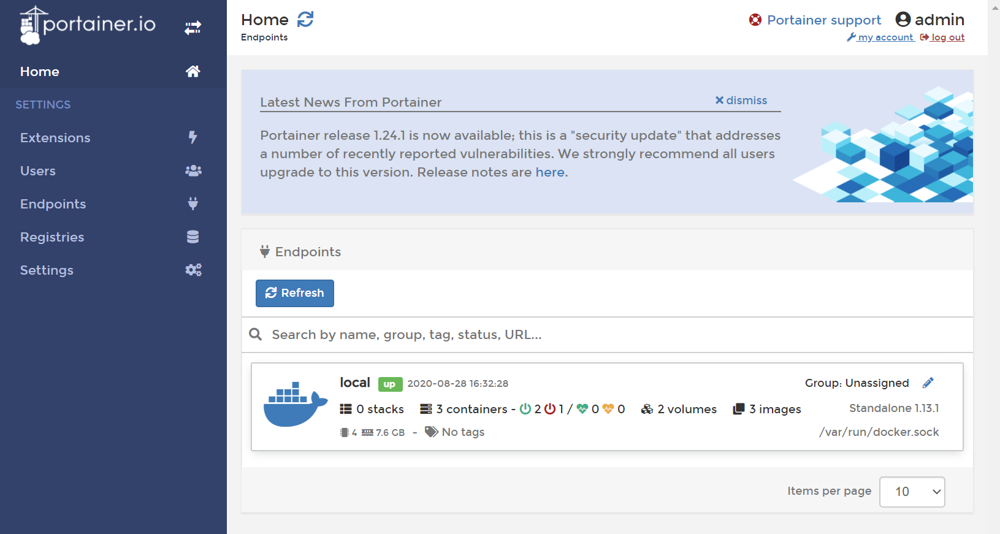

# Docker

ApisCP does not yet provide direct support for Docker, but it's easy to integrate into ApisCP. 

## Installation

::: warning Unsafe for multi-tenant operations
The instructions contained herein assume you are the only person managing accounts on this server. 
:::

### CentOS 7
Install the `docker` package using `yum`, then replicate it into the [filesystem template](Filesystem.md#filesystem-template).

```bash
yum install -y docker
/usr/local/apnscp/bin/scripts/yum-post.php install -d docker siteinfo
mkdir -p /home/virtual/FILESYSTEMTEMPLATE/siteinfo/etc/sysconfig
cp -dp /etc/sysconfig/docker /home/virtual/FILESYSTEMTEMPLATE/siteinfo/etc/sysconfig/
systemctl reload fsmount
```

Files in `/etc/sysconfig` are typically skipped during filesystem replication. Populate this file to avoid any complications during initialization.

::: warning CentOS 7 rhsm hotfix
Broken package dependencies create a circular link in CentOS 7 for RedHat's subscription manager, required by Docker. Remove the dangling link, then download the CA/intermediate certs directly from RedHat ([CentOS #14785](https://bugs.centos.org/view.php?id=14785)):

```bash
rm -f /etc/rhsm/ca/redhat-uep.pem
openssl s_client -showcerts -servername registry.access.redhat.com -connect registry.access.redhat.com:443 </dev/null 2>/dev/null | openssl x509 -text > /etc/rhsm/ca/redhat-uep.pem
cp -fpldR /etc/rhsm /home/virtual/FILESYSTEMTEMPLATE/siteinfo/etc/
```
:::

### CentOS 8/Stream

`docker-ce` package replaces `docker` in CentOS 8. CentOS 8 replaces Docker with [Podman](https://developers.redhat.com/blog/2020/11/19/transitioning-from-docker-to-podman/) as a noteworthy alternative. To run Docker on a CentOS 8+ platform, Cockpit must be removed as well as an additional repository added that contains `docker-ce` and dependencies.

```bash
dnf config-manager --add-repo https://download.docker.com/linux/centos/docker-ce.repo
dnf install -y --allowerasing docker-ce
/usr/local/apnscp/bin/scripts/yum-post.php install -d docker-ce siteinfo
systemctl reload fsmount
```

Docker's default configuration inhibits listening in other locations. It will be overrode with a custom systemd service definition that omits `-H fd://` (see [#22339](https://github.com/moby/moby/issues/22339), [#21559](https://github.com/moby/moby/issues/21559), [#25471](https://github.com/moby/moby/issues/25471), [PR#27473](https://github.com/moby/moby/pull/27473)). 

```bash
mkdir -p /etc/systemd/system/docker.service.d
cat << EOF > /etc/systemd/system/docker.service.d/override.conf
[Service]
# This clears any ExecStart= inherited from docker.service
ExecStart=
ExecStart=/usr/bin/dockerd --containerd=/run/containerd/containerd.sock
EOF
systemctl daemon-reload
```

### Final setup

Add a group named `docker`. This group will be used to authorize any user to use the Docker service. We'll come back to this later, adding the group for each site that will have Docker access.

```bash
groupadd --system docker 2> /dev/null
```

Reconfigure Docker to expose its Unix socket to an accessible location within the filesystem template.

```bash
systemctl enable --now docker
echo -e '{\n\t"hosts": ["unix:///var/run/docker.sock", "unix:///.socket/docker.sock"],\n\t"group": "docker"\n}' > /etc/docker/daemon.json
systemctl restart docker
ln -s  /.socket/docker.sock /home/virtual/FILESYSTEMTEMPLATE/siteinfo/var/run/docker.sock
systemctl reload fsmount
```

## Authorizing Docker usage per site
For each site to enable Docker, create the group then add the Site Administrator (or any sub-user) to the `docker` group.

Assume we're adding the Site Administrator for apiscp.com to use Docker. `get_config`, a [CLI helper](CLI.md#get-config), will help lookup the Site Administrator (`admin_user` field) for a given site.

```bash
chroot /home/virtual/apiscp.com/ groupadd --system -g "$(getent group docker | cut -d: -f3)" docker
chroot /home/virtual/apiscp.com/ usermod -G docker -a "$(get_config apiscp.com siteinfo admin_user)"
# Switch to the Site Admin for apiscp.com
su apiscp.com
# Confirm the user is part of "docker" group
id
# Sample response:
# uid=9999(myadmin) gid=1000(myadmin) groups=1000(myadmin),10(wheel),978(docker)
```

## First container

For a hypothetical first run app, [Apache Zeppelin](https://zeppelin.apache.org/docs/0.7.0/install/docker.html) is used as it's what initiated this document.

Create a subdomain or addon domain. Inside the [document root](https://kb.apnscp.com/web-content/where-is-site-content-served-from/) add a [.htaccess](https://kb.apnscp.com/guides/htaccess-guide/) file that will proxy all requests to the container.

For example, if the port argument is `--port 8082:8080` then externally, 8082 is being forwarded internally to the Docker container expecting traffic on 8080. Knowing this, prepare the .htaccess file:

```
DirectoryIndex disabled

RewriteEngine On
RewriteCond %{HTTP:Connection} =upgrade [NC]
RewriteCond %{HTTP:Upgrade} =websocket [NC]
RewriteRule ^(.*)$ ws://localhost:8082/$1 [L,QSA,P]
RewriteRule ^(.*)$ http://localhost:8082/$1 [L,QSA,P]
```

::: tip Websocket disabled by default
Enable Websocket support by loading the [wstunnel](https://httpd.apache.org/docs/2.4/mod/mod_proxy_wstunnel.html) module. Not every application utilizes Websockets, so check with your vendor documentation. Zeppelin requires Websocket for use.

Add `LoadModule proxy_wstunnel_module modules/mod_proxy_wstunnel.so` to `/etc/httpd/conf/httpd-custom.conf`, then run `htrebuild` to activate configuration changes.
:::

::: tip Disabling index negotiation
Apache will try multiple files to determine which file to serve when no file is explicitly provided in the request URI. Disabling an index ensures this request - without a filename - is passed directly to your Docker instance for resolution.
:::

Run Zeppelin, and you're done!

```bash
docker run -d  -p 8082:8080 --name zeppelin apache/zeppelin:0.9.0 
```

To list active containers, run `docker container list`. To stop a container, run `docker stop CONTAINER-ID`. Adding `--rm` to the task creates a [volatile container](https://docs.docker.com/engine/reference/run/#clean-up---rm), which will remove created data on exit.

This task may be added to boot on startup using the `@reboot` token in crond:

```bash
crontab -e
# Next add the following line
@reboot docker run -d  -p 8082:8080 --name zeppelin apache/zeppelin:0.9.0 
```

## Container management

[Portainer](https://portainer.io) is a tool made for managing a collection of Docker containers. Given the sensitive nature of sending credentials across the wire, this subdomain (*portainer.apiscp.com*) will require HTTPS and set an HTTP strict transport security header to ensure future connections use SSL.



First create the persistent volume store, then run it.

```bash
docker volume create portainer_data
docker run -d -p 8000:8000 -p 9000:9000 --name=portainer --restart=always -v /var/run/docker.sock:/var/run/docker.sock -v portainer_data:/data portainer/portainer
```

Lastly, connect it using Apache to the backend container.

```
DirectoryIndex disabled

RequestHeader set X-Forwarded-Proto "https"
Header always set Strict-Transport-Security "max-age=63072000;"

RewriteEngine On
RewriteCond %{HTTPS} !=on
RewriteRule ^(.*)$ https://%{HTTP_HOST}/$1 [R,L]

RewriteCond %{HTTP:Connection} =upgrade [NC]
RewriteCond %{HTTP:Upgrade} =websocket [NC]
RewriteRule ^(.*)$ ws://localhost:9000/$1 [L,QSA,P]
RewriteRule ^(.*)$ http://localhost:9000/$1 [L,QSA,P]
```

That's all there is!

## Security

This current implementation of Docker **is not suitable in a multi-administrator environment**. Users within other domains may see and manage Docker containers. There are plans to implement RBAC and bring Docker as a permanent fixture to ApisCP, but for now **only one authorized user may use Docker on a server**.

If the same group treatment is applied to another domain, for instance, that user also has visibility of the Docker containers:

```bash
chroot /home/virtual/apisnetworks.com/ groupadd --system -g "$(getent group docker | cut -d: -f3)" docker
chroot /home/virtual/apisnetworks.com/ usermod -G docker -a "$(get_config apisnetworks.com siteinfo admin_user)"
su apisnetworks.com
docker container ls
# CONTAINER ID        IMAGE                   COMMAND                  CREATED             STATUS              PORTS                                            NAMES
# 13d1ed48ff42        portainer/portainer     "/portainer"             8 hours ago         Up 8 hours          0.0.0.0:8000->8000/tcp, 0.0.0.0:9000->9000/tcp   portainer
# f1a5e11a3cc9        apache/zeppelin:0.9.0   "/usr/bin/tini -- ..."   9 hours ago         Up 9 hours          0.0.0.0:8082->8080/tcp                           zeppelin
```

Secondly, in the above examples, Docker privileges are bestowed to the Site Administrator of an account via `usermod`. In normal configuration, PHP-FPM runs as a separate, unprivileged user (`apache`). This feature may be changed by editing the service parameter `apache`,`webuser` to match the Site Administrator. In such configurations, an exploit in PHP would permit an attacker access to all `docker` commands.

**Never grant a PHP-FPM user Docker privileges. Never designate a Docker user as apache,webuser.**

```bash
# NEVER EVER DO THIS!
EditDomain -c apache,webuser="$(get_config apisnetworks.com siteinfo admin_user)" apisnetworks.com
chroot /home/virtual/apisnetworks.com/ usermod -G docker -a "$(get_config apisnetworks.com siteinfo admin_user)"
# ^^^ BZZZT. WRONG. ^^^
```
