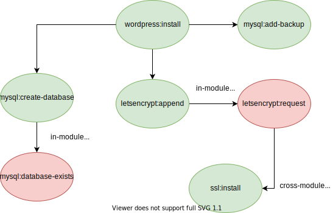

# Hooks

The hook subsystem provides a simple, passive interface to ApisCP without module extensions. Hooks come in two flavors, account and API. Account hooks are available for edit, create, delete, suspend, activate, import, and export operations. Unlike a module, a hook *cannot* interrupt flow.

## Account hooks

### Installation

Example hooks are provided in `bin/hooks` as part of the apnscp distribution. Active hooks are located in `config/custom/hooks`. All hooks follow a familiar interface, with the first argument the *site identifier*. Import and export hooks also include the target format as well as source/destination file respectively.

A hook is accepted if it has a ".php" or ".sh" extension. Any other matching hook is ignored.

```bash
cd /usr/local/apnscp
mkdir -p config/custom/hooks
cp bin/hooks/editDomain.php config/custom/hooks
# Create the domain
env DEBUG=1 VERBOSE=-1 AddDomain -c siteinfo,domain=hooktest.com -c siteinfo,admin_user=hooktest -c dns,enabled=0
```

`env DEBUG=1` enables opportunistic debugging, which generates additional information at runtime. `VERBOSE=-1` is a shorthand flag to enable backtraces for all levels of error reporting. Backtraces help identify the pathway a problem bubbles up. Refer to sample code in each hook for context strategies.

## API hooks

Programming is covered in detail in [PROGRAMMING.md](../PROGRAMMING.md). Hooks are simplified means of reacting to an API call in ApisCP. Unlike a surrogate, which extends a module's internals, an API hook is decoupled from implementation details and may only react to the return value (and arguments) of an API call. A hook cannot interrupt an API call nor is it always called for each invocation. A hook is called within the module context and thus has access to all private and protected properties and methods of the module class to which it binds therefore it **must not** be declared with the `static` modifier.

::: tip
*Hooks are only called if the method is the first call of the module API.* For tighter control, a surrogate is preferred, which is always called when the corresponding method is called.
:::

API hooks are declared in `config/custom/boot.php` as with other overrides. Hooks are intended to initialize early in the request lifecycle. Once a module is invoked, associated callbacks are frozen.

*API hooks are only called if the method is the first call of the module API.* For tighter control, a [surrogate](../PROGRAMMING.md#extending-modules-with-surrogates) is preferred, which is always called when the corresponding method is called.

```php
<?php
    \a23r::registerCallback('common', 'whoami', function ($ret, $args) {
		info("whoami called with arguments: [%s] + %d permission level", implode(', ', $args), $this->permission_level);
	});

```

::: details Sample output
Running `cpcmd common:whoami` would report the following,

```
INFO    : whoami called with arguments: [] + 8 permission level
----------------------------------------
MESSAGE SUMMARY
Reporter level: OK
INFO: whoami called with arguments: [] + 8 permission level
----------------------------------------
admin
```
:::

Hooks cannot interrupt flow, but can enhance it. Consider installing WordPress and bundling additional plugins at install. This would fire *after* WordPress has successfully installed. The following example would add Yoast SEO + WP Smushit plugins and install Hello Elementor theme using the ApisCP API.

```php
<?php
    \a23r::registerCallback('wordpress', 'install', function ($ret, $args) {
        if (!$ret) {
            return;
        }
        // get arguments to wordpress:install
        [$hostname, $path, $opts] = $args;
        foreach (['wordpress-seo', 'wp-smushit'] as $plugin) {
            $this->wordpress_install_plugin($hostname, $path, $plugin);
        }
        // install and activate Hello Elementor theme
        $this->wordpress_install_theme($hostname, $path, 'hello-elementor');
	});
```

Likewise consider the call graph for `wordpress:install`:



Methods in green will be checked for callback functionality. Methods in red will not. Callbacks only work on the entry point of the module. A cross-module call (calling another method in another module) creates an entry point in a new module. An in-module call conversely does not leave the module and will not trigger a callback. Any method could be called independently and it would trigger a callback.

If greater fidelity is required, consider converting the callbacks into a surrogate. The above example may be rewritten in surrogate form as:

```php
<?php
    
    class Wordpress_Module_Surrogate extends Wordpress_Module
	{
    	public function install(string $hostname, string $path = '', array $opts = array()): bool 
        {
            if (!parent::install($hostname, $path, $opts)) {
                return false;
            }
            
            foreach(['wordpress-seo', 'wp-smushit'] as $plugin) {
                $this->install_plugin($hostname, $path, $plugin);
            }
            
            $this->install_theme($hostname, $path, 'hello-elementor');
            
            return true;
        }
	}
```

