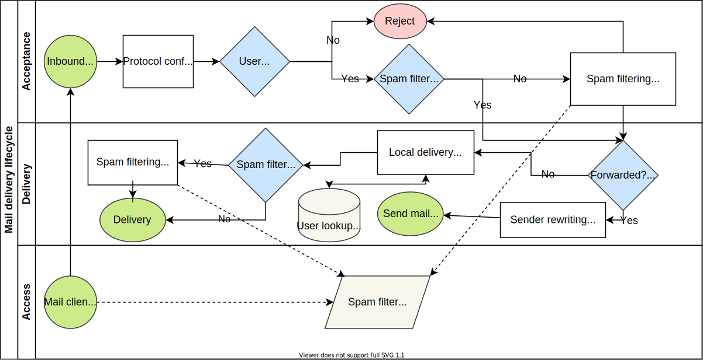

Mail can be self-hosted by using the `builtin` mail provider or remotely hosted by using any other provider. Self-hosted mail is handled by several components summarized below. **Providers** that provide turnkey configuration for third-party services.

## Providers

* [builtin](#builtin-services): utilizes ApisCP's mail stack below
* [gmail](https://github.com/apisnetworks/apiscp-mail-gmail): Gmail
* [mxroute](https://github.com/apisnetworks/apiscp-mail-mxroute): MXRoute
* null: dummy driver that always returns success

## Builtin services

Several services work together. The table and diagram provide a summary of these services. Documentation is provided where appropriate.

| Service                         | Role                                                        |
| ------------------------------- | ----------------------------------------------------------- |
| [Postfix](SMTP.md)              | Receives and sends mail                                     |
| [Dovecot](Dovecot.md)           | IMAP/POP3                                                   |
| [rspamd](rspamd.md)             | Spam filtering, outbound milter (policy, DKIM)              |
| [SpamAssassin](SpamAssassin.md) | Spam filtering, *does not provide outbound milter services* |
| [Authlib](Authlib.md)           | Authentication library for LDA                              |
| [maildrop](LDA.md)              | Local delivery agent                                        |
| [PostSRSd](SMTP.md#srs)         | Sender rewriting scheme support for relayed mail            |
| [Majordomo](Majordomo.md)       | Mailing list                                                |



::: details Postfix services
`smtpd`, `postscreen`, `verify`, `virtual`, and `smtp` are internal Postfix services. You can learn more about these services in [SMTP.md](SMTP.md) or from Postfix's [documentation](http://www.postfix.org/documentation.html).
:::

## Spam filters

Both [SpamAssassin](https://spamassassin.apache.org) and [rspamd](https://rspamd.com) are offered as drop-in anti-spam solutions. SpamAssassin has better accuracy with minimal configuration, but rspamd excels in throughput and features, doubling as a DKIM signer and policy milter.

Of particular importance is the placement of rspamd within the stack, which operates on inbound mail before-queue that allows rejection *at connection* that terminates an SMTP connection with a 5xx error message ("571 delivery not authorized" specifically). SpamAssassin will not generate a delivery status notification for messages marked as spam as placement before-queue induces too much connection delay that discourages timely delivery by impatient SMTP clients. In a mature rspamd cluster, filtering takes approximately 0.15 seconds per message versus 4.5 seconds in SpamAssassin.

### Selection

Spam filter can be configured using `cpcmd scope:set mail.spam-filter FILTER` where *FILTER*  is either `spamassassin` or `rspamd`. rspamd can run in piggyback mode, that is to say it passively learns from SpamAssassin while providing policy milter capabilities. This can be enabled by enabling rspamd while selecting SpamAssassin as the spam filter.

```bash
cpcmd scope:set mail.rspamd-piggyback true
# Above implicitly sets spamfilter='spamassassin' and rspamd_enabled=true in Bootstrapper
```

## Delivery requirements

Message delivery is determined by reputation. Higher reputation increases the likelihood a message will be properly delivered to its intended recipient. Several components influence reputation. The following table summarizes these features. Higher conformance is correlated to higher delivery success.

| Requirement                                 | Purpose                 |
| ------------------------------------------- | ----------------------- |
| [FCrDNS](#fcrdns)                           | Competency check        |
| [SPF](#spf)                                 | Sender authorization    |
| [DKIM](rspamd.md#dkim-signing)              | Sender authentication   |
| [DMARC](#dmarc)                             | Violation disposition   |
| [IP reputation](#ip-reputation)             | Sending patterns        |
| [Well-formed headers](#well-formed-headers) | Competency check        |
| [FBL](#feedback-loops)                      | Sender violations       |
| [Multiple IPs](#multiple-ips)               | Unexpected interruption |

Mail may be tested using [mail-tester.com](https://mail-tester.com).

### FCrDNS

Forward-confirmed reverse DNS (FCrDNS) is a situation in which the IP address resolves to a hostname and hostname resolves to the IP address. This is established by setting a PTR record to map IP => hostname and A and/or AAAA records to map hostname => IP.

PTR records are assigned through the respective VPS provider or in the case of having authority over an IP range, using [PowerDNS](./dns/PowerDNS.md) or following the provider's documentation.

- [AWS](https://aws.amazon.com/en/premiumsupport/knowledge-center/route-53-reverse-dns/)
- [Google Cloud Platform](https://cloud.google.com/compute/docs/instances/create-ptr-record)
- [Hetzner](https://docs.hetzner.com/cloud/servers/cloud-server-rdns/)
- [Linode](https://www.linode.com/docs/guides/configure-your-linode-for-reverse-dns/)
- [Vultr](https://www.vultr.com/docs/how-to-create-reverse-dns-or-ptr-records-in-the-vultr-control-panel)

A, and AAAA when IPv6 enabled, may be added through **DNS** > **DNS Manager** using a suitable [DNS driver](DNS.md). 

FCrDNS can be confirmed using `dig` to query DNS and `net.hostname` [Scope](Scopes.md) to confirm server hostname.

```bash
dig +short -x 64.22.68.70
# Reports nexus.apiscp.com
dig +short nexus.apiscp.com
# Reports 64.22.68.70
cpcmd scope:get net.hostname
# Reports nexus.apiscp.com
```

::: tip Server naming
A convention is to name the server after a collection of something, such as planets. If your website is "apiscp.com", then a good server name may be "earth.apiscp.com" or "pluto.apiscp.com".

Additional naming schemes can be found via [namingschemes.com](https://namingschemes.com).

An account domain name may not duplicate the server hostname, so name your server "earth.apiscp.com" and not "apiscp.com". 

`cpcmd scope:set net.hostname X.Y.Z` will help you quickly change the hostname.
:::

### SPF

[SPF](https://en.wikipedia.org/wiki/Sender_Policy_Framework) records determine who may send mail for a domain. SPF records are published as a TXT record on the sender's domain. For example, if the sender were `tom@apiscp.com`, then a TXT record will be looked for on `apiscp.com` with requisite SPF records (`v=spf1` preamble). 

A simple SPF record is of the form `v=spf1 a mx ~all`. This allows servers whose IP address matches the domain's IP address as well as servers whose IP address matches the MX values to send mail for a domain. `~all` is a softfail, which allows [DMARC](#dmarc) to have ultimate say in delivery. 

*It's good policy to use softfail (~) rather than hardfail (-) and defer delivery rules to DMARC*.

**New in 3.2.20**

SPF records may be set in config.ini under *[mail]* => *default_spf*.

```bash
cpcmd scope:set cp.config mail default_spf "v=spf1 a mx ~all"
# Build new configuration
systemctl restart apiscp
```

SPF records are not applied retroactively, but can be easily done with a bulk script. Create a file named `update.php` in `/usr/local/apnscp` with the following content
```php
<?php
    include __DIR__ . '/lib/CLI/cmd.php';

    $handler = new \Opcenter\Dns\Bulk();
    $handler->remove(new \Opcenter\Dns\Record('_dummy_zone.com', [
        'name' => '', 
        'rr' => 'TXT', 
        'parameter' => 'v=spf1 a mx -all'
    ]), function (\apnscpFunctionInterceptor $afi, \Opcenter\Dns\Record $r) {
        return $afi->email_transport_exists($r->getZone());
    });
    
    $handler->add(new \Opcenter\Dns\Record('_dummy_zone.com', [
        'name' => '', 
        'rr' => 'TXT', 
        'parameter' => MAIL_DEFAULT_SPF
    ]), function (\apnscpFunctionInterceptor $afi, \Opcenter\Dns\Record $r) {
        return $afi->email_transport_exists($r->getZone());
    });
```

Then run `env DEBUG=1 apnscp_php update.php` to remove all DNS TXT records named on all hosted domains that match the pattern `v=spf1 a mx -all`. Records will be replaced with the new value from *[mail]* => *default_spf*.  A closure check is supplied as the second parameter to ensure SPF records are only updated on sites that are setup to receive mail on the server.

Bulk updates work independent of DNS provider.

---

SPF records may redirect to another record to simplify management. For example, `gmail.com` redirects to `_spf.google.com`:

```bash
dig +short TXT gmail.com
# Reports "v=spf1 redirect=_spf.google.com"
dig +short TXT _spf.google.com
# Reports "v=spf1 include:_netblocks.google.com include:_netblocks2.google.com include:_netblocks3.google.com ~all"
dig +short TXT _netblocks.google.com
# Reports "v=spf1 ip4:35.190.247.0/24 ip4:64.233.160.0/19 ip4:66.102.0.0/20 ip4:66.249.80.0/20 ip4:72.14.192.0/18 ip4:74.125.0.0/16 ip4:108.177.8.0/21 ip4:173.194.0.0/16 ip4:209.85.128.0/17 ip4:216.58.192.0/19 ip4:216.239.32.0/19 ~all"
```

Of interest in this example is nesting and redirection, which SPF has several limits defined in [RFC 7208](https://tools.ietf.org/html/rfc7208). An SPF record may not exceed 512 octets (characters), which is a UDP limit imposed by DNS protocol ([RFC 1045 § 2.3.4](https://tools.ietf.org/html/rfc1035#section-2.3.4)). SPF records may at most perform 10 lookups (4.6.4), including the base SPF lookup. In the above once all SPF records are expanded it becomes 5 lookups (1 initial lookup, 1 redirect lookup, 3 includes) . `a` and `mx` also count as lookups, so the following would be 5 queries:

```bash
dig +short TXT example.com
# Reports "v=spf1 a mx include:spf.example.com"
dig +short TXT spf.example.com
# Reports "v=spf1 ip4:1.2.3.4/24 mx:example.org"
```

SPF records may be checked via [mimecast](https://www.dmarcanalyzer.com/spf/checker/).

### DKIM

[DomainKeys Identified Mail](https://en.wikipedia.org/wiki/DomainKeys_Identified_Mail) is a cryptographic signature applied in the message header. Its role is to thwart forgeries by making messages tamperproof. DKIM can work in conjunction with [DMARC](#dmarc) to quarantine or reject mail that does not contain a DKIM signature for a sender's domain. 

DKIM signing is performed by rspamd. Likewise it's covered in [rspamd.md](rspamd.md#dkim-signing).

DKIM records may be checked via [mimecast](https://www.dmarcanalyzer.com/dkim/dkim-check/).

### DMARC

[Domain-based Message Authentication, Reporting & Conformance](https://en.wikipedia.org/wiki/DMARC) despite being a mouthful provides enforcement policy for SPF and DKIM. Remember `~all` in the SPF example above? It's because DKIM has final authority. Using `-all` (hardfail) would preclude DMARC from having final say in delivery (*disposition*)  in the event of a mismatch.

A DMARC record is a TXT record with a `v=DMARC1;` preamble located under  `_dmarc` for the domain.

```bash
dig +short TXT _dmarc.gmail.com
# Reports
# "v=DMARC1; p=none; sp=quarantine; rua=mailto:mailauth-reports@google.com"
```

In the above example, `v=DMARC1` is DMARC version; `p=none` reports failures, but doesn't impose disposition rules; `sp=quarantine` always quarantines mail that comes from subdomains of gmail.com; and `rua=mailto:...` is a URI to send failing messages to used in conjunction with `p=none`. `pct=` allows a policy to be applied to a percentage of such mail. In the above, since since `pct=` is absent the implied value is `p=100` or 100%.

**New in 3.2.20**

DMARC records may be set in config.ini under *[mail]* => *default_dmarc*.

```bash
cpcmd scope:set cp.config mail default_dmarc "v=DMARC1; p=quarantine; pct=100;"
# Build new configuration
systemctl restart apiscp
```

SPF records are not applied retroactively, but can be easily done with a bulk script. Create a file named `update.php` in `/usr/local/apnscp` with the following content

```php
<?php
    include __DIR__ . '/lib/CLI/cmd.php';

    $handler = new \Opcenter\Dns\Bulk();
    $handler->remove(new \Opcenter\Dns\Record('_dummy_zone.com', [
        'name' => '_dmarc', 
        'rr' => 'TXT', 
        'parameter' => ''
    ]), function (\apnscpFunctionInterceptor $afi, \Opcenter\Dns\Record $r) {
        return $afi->email_transport_exists($r->getZone());
    });
    
    $handler->add(new \Opcenter\Dns\Record('_dummy_zone.com', [
        'name' => '_dmarc', 
        'rr' => 'TXT', 
        'parameter' => MAIL_DEFAULT_DMARC
    ]), function (\apnscpFunctionInterceptor $afi, \Opcenter\Dns\Record $r) {
        return $afi->email_transport_exists($r->getZone());
    });
```

Then run `env DEBUG=1 apnscp_php update.php` to remove all `_dmarc` DNS TXT records on all hosted domains. Unlike with SPF example above, DMARC uses a distinct subdomain, so we can skip the parameter check by leaving that field blank.

Records will be replaced with the new value from *[mail]* => *default_dmarc*.  A closure check is supplied as the second parameter to ensure DMARC records are only updated on sites that are setup to receive mail on the server.

Bulk updates work independent of DNS provider.

DMARC records may be checked via [mimecast](https://www.dmarcanalyzer.com/dmarc/dmarc-record-check/).

### IP reputation
IP reputation is the most difficult quality to improve in overall mail reputation as one often inherits an IP with poor reputation or just so happens to reside on a subnet whose neighbors have poor reputation. Not all RBLs are used by most providers nor are some private RBLs used by larger firms published.

IP reputation may be checked via [MultiRBL](http://multirbl.valli.org/). As a rule of thumb if you're on more than a few RBLs, other than *Spam Grouper*, there's trouble abound.

### Well-formed headers

Headers fall under "use good judgment". Certain mail providers, such as GMail, record all message IDs that pass through their network. Each message ID must be unique, so blindly forwarding or sending the same message without generating a new message ID will trigger a violation. Messages sent to several recipients, as in marketing correspondence, must have a "`Precedence: bulk`" header. In addition to these basic guidelines, Google provides [additional recommendations](https://support.google.com/mail/answer/81126?hl=en):

- Format messages according to the Internet Format Standard ([RFC 5322](https://tools.ietf.org/html/rfc5322)).
- If your messages are in HTML, format them according to [HTML standards](https://html.spec.whatwg.org/multipage/).
- Don’t use HTML and CSS to hide content in your messages. Hiding content might cause messages to be marked as spam.
- Message **From:** headers should include only one email address, as shown in this example:  
    From: notifications@your-company.net 
- Include a valid Message-ID header field in every message ([RFC 5322](https://tools.ietf.org/html/rfc5322#section-3.6.4)).
- Links in the body messages should be visible and easy to understand. Users should know where they’ll go when they click links.
- Sender information should be clear and visible.
- Message subjects should be relevant and not misleading.

[mail-tester](https://mail-tester.com) provides a convenient way to check for header conformity.

### Feedback loops

FBLs inform you of sending violations from users on your network. Whenever a user marks a message a spam, the participating service will send a copy of the email to the FBL address. Policing FBLs will help you keep spam off your network before it magnifies into greater consequence. [emailfeedbackloops.com](https://www.emailfeedbackloops.com/how-to-apply-for-feedback-loops.php) contains a tiered list of participating providers.

FBL participation is typically limited to the [ASN contact](https://www.ultratools.com/tools/asnInfo) for an IP address range and are not accessible to an operator of a VPS. As a rule of thumb, participate with AOL, Hotmail, and Yahoo.

### Multiple IPs

Lastly, multiple IP addresses *is strongly recommended*. Having additional IP addresses on standby provides mitigation when a mail service provider blocks mail to their server without providing a means to delist. GMail for example uses time-based delisting, you cannot manually request a delisting - it must expire and expiry time is based on reputation.

Having additional IPs allows for a "hot" IP address to cool down once the problematic account has been resolved on the server. 

::: tip Justification required
ARIN justification ([RFC 2050](https://tools.ietf.org/html/rfc2050) § 2.1) is required for additional IPv4 addresses. Justification is beyond the scope of this document.
:::

To switch an IP address, use `postconf`,

```bash
# Set Postfix to connect to SMTP servers using 1.2.3.4
postconf -o smtp_bind_address=1.2.3.4
postfix reload
```

More advanced [round-robin configurations](http://postfix.1071664.n5.nabble.com/round-robin-map-with-ipv4-and-ipv6-td104719.html) are available as well as sender-dependent transport maps that use sender domains to [bind to IPs](Smtp.md#splitting-delivery-ips) on-the-fly.

Always keep **at least one IP address** on standby.