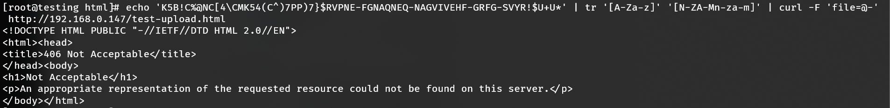
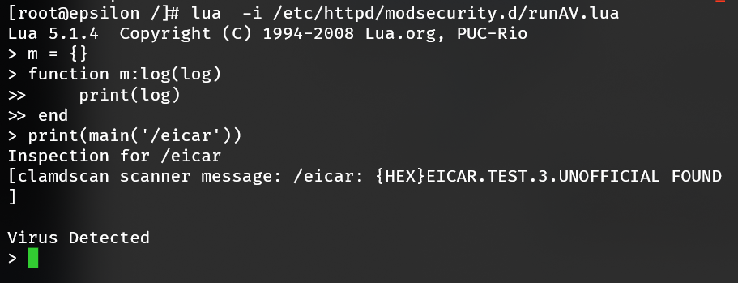

mod_security is enabled when ClamAV malware scanning is enabled. This can be checked and toggled using the *system.virus-scanner* [Scope](Scopes.md).

```bash
# If false, malware scanning is disabled
cpcmd scope:get system.virus-scanner
# Enable malware scanning
cpcmd scope:set system.virus-scanner clamav
# Likewise, to disable it
cpcmd scope:set system.virus-scanner false
```

## Testing

An [EICAR test](https://www.eicar.org/?page_id=3950) file may be used to evaluate whether mod_security is setup correctly. 

::: tip
It may be necessary to disable anti-virus software briefly to download the test file. EICAR is a universal test for anti-virus software. If AV is working correctly, then EICAR will be deleted/quarantined once it's downloaded onto your machine.
:::

Create a test HTML file named "test-upload.html", which accepts a form upload. Place this file in `/var/www/html`:

```bash
cat > /var/www/html/test-upload.html <<- EOF
<! DOCTYPE html>
<html>
<body>
<form action="upload.php" method="post" enctype="multipart/form-data">
<input type="file" name="file" id="fileToUpload">
<input type="submit" value="Upload Test" name="submit">
</form>
</body>
EOF
```

Next access https://\<SERVER IP>/test-upload.html and upload the EICAR text file. If mod_security is working as intended, it will return a "406 Not Acceptable" status code. Alternatively you may test it via cURL too:

```bash
echo 'K5B!C%@NC[4\CMK54(C^)7PP)7}$RVPNE-FGNAQNEQ-NAGVIVEHF-GRFG-SVYR!$U+U*' | tr '[A-Za-z]' '[N-ZA-Mn-za-m]' | curl -F 'file=@-' http://<SERVER IP>/test-upload.html
```

::: details
EICAR characters are transliterated using ROT-13 to avoid detection by anti-virus software, otherwise submission is identical to desktop submission.
:::



Additional logging evidence will be present in /var/log/messages and /var/log/httpd.

```text
Feb 12 14:48:56 testing clamd[6668]: fd[12]: {HEX}EICAR.TEST.3.UNOFFICIAL(44d88612fea8a8f36de82e1278abb02f:68) FOUND
```

```text
# via modsec_audit.log
192.168.0.147 192.168.0.147 - - [12/Feb/2020:14:53:25 --0500] "POST /test-upload.html HTTP/1.1" 406 249 "-" "-" XkRXtW8X20xyKcESfznVdwAAAE4 "-" /20200212/20200212-1453/20200212-145325-XkRXtW8X20xyKcESfznVdwAAAE4 0 2276 md5:175e0cfd277ec488f0c1b401e06b68c0 

# via modsec_debug.log
[12/Feb/2020:14:53:25 --0500] [192.168.0.147/sid#558bcb9dcac8][rid#7f00d80e11c0][/test-upload.html][1] Access denied with code 406 (phase 2). Virus Detected [file "/etc/httpd/modsecurity.d/activated_rules/clamav.conf"] [line "5"] [id "1010101"] [msg "Malicious File Attachment"] [severity "ALERT"]
```

### Lua testing

Testing from a HTML upload applet is sufficient for most situations; however, additional testing may be done to isolate the Lua/ClamAV segment. Apache <=> mod_security <=> Lua <=> ClamAV. Create a m.log() method for interoperability.

Call `lua` passing off the runAV.lua script to it:

```bash
lua  -i /etc/httpd/modsecurity.d/runAV.lua
```

Then create a stub logger to evaluate the file /eicar with an EICAR signature:

```lua
m = {}
function m:log(log)
    print(log)
end
print(main('/eicar'))
```

Confirmation will be similar, reporting the virus found.

