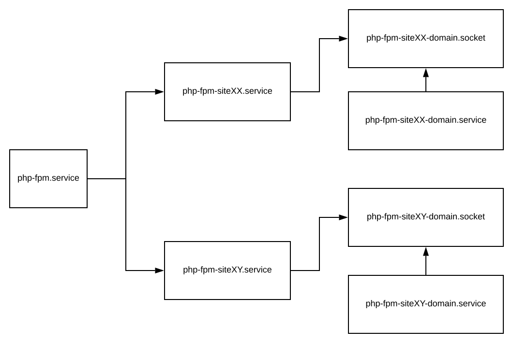
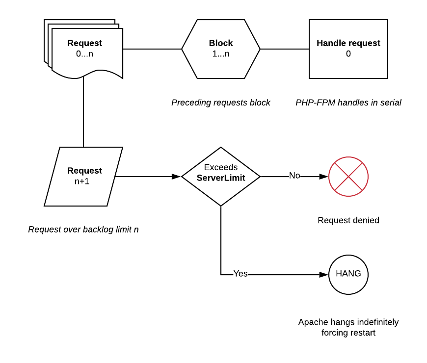

# PHP-FPM

PHP-FPM is a high performance PHP daemon built on FastCGI and introduced in ApisCP 3.1. On ApisCP platforms PHP-FPM demonstrates a 2-3x higher throughput than mod_php ("ISAPI"), which integrates into Apache as a module. In PHP-FPM, a request is sent over a UNIX domain socket to a dedicated worker pool for processing. In ISAPI, PHP requests are handled by a separate VM integrated into Apache that must scaffold and tear down at the end of each request. ISAPI is ideal in low-memory environments but loses relevance outside the niche scenario.

PHP-FPM offers several advantages over an ISAPI integration:

## Advantages

- **Resource enforcement**
  PHP-FPM pools run under the group ID of each account, which affords simple [cgroup](https://en.wikipedia.org/wiki/Cgroups ) treatment to each process. ISAPI runs in a threaded environment that is incompatible with cgroup v1 (cgroup v2 supports threaded accounting at the cost of immense complexity). Every request that comes through may be governed by CPU, memory, block IO, and network IO limits. Likewise every request may be accounted towards an account's cumulative usage.

- **Jailing**
  Pools run within the synthetic root of each account ensuring isolation between accounts. ISAPI uses a variety of mechanisms to impede arbitrary access ([SECURITY.md](../SECURITY.md)) that may provide a *loose deterrent*. PHP-FPM requests are jailed using systemd [namespaces](https://www.freedesktop.org/software/systemd/man/systemd.exec.html#RootDirectory=), a powerful OS feature that is part of userland management (PID 1).

  To limit snooping or the potential of socket remaps, sockets are stored outside the synthetic root in a general runtime directory that inhibits access beyond directory access using conventional discretionary access controls.

- **Path cache**
  Running each account in a jail obviates the requirement for open_basedir restrictions. open_basedir restrictions disable realpath caching ([bug #52312](https://bugs.php.net/bug.php?id=52312)) to stymie symlink attacks. Enabling realpath caches improves throughput by caching filesystem metadata and making assumptions about the properties of the file.

- **User customization**
  As each pool runs independent of other accounts, end-users may tailor the PHP pool to their needs, such as changing the process manager or PHP settings without relying on .htaccess directives that are always re-evaluated on each request. Users cannot tune critical values such as the pool user, chroot, socket path (without grave consequence) or other protected values as these are extracted to the systemd service definition.

  **cgroup enforcement is strongly encouraged to prevent abuse**. Set `cgroup,memory` as a minimum to ensure that a user cannot define a static pool that could spawn an egregious number of workers to cause an out-of-memory condition.

- **RewriteBase fixup**
  `SCRIPT_FILENAME` is rewritten before being passed to proxy. Because of this, PHP scripts on a subdomain or addon domain no longer require `RewriteBase /` to be set greatly reducing confusion on migrating to an ApisCP platform.

- **Multi-tenancy** *PENDING*
  Users may spawn multiple PHP-FPM pools each with different users. For example, it would be possible to create a PHP pool for production and staging in which the production environment adheres to the principles of [Fortification](Fortification.md) and the staging environment is owned entirely by the developer account; both operate under different UIDs.

  **cgroup enforcement is strongly encouraged to prevent abuse**. Set `cgroup,memory` as a minimum to ensure that a user cannot define a static pool that could spawn an egregious number of workers to cause an out-of-memory condition.

- **Flexible ownership**
  Similarly, each pool may operate under a different UID, preferably a system user without machine access, to provide further separation between accounts and ensure zero overlap when discretionary access controls are applied. Setting the pool to the account owner facilitates easy management without the need for Fortification but also  negates any benefits of audit trails should an account get hacked from an insecure WordPress plugin or any PHP application.

--------------------------------------------------------------------------------------

## Disadvantages

* **Memory requirements**
  Each pool requires a minimum of 40 MB. In real-world situations each additional worker may require an additional 16-24 MB memory in typical usage scenarios. Workers that spawn from the pool manager follow [copy-on-write](https://en.wikipedia.org/wiki/Copy-on-write) semantics idiosyncratic of a [fork()](http://man7.org/linux/man-pages/man2/fork.2.html) syscall, meaning the address space for PHP is shared when a worker spawns. Only the PHP scripts loaded within the worker are allocated additional memory.

  To help ameliorate memory constraints in high density environments, PHP-FPM uses the [ondemand](https://www.php.net/manual/en/install.fpm.configuration.php#pm) process manager to automatically sleep idle processes after a set time (1 minute). This can be overrode by changing the PHP-FPM [configuration template](https://hq.apiscp.com/service-overrides/). ondemand exhibits a very low latency when used in conjunction with OPCache (enabled by default) to spin up additional workers.

## Architecture

All PHP-FPM pools are managed through systemd using socket activation. When a request is received by Apache, it writes to a Unix domain socket, outside the account chroot, managed by systemd. systemd spawns the worker pool to handle subsequent requests, which solves the [Thundering herd problem](https://en.wikipedia.org/wiki/Thundering_herd_problem) to a certain extent. Each request is jailed to the account through systemd. cgroup assignment is done prior to pool initialization, which extends to all child processes spawned from within the pool ensuring fair resource treatment. Configuration may be overriden on a per-pool level with pool configuration at the discretion of (and of consequence to) the account owner.

## Building

### Configuration

The default PHP interpreter may be changed using the `apache.php-version` [Scope](Scopes.md). Additional configuration flags may be specified by setting `phpXX_build_flags` in Bootstrapper where XX is \<MAJOR>\<MINOR> (`cp.bootstrapper`is a Scope to facilitate interaction). Alternatively `php_build_flags` may be set, which applies to all PHP builds.

```bash
# Enable PCNTL extension, signal and process handling for use with Laravel Horizon
# Assuming PHP 7.4 is installed, configuration will apply to this build.
cpcmd scope:set cp.bootstrapper php74_build_flags "--enable-pcntl"
# Force rebuild. This implicitly sends php_force_build=true to bootstrap.yml
cpcmd scope:set apache.php-version 7.4
```

### Installing modules

To install `imagick` off PECL for the system PHP build,

```bash
cd /usr/local/apnscp/resources/playbooks
ansible-playbook bootstrap.yml --tags=php/install-pecl-module --extra-vars=pecl_extensions=imagick
```
::: tip
`--extra-vars=force_module_rebuild=true` may be specified to force a module update as well as module configuration in FST/siteinfo/etc/phpXX.d/.
:::

Modules may be set per version and permanently applied for all PHP builds by setting either `pecl_phpXX` or `pecl_extensions` variables.

```bash
# Always build imagick + igbinary + redis extensions
cpcmd scope:set cp.bootstrapper pecl_extensions '[imagick,igbinary,redis]'
# Build all modules
upcp -sb php/install-pecl-module
```

#### Non-PECL modules
git and archive sources are also supported. If we want to add mailparse (from PECL), memcached (from GitHub), and inotify:

```bash
cpcmd scope:set cp.bootstrapper pecl_extensions '["mailparse","https://github.com/php-memcached-dev/php-memcached.git","https://pecl.php.net/get/inotify-2.0.0.tgz"]'
upcp -sb php/install-pecl-module
```

::: danger
This task runs as root. Be sure you trust module sources.
:::

By convention ApisCP will use the basename up to the first character in the set `:-.` as the module name. In the above example, `php-memcached` module configuration would be saved as "php.ini" in FST/siteinfo/etc/phpXX.d/. You can override this behavior using **dense extension format**.

#### Dense extension format
Not all extensions are named as you'd want them to be. ApisCP supports a dense format for extensions that explicitly defines the extension URL, name, and whether it's a Zend extension. An example of this is Xdebug that when installed from the latest GitHub release would be treated as "2.ini".

```bash
ansible-playbook bootstrap.yml  --tags=php/install-pecl-module,apnscp/php-filesystem-template --extra-vars=pecl_extensions='{"name":"xdebug","zend":true,"extension":"https://github.com/xdebug/xdebug/archive/2.9.6.tar.gz"}'
```

Dense mode accepts the following attributes:

| Parameter | Description                                    |
| --------- | ---------------------------------------------- |
| name      | Extension name                                 |
| zend      | Whether Zend extension                         |
| extension | Standard extension URI (PECL, URL, local file) |

Likewise to set as default for all PHP builds,

```bash
cpcmd scope:set cp.bootstrapper pecl_extensions '["mailparse","https://github.com/php-memcached-dev/php-memcached.git","https://pecl.php.net/get/inotify-2.0.0.tgz",'\''{"name":"xdebug","zend":true,"extension":"https://github.com/xdebug/xdebug/archive/2.9.6.tar.gz"}'\'']'
```

::: warning Quote parsing
Escaping quotes can become elaborate very quickly. To escape a nested single quote, first close the quote, then escape the intended quote, then resume single quotes. Adding `'` inside `'...'` would thus be `''\'''`
:::

## Enabling sites

Switching an account over is a breeze! Flip the `apache,jail` setting to enable jailing:

```bash
EditDomain -c apache,jail=1 -D domain.com
```

To set the default going forward, either make the adjustment in a plan via `./artisan opcenter:plan` or set the default FPM behavior, `cpcmd scope:set cp.config httpd use_fpm true`. All new accounts created will use PHP-FPM by default.

To perform an en-masse edit:

```bash
cd /home/virtual
EditDomain --all -c apache,jail=1
```

And for the overachieving variety:

```bash
yum install -y jq
cpcmd -o json admin:collect null '[apache.jail:0]' | jq -r 'keys[]' | while read -r SITE ; do
  echo "Editing $(get_config "$SITE" siteinfo domain)"
  EditDomain -c apache,jail=1 "$SITE"
done
```

There will be an elision delay configured in *[httpd]* => *reload_delay* designed to allow multiple HTTP reload calls to merge into a single call to prevent a denial of service attack. By default, this is 2 minutes.

### Single-user behavior

ApisCP supports a single-user behavior which disables the benefits of [Fortification](Fortification.md). This behavior is consistent with cPanel and competing panels that do not isolate web users. Set `apache,webuser` to match the account admin:

```bash
EditDomain -c apache,webuser=myadmin -D mydomain.com
# Or for simplicity...
EditDomain -c apache,webuser="$(get_config mydomain.com siteinfo admin_user)" -D mydomain.com
```

ApisCP will change ownership on all files matching the previous user ("apache") to the new user "myadmin". Ownership change from a system user to an account user is an irreversible process. Now, files created by the web server will be under the account username. *Should and weakness exist* in any web app on the account that allows an attacker to run arbitrary code, then the attacker now has unrestricted access to all users on the account.

This is an extremely dangerous configuration that should be avoided at all costs.

## Service management

Worker throughput may be examined via systemd. FPM workers are watchdog-aware, which means they automatically report health back to systemd within a deadline window to improve reliability, recovering as needed. Worker metrics may be examined via `systemctl status`,

```bash
systemctl status php-fpm-site1-domain.com
```

PHP-FPM workers are grouped *\<SITE>*-*\<MARKER>*. By default the *marker* is the primary domain on the account. *site* is the immutable siteXX designator of the domain.

```bash
systemctl status php-fpm-site1-domain.com

#########################
# Sample response follows
#########################
● php-fpm-site1-domain.com.service - PHP worker for site1 - domain.com
   Loaded: loaded (/usr/local/apnscp/resources/templates/apache/php/fpm-service.blade.php; disabled; vendor preset: disabled)
   Active: active (running) since Fri 2019-08-30 17:35:01 EDT; 1min 25s ago
  Process: 17905 ExecStartPost=/bin/sh -c for i in /sys/fs/cgroup/*/site1/tasks ; do echo $MAINPID > $i ; done (code=exited, status=0/SUCCESS)
 Main PID: 17898 (php-fpm)
   Status: "Processes active: 0, idle: 1, Requests: 3, slow: 0, Traffic: 0.0667req/sec"
    Tasks: 1
   Memory: 26.0M
   CGroup: /system.slice/php-fpm-site1-domain.com.service
           ├─17898 php-fpm: master process (/etc/php-fpm.d/sites/domain.com.conf)
           └─17906 php-fpm: pool domain.com

```

ApisCP manages pool groups, restarting as needed after the elision window expires. To restart or suspend the pool for a site, use the `php-fpm-siteXX` service wrapper.

```bash
# Suspend all pools allocated to site1
# Note: socket activation will start the worker on demand!
systemctl stop php-fpm-site1
# Restart all PHP-FPM pools, for example configuration updated
systemctl restart php-fpm-site1
```

Permanent suspension may be achieved by disabling the corresponding socket,

```bash
systemctl mask php-fpm-site1-*.socket
systemctl stop php-fpm-site1
```

However this is seldom useful as suspending the account achieves a similar result:

```bash
SuspendDomain site1
```

### Bulk update

`php-fpm` is a composite unit to manage all PHP-FPM instances on a server. For example, it may be necessary to propagate configuration changes from a lower filesystem layer.

```bash
# Make changes in FST/siteinfo/...
systemctl stop php-fpm
systemctl reload fsmount
systemctl start php-fpm
```

### Service relationship
Both *php-fpm* and *php-fpm-siteXX* represent one-way bindings to the respective pools. The full service name, *php-fpm-siteXX-domain* consists of 2 parts, a socket-activated service ending in *.socket* that spawns the PHP-FPM pool that shares the same name once activity arrives on that socket from Apache.

Restarting *php-fpm.service* will restart all PHP-FPM pools previously running, however, will leave dormant pools inactive. Likewise the same treatment is applied to *php-fpm-siteXX.service* but only to pools belonging to that site. Restarting *php-fpm-siteXX-domain.socket* will restart the similarly named service if it was previously listening or re-enable the socket listener if previously deactivated via a `stop` command (`systemctl stop php-fpm`). Starting *php-fpm-siteXX-domain.service* will unconditionally start the PHP-FPM pool without waiting for activity from the named *.socket*.




### Overriding service definitions

Overriding configuration follows systemd [convention](https://wiki.archlinux.org/index.php/systemd#Editing_provided_units). Create a directory in /etc/systemd/system/ named after the service. Any .conf within the directory will be merged into the service definition thus making it possible, for example, to change the PHP-FPM worker or set environment variables prior to pool startup. Further, overrides are non-destructive and guaranteed to not be overwritten.

```bash
cd /etc/systemd/system
mkdir php-fpm-site1-example.com.service.d/
cd php-fpm-site1-example.com.service.d
cat <<EOF >>override.conf
[Service]
# Run the service at lowest priority
LimitNICE=40
EOF
systemctl daemon-reload
systemctl restart php-fpm-site1-example.com
```

## Resource enforcement

All `cgroup` service directives apply to PHP-FPM workers, including blkio IO throttling. To set a 2 MB/s write throttle on all PHP-FPM tasks use `blkio,writebw` or throttle IOPS use the "iops" equivalent, `blkio,writeiops`:

```bash
EditDomain -c cgroup,writebw=2 domain.com
# Apply the min of blkio,writ.ebw/blkio,writeiops
# Both are equivalent assuming 4 KB blocks
EditDomain -c cgroup,writebw=2 -c blkio,writeiops=512 domain.com
```

Memory ceilings likewise may be set via `cgroup,memory`.

```bash
# Set ceiling of 512 MB for all processes
EditDomain -c cgroup,memory=512 domain.com
```

IO and CPU weighting may be set via ioweight and cpuweight respectively. ioweight requires usage of the CFQ/BFQ IO elevators.

```bash
# Default weight is 100
# Halve IO priority, double CPU priority
EditDomain -c cgroup,ioweight=50 -c cgroup,cpuweight=200 domain.com
```

See [Resource enforcement.md](./Resource%20enforcement.md) for further details.

::: warning
Setting limits artificially low may create a connection backlog that can prevent consume more system resources than it strives to prevent. Resource limits should be used to prevent egregious abuse, not set firm boundaries based on average daily usage.
:::

## PHP configuration

### Override precedence

ApisCP uses a composition filesystem called [BoxFS](Filesystem.md) that allows files inheritance from lower levels and remain on these levels until changed. Once changed, these files copy upward to the account layer. Utilizing this approach, files can be shared upward or [templated](Customizating.md) out to sites.

- `FILESYSTEMTEMPLATE/siteinfo/etc/php.ini` is the base configuration that may be edited by Site Administrators and copied up to their respective account layer. 
- `FILESYSTEMTEMPLATE/siteinfo/etc/phpXX.d` is a version-specific configuration directory also editable that follows propagation rules. 
- `siteXX/fst/etc/php-fpm.d/sites/` may not be edited directly and instead relies on inclusion of `fpm-config-custom.blade.php` template. Any `php_admin_value`/`php_admin_flag` directive trumps all other matching directive settings. 
- Site Administrators can apply additional directives in `siteXX/etc/php-fpm.d/` that apply to all pools of the site. *Must end in .conf and follow PHP-FPM pool directives*.
- `.user.ini` in each document root allows for additional configuration. This configuration is cached for 300 seconds per `user_ini.cache_ttl`.

The following table summarizes inheritance behavior for PHP directives. All locations follow debugging path [conventions](../DEBUGGING.md#log-locations). Unless marked atypical, configuration follows normal DIRECTIVE=VALUE syntax. See corresponding section for atypical configuration. *DOCROOT* refers to the document root for the given HTTP resource.

| Location                                  | Editable By | Atypical | Remarks                                                      |
| ----------------------------------------- | ----------- | :------: | ------------------------------------------------------------ |
| `FST/siteinfo/etc/php.ini`                | admin       |          | [System-wide configuration](#system-wide-configuration). Reload `fsmount` after edit. |
| `siteXX/fst/etc/php.ini`                  | admin, site |          | Copy-up from FST. Requires chown for site edit.              |
| `siteXX/fst/etc/php-fpm.d/sites`          | admin, site |    X     | [Service configuration](#service-configuration). Cannot override php_admin directives. |
| `resources/templates/apache/php/partials` | admin       |    X     | [Service templates](#service-templates). Intended for creation-time configuration. Overrides php_admin. |
| `siteXX/info/php-policy.xml`              | admin       |    X     | [Policy Maps](#policy-maps). Mixed configuration. Can override php_admin if templated. |
| `DOCROOT/.user.ini`                       | site        |          | [User overrides](#user-overrides). 5 minute reload interval. Cannot override php_admin. |


### System-wide configuration

System-wide changes may be made to `/home/virtual/FILESYSTEM/siteinfo/etc/php.ini`. In single-mount installations, this is linked directly to `/etc/php.ini`. Once edited, layer cache must be flushed upward.

```bash
systemctl reload fsmount
systemctl restart php-fpm
```

**This fails if** a site has modified `/etc/php.ini` within their account root ([copy-up semantics](./Filesystem.md#technical-details) of BoxFS). In such situations, an override may be applied either in `/home/virtual/FILESYSTEMTEMPLATE/siteinfo/etc/phpXX.d/file.ini` or by overriding the PHP-FPM service template. When applied in etc/phpXX.d/, a site owner may remove or edit the file from the account. For a permanent, uneditable solution, see **Site templates** below.

Any changes should be located at the end of php.ini so as not to conflict with [base directives](https://gitlab.com/apisnetworks/apnscp/-/blob/master/resources/playbooks/roles/php/create-configuration/defaults/main.yml) block applied by ApisCP. 

*Last instance of a directive always wins in php.ini.*

::: warning
`/etc/phpXX.d` is not the same as `/home/virtual/FILESYSTEMTEMPLATE/siteinfo/etc/phpXX.d`. Files placed in /etc/phpXX.d are not propagated like in /etc/php.ini.
:::

### Service configuration

Next layer of customization is in the pool or systemd service declaration. Pool configuration is located in `siteXX/fst/etc/php-fpm.d/sites/` where each configuration is named after the pool. These files may not be directly edited by Site Administrators and are regenerated from template.  Files in `siteXX/fst/etc/php-fpm.d/` may be edited by Site Administrators.

`php_value` and `php_flag` allows these values to be overrode. `php_admin_value` and `php_admin_flag` disallow override.

For example, in siteXX/fst/etc/php-fpm.d/memory.conf

```ini
php_value[upload_max_filesize] = 64m
php_value[post_max_size] = 64m
```

Then restart the pool, `systemctl restart php-fpm-siteXX` 

::: tip php_admin immutability
Any value marked as `php_admin_value` or `php_admin_flag` may not be reset or changed once set. Use fpm-config-custom.blade.php below to update.
:::

### Service templates

Customizations are applied inline to all PHP-FPM pools defined in sites/ if an override exists in `config/custom/resources/templates/apache/php/partials/fpm-config-custom.blade.php`:

```ini
mkdir -p /usr/local/apnscp/config/custom/resources/templates/apache/php/partials/

cat <<EOF >> /usr/local/apnscp/config/custom/resources/templates/apache/php/partials/fpm-config-custom.blade.php

# Note, this is better serviced by cgroup,memory resource enforcement
php_admin_value[memory_limit] = 384m
php_value[upload_max_filesize] = 64m
php_value[post_max_size] = 64m
# Load redis.so from /usr/lib64/<ZENDAPIVERSION>
php_value[extension] = redis
EOF
```

Once set, rebuild PHP-FPM for all sites:

```bash
EditDomain --reconfig --all
```

::: warning Updating configuration first time
ApisCP compiles configuration on each start to provide the best possible performance. When creating resource overrides in `config/custom/resources/view` or `config/custom/resources/templates` the first time restart ApisCP so it knows to look in these directories. Prior to making this change, these locations are compiled out on boot.

`systemctl restart apiscp`
:::

### User overrides

PHP-FPM uses `.user.ini` in each document root to set PHP configuration at runtime.

Configuration in PHP-FPM is assignment-based, similar to php.ini, rather than directive. Paths are jailed and respect the synthetic root layout. For example,

**.htaccess**  
`php_value auto_prepend_file /home/virtual/site12/fst/var/www/html/heading.php`

**.user.ini**  
`auto_prepend_file = /var/www/html/heading.php`

PHP-FPM caches per-directory `.user.ini` files. By default the duration is 300 seconds (5 minutes). This can be altered by adding a FPM configuration to /etc/php-fpm.d/*file*.conf or by overriding the PHP-FPM template in templates/apache/php/.

Then restart the affected pool, `systemctl restart php-fpm-siteXX` where siteXX is the site marker or do an en masse restart with `systemctl restart php-fpm`.

Since v3.1.38, directives are migrated automatically for all known domain/subdomain parent document roots when a site is switched between jail/non-jail mode. `php:migrate-directives(string $host, string $path = '', string $from)` provides a migration interface for directives behind a subdirectory.

Directives may be applied pool-wide by the Site Administrator by creating a new file in /etc/php-fpm.d/,  by editing /etc/php.ini directly, or creating a drop-in in /etc/phpXX.d/. Pools may be restarted by the Site Administrator in **Web** > **PHP Pools**.

### Masquerading other file types as PHP

Don't do this. Use a dispatcher via .htaccess to funnel all requests to emulate desired behavior. Should prevailing wisdom fail, add the following to the .htaccess to map .html and .htm to PHP-FPM:

```
<Files ~ "\.html?$">
        ProxyFCGISetEnvIf "reqenv('VPATH') =~ m|^/home/virtual/[^/]+/fst(/.++)$|" SCRIPT_FILENAME "$1/%{reqenv:SCRIPT_NAME}"
        SetHandler "%{env:PHP_HANDLER}"
</Files>
```

Next override [security.limit_extensions](https://www.php.net/manual/en/install.fpm.configuration.php#security-limit-extensions) in `/etc/php-fpm.d/`:

```
security.limit_extensions=.php .phar .html .htm
```

Then restart the affected pool, `systemctl restart php-fpm-siteXX` where siteXX is the site marker or do an en masse restart with `systemctl restart php-fpm`.

## HTTP configuration

### PHP-FPM timeout

The web server expects a request to complete within **60 seconds**. Any request outside this window will return a *504 Gateway Timeout* response. Alter the system-wide configuration in `/etc/httpd/conf/httpd-custom.conf` by setting `ProxyTimeout 180` to raise the limit to 3 minutes. Proxy timeout may be adjusted on a per-site basis by creating a file named `custom` in `/etc/httpd/conf/siteXX` with the same directive. When overriding per-site, be sure to rebuild the configuration:

```bash
# Get XX via get_site_id domain.com
echo 'ProxyTimeout 180' >> /etc/httpd/conf/siteXX/custom
htrebuild
systemctl reload httpd
```

Granular per-proxy configuration is covered in "[Apache proxy configuration](#apache-proxy-configuration)" below.


### Worker limits

Apache uses an Event MPM, which consists of 1 or more processes (called "children") consisting of 1 or more threads. By default, each child consists of 20 threads. *THREADS* x *CHILDREN* gives the **maximum number of concurrent connections**. See [Apache.md](Apache.md) for more information on configuration.

Each process does not communicate with one another. These processes operate independently. Configurations specified below therefore **apply per child**. For example, setting a "max" number of connections to a PHP-FPM worker as *2* does not restrict at most 2 concurrent connections to a site, but at most *2* concurrent connections in that child process to the PHP-FPM backend. The true limit is *MAX* X *CHILDREN*. Keepalives may result in successive requests binding to the former child instead of distributing requests evenly between all children.

PHP-FPM utilizes "ondemand" as its process manager to spawn PHP workers on demand and likewise sleep after extended idle periods (*default:* 60 seconds). ondemand imposes a minimum backlog value of 511 connections, which means in the event a PHP-FPM worker cannot furnish a request immediately, up to 511 connections may linger in Apache pending acknowledgement by PHP-FPM before further requests are rejected. If the pending connection balance exceeds `ServerLimit` in Apache, then no further requests may be made to the server, including to static resources.



When a PHP-FPM worker spawns, it clones the parent memory, which provides the bare essentials to begin furnishing a request. Cloning takes very little time (< 50 ms) after which point it will accept the request over its socket. If a request is blocked, the request *cannot* be accepted over socket. Tuning is intended to prevent monopolization of available connection slots that PHP-FPM would not adequately restrict. **In high throughput environments**, these numbers should be raised.

Set a maximum number of connections to the PHP-FPM socket and set an accept() timeout to prevent blocked requests from piling up and thus monopolizing available connection slots in Apache. The following directives in `siteXX/custom` set a worker limit of 5 connections per server with a 10 second delay in accept(). The total connection backlog is thus 5 X *SERVERS* or in a default configuration with 20 `ThreadsPerChild` 25% of the available connection slots.

```
<Proxy "fcgi://localhost" max=5 acquire=10s>
</Proxy>
```

A template is provided that permits overriding proxy settings via `resources/templates/apache/php/partials/proxy-settings.blade.php`. See [Customizing.md](Customizing.md) for tips on overriding this template. Any directive permitted within a `<Proxy>` directive may be used in `proxy-settings.blade.php`. For example, to raise the total connection time to 600 seconds for a request:

```
ProxySet timeout=600s
```

After making changes, edit all domains that use PHP-FPM to effect changes.

```bash
EditDomain --all
```

## Multiversion PHP

Multiversion comes in two flavors, native (also called "multiPHP") and Remi, named after the eponymous author that maintains the Remi build system.

### Native builds

ApisCP ships with 1 PHP release for simplicity, but can support multiple versions as necessary. Additional versions may be built using Bootstrapper. A Scope is provided, *php.multi*, that facilitates building new versions.

```bash
# Add additional compile-time flags to 7.4 and build it
cpcmd scope:set cp.bootstrapper php74_build_flags "--with-password-argon2"
# Add PHP 7.4 support
cpcmd scope:set php.multi 7.4
# Remove PHP 7.4
cpcmd scope:set php.multi '[7.4:false]'
```

All native multiPHP builds are located in /.socket/php/multiphp/native. OPCache is configured automatically.

#### Automatic builds/updates

**New in 3.2.6**

`php_multiphp` is a Bootstrapper setting that allows automated builds at install and updates during monthly platform checks. Versions should be defined as a list of MAJOR.MINOR versions; MAJOR.MINOR.PATCH works but would never update past initial install.

```bash
cpcmd scope:set cp.bootstrapper php_multiphp '[5.6,7.2]'
upcp -sb php/multiphp
# Similar to above, but add 7.1
cpcmd scope:set php.multi '[5.6,7.1]'
# Reports 5.6, 7.1, and 7.2
cpcmd scope:get php.multi
# Remove PHP 7.2
cpcmd scope:set php.multi '[7.2:false]'
# Report active multiPHP versions 5.6, 7.1
cpcmd scope:get php.multi
```

The latest version of 5.6 and 7.2 would build as multiPHP releases. Any extensions defined either globally (`pecl_extensions`) or per-version (`pecl_phpXX`) are also installed as needed.

#### Installing modules

Modules may be installed as one would normally expect with regular PHP-FPM. The only difference is the presence of `multiphp_build=true` and `php_version` must be explicitly set to at least MAJOR.MINOR.

To install imagick off PECL for PHP 7.4,

```bash
cd /usr/local/apnscp/resources/playbooks
ansible-playbook bootstrap.yml  --tags=php/install-pecl-module --extra-vars=pecl_extensions=igbinary --extra-vars=php_version=7.4 --extra-vars=multiphp_build=true
```

Likewise `pecl_php74` could be set as a list with `['igbinary']` to automatically build for PHP 7.4:

```bash
cpcmd scope:set cp.bootstrapper pecl_php74 '[igbinary]'
cd /usr/local/apnscp/resources/playbooks
ansible-playbook bootstrap.yml --tags=php/install-pecl-module --extra-vars=php_version=7.4 --extra-vars=multiphp_build=true
```

### Remi builds

For easier package-based multiPHP management, ApisCP includes support for [Remi PHP](https://rpms.remirepo.net/). If installing on CentOS or RedHat 8, change "7" to "8".

```bash
yum install http://rpms.remirepo.net/enterprise/remi-release-$(rpm -E '%{rhel}').rpm
```

Then to install say PHP 7.4 with ionCube loader, MySQL, OPCache PECL:

```bash
yum install -y php74-php-fpm php74-php-ioncube-loader php74-php-pecl-mysql php74-php-opcache
```

#### Installing modules

Remi does not support manual installation of modules. Use packages provided through the public RPM repository. `yum list 'php*-pecl-*'` will give an indication of packages available for install.

#### Adding non-PHP Remi packages

Additional packages may be installed first from Remi, then replicated into the FST. Yum Synchronizer ("Synchronizer") located in `bin/scripts/yum-post.php` provides a set of tools to manage RPM replication into FST.

```bash
# Install "vips" package from Remi
yum install -y vips
# Query "vips" dependencies
cd /usr/local/apnscp
./bin/scripts/yum-post.php depends vips
# WARNING : CLI\Yum\Synchronizer\Depends::run(): Package `vips' is not resolved. Install the following dependencies to resolve: ilmbase, OpenEXR-libs, ImageMagick6-libs, cfitsio, libexif, fftw-libs-double, gdk-pixbuf2, libgsf, hdf5, matio, openslide, orc, pango, poppler-glib, librsvg2, vips, libwebp7

# Install vips into siteinfo. "-d" installs dependencies as well
./bin/scripts/yum-post.php install -d vips siteinfo
```

`-d` calculates dependencies necessary to satisfy operation and installs those packages into the named service layer. When mixing packages between different services that may be satisfied by a union of service layers, it is permissible to omit "-d". Installing packages without installing the dependencies, however, may cause PHP or any binary to fail to load.

#### Solving dependencies

Install the ImageMagick extension from PECL, then attempt to load PHP-FPM from the account, it will fail:

```bash
yum install -y php72-php-pecl-imagick
su apis.com
# Try loading PHP-FPM, dependencies will prevent it from starting
/usr/bin/scl enable php72 -- php-fpm --nodaemonize --fpm-config=/etc/php-fpm.d/sites/apis.com.conf
# [09-Jan-2020 13:17:36] NOTICE: PHP message: PHP Warning:  PHP Startup: Unable to load dynamic library 'imagick.so' (tried: /opt/remi/php72/root/usr/lib64/php/modules/imagick.so (libharfbuzz.so.0: cannot open shared object file: No such file or directory), /opt/remi/php72/root/usr/lib64/php/modules/imagick.so.so (/opt/remi/php72/root/usr/lib64/php/modules/imagick.so.so: cannot open shared object file: No such file or directory)) in Unknown on line 0
```

Exit out of the shell, solve the dependencies, then try again:

```bash
# Exit current su apis.com session
exit
rpm -qf /usr/lib64/libharfbuzz.so.0
# Package is libharfbuzz...
/usr/local/apnscp/bin/scripts/yum-post.php install -d libharfbuzz siteinfo
su apis.com
# Try loading PHP-FPM again... rinse and repeat until it works
```

Do not attempt to install a module directly; it is already relocated. Once satisfied, you may run into permission issues if PHP-FPM runs as an unprivileged system user ("apache") rather than the account owner. `su -s /bin/bash -G ADMINUSER apache` would setup a similar environment to systemd prior to launch.

### Native vs Remi

Remi is an easier system to manage when juggling a variety of PHP versions, but it comes at some cost to performance and potential dependency management.

1. Modular builds are slower than monolithic both in startup time and run time.
2. Generalized builds are unable to target system-specific optimizations. WordPress throughput for example drops 9.38% (16.13 req/sec vs 17.80 req/sec) when using Remi builds.
3. Remi is not officially supported by Apis Networks for support. PHP bundled with ApisCP is built with features to address nearly all hosting inquiries over the last 15 years.
4. Remi builds do not provide configuration adjustments to Site Administrators.
5. Each PHP release may have different library requirements. `yum-post.php depends` will do its best to resolve these for you. After setup, verify it works correctly in an account (`su domain.com`) by running `scl enable phpXX -- php -r 'phpinfo();' > /dev/null` to attempt to load all extensions. This will pull in PHP extensions and hopefully provide some hint at what - if anything - is missing.

### Switching versions

#### API
**New in 3.2.18**

Use `cpcmd -d domain.com php:pool-set-version $VERSION` to set the pool version for a site. All versions can be listed by `cpcmd -d domain.com php:pool-versions`.

Likewise end-users may adjust their pools via **Web** > **PHP Pools**. Pools may be restricted using a [policy map](#policy-maps).

#### Manual

::: warning Override precedence
Manually setting PHP versions takes precedence over the API. This may be useful to lock a site to use a specific pool.
:::

##### Native

In /etc/systemd/system, create a directory named after the pool and suffixed with ".d". Pools are named php-fpm-siteXX-NAME. For example, to override pool named apis.com on site1, create a directory named *php-fpm-site1-apis.com.d/* and a file named "override.conf".

`systemctl edit php-fpm-site1-apis.com` is equivalent to the above operation.

```
[Service]
# The next line overrides the previously inherited ExecStart
ExecStart=
# DO NOT surround in quotes, it would be treated as a literal if so
ExecStart=/.socket/php/multiphp/native/7.4/sbin/php-fpm --nodaemonize --fpm-config=/etc/php-fpm.d/sites/apis.com.conf
```

Then restart the service,

```bash
systemctl restart php-fpm-site1-apis.com
```

##### Remi

In /etc/systemd/system, create a directory named after the pool and suffixed with ".d". Pools are named php-fpm-siteXX-NAME. For example, to override pool named apis.com on site1, create a directory named *php-fpm-site1-apis.com.d/* and a file named "override.conf".

`systemctl edit php-fpm-site1-apis.com` is equivalent to the above operation.

```
[Service]
# The next line overrides the previously inherited ExecStart
ExecStart=
# DO NOT surround in quotes, it would be treated as a literal if so
ExecStart=/usr/bin/scl enable php74 -- php-fpm --daemonize --fpm-config=/etc/php-fpm.d/sites/apis.com.conf
```

Then restart the service,

```bash
systemctl restart php-fpm-site1-apis.com
```

This is very similar to **native** with a few key differences:

1. SCL is used to shim a new path, "php-fpm" is picked up in this shimmed path. /usr/sbin/php-fpm would be incorrect.
2. An empty `ExecStart=` clears any previous ExecStart directives. Without this, ExecStart would be appended to the inherited ExecStart= command that starts PHP-FPM.
3. `--nodaemonize` changes to `--daemonize` to ensure systemd picks up the scl to php-fpm process image change.

PHP runtimes are located in `php<MAJOR><MINOR>-runtime` packages. `php<MAJOR><MINOR>` is a dummy package that pulls in dependency packages, including runtime.

SCL collection configuration is defined in /etc/scl/conf. Remi PHP versions are named php\<MAJOR>\<MINOR>.

### Policy maps
**New in 3.2.18**

A policy map remembers what PHP version is assigned to a given pool or account as well as setting several important parameters. Each policy map is generated from a template and saved to the account under `siteXX/info/php-policy.yml`. When hand-editing a policy, run `EditDomain --reconfig siteXX` to regenerate its configuration. If a pool version change is desired, then run `cpcmd -d siteXX php:pool-restart` after `EditDomain`.

☝ See [master branch](https://gitlab.com/apisnetworks/apnscp/-/blob/master/resources/templates/apache/php/policy.blade.php) for latest policy template.

```yaml
global:
  # defaults to system version
  # Bootstrapper value: system_php_version
  version:
  # Max PHP-FPM workers
  # PHP-FPM value: pm.max_children
  workers: {{ max(NPROC+2, 5) }}
  # Max idle duration before a PHP-FPM worker quits
  # PHP-FPM value: pm.process_idle_timeout
  idle_timeout: 60s
  # Max threads dedicated per server for queuing
  # Apache value: <Proxy max=n>
  threads: 3
  # Max backlog
  # PHP-FPM value: listen.backlog
  backlog: 30
  # Connection timeout
  # Apache value: <Proxy acquire=n>
  connect: 5s
  # All php_admin settings - cannot be overrode
  php_settings:
    # Maximum memory *per* PHP-FPM worker (keep low!)
    # PHP value: memory_limit
    memory_limit: {{ (int)min(\Opcenter\System\Memory::stats()['memtotal']/1024*0.15,384) }}M
pools:
  # Per-pool configuration is not supported yet!
  # "mydomain.com":
  #   workers: 5
  #   version: null or specific version
# List of versions to disallow
blacklist:
  # - 5.6
  # - 7.0
# List of versions to allow
# Omit to allow all versions
whitelist:
```

As this is a Blade template, it's also possible to template the configuration.

```yaml
global:
  # Set default PHP interpreter to 5.6 for legacy plans
  @if ($svc->getServiceValue('siteinfo', 'plan') === 'legacy')
  
  version: '5.6'
  @else
  
  version: '8.0'
  @endif
  
  workers: {{ max(NPROC+2, 5) }}
```

Note the additional spacing after each conditional statement. This is a formatting peculiarity of Blade that joins the following line on compilation.

## Composer

### Updating

Run `php/composer` with `composer_keep_updates=true` to force a manual update of Composer. Composer may be periodically updated every platform scrub by setting this value in `apnscp-vars-runtime.yml`. A Scope is provided to make this easier.

```bash
# Update one-time
env BSARGS="--extra-vars=composer_keep_updated=true" upcp -sb php/composer
# Keep updated during scrubs
cpcmd scope:set php.composer-autoupdate true
```


## Troubleshooting

### Pool fails to start

Pools use socket activation to start. When activity comes across `/run/php-fpm/siteXX-pool-name.socket`, the corresponding service, `php-fpm-siteXX-pool-name` is started using systemd. systemd has a hold-off period that marks a pool as failed if more than 3 restarts occur within a 15 second interval. Restrictions are in place to avoid unintended denial of service attacks. systemd does not provide a means to restart these pools once deactivated either, requiring manual intervention within the panel to restart.

Validate the concern that caused the pool not to start.

```bash
journalctl -n20 -u php-fpm-siteXX-domain.com
# Look for timestamps of failures, e.g.
# Nov 22 20:11:59 test3.apisnetworks.com php-fpm[7199]: [22-Nov-2020 20:11:59] WARNING: Nothing matches the include pattern '/etc/php-fpm.d/*.conf' from /etc/php-fpm.d/sites/apisnetworks.test.conf at line 53.
# Nov 22 20:11:59 test3.apisnetworks.com php-fpm[7199]: [22-Nov-2020 20:11:59] ERROR: Unable to write to the PID file.: Disk quota exceeded (122)
# Nov 22 20:11:59 test3.apisnetworks.com php-fpm[7199]: [22-Nov-2020 20:11:59] ERROR: FPM initialization failed
# Nov 22 20:11:59 test3.apisnetworks.com systemd[1]: php-fpm-site193-apisnetworks.test.service holdoff time over, scheduling restart.
# Nov 22 20:11:59 test3.apisnetworks.com systemd[1]: Stopped PHP worker for site193 - apisnetworks.test.
# Nov 22 20:11:59 test3.apisnetworks.com systemd[1]: start request repeated too quickly for php-fpm-site193-apisnetworks.test.service
# Nov 22 20:11:59 test3.apisnetworks.com systemd[1]: Failed to start PHP worker for site193 - apisnetworks.test.
# Nov 22 20:11:59 test3.apisnetworks.com systemd[1]: Unit php-fpm-site193-apisnetworks.test.service entered failed state.
# Nov 22 20:11:59 test3.apisnetworks.com systemd[1]: php-fpm-site193-apisnetworks.test.service failed.
```

Correct the underlying cause to remedy the problem. In this case increase disk quota: `EditDomain -c diskquota,quota=10000 -D apisnetworks.test`.

::: tip Scroll up
PHP-FPM will attempt to restart 3 times logging each failure. Because of this behavior the root cause may not be immediately apparently in the last 13 lines (*4 diagnostic lines per failure + 1 final failure*).
:::

### Verifying pool socket status

`systemctl list-dependencies sockets.target` displays all sockets as well as their corresponding status. 🟢 is an active socket, while 🔴 is inactive.