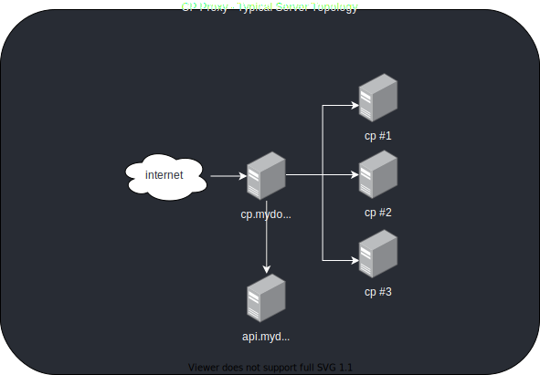

# Panel proxy

Panel proxy provides a centralized login portal for all participating ApisCP nodes. Panel proxy consists of three components: (1) collection agent **cp-collect**, (2) API service **cp-api**, and (3) reverse proxy **cp-proxy**.

The designated panel proxy server will always be visible in the address bar regardless of server an account actually resides on. Locations will change when a user clicks through to phpMyAdmin, phpPgAdmin, or any webmail application. This is by design.

Panel proxy can be combined with [Cachet](https://cachethq.io/) to report server status on login, reported as "\<indicator> **Network Status**"

All components of panel proxy are available on [GitHub](https://github.com/search?q=topic%3Apanel-proxy+org%3Aapisnetworks&type=Repositories).

A typical topology exists of at least 2 nodes with the cp-api on a separate node from cp-proxy/cp-collector for security. 

::: details Layout considerations
cp-collector encrypts authentication data with a key outside the database. This key is required to decrypt authentication keys (API/SSH) to collect accounts. Separation of services adds an extra layer of security should the API server become compromised. This also allows the API service to run on a normal ApisCP instance as its own account.
:::



## Collection agent

**Repository**: [apisnetworks/cp-collect](https://github.com/apisnetworks/cp-collect)

### Quickstart
**Prerequisites**
[ ]  All servers under the same domain, e.g. svr1.mydomain.com, svr2.mydomain.com
[ ]  Encryption key specified in .env or generated with `./proxy key:generate`

A unprivileged user, `cpcollect`, will account collections.

- Create a `cpcollect` system user
  ```bash
  useradd -rms /sbin/nologin cpcollect
  cd /home/cpcollect
  ```
  
- Clone the repository
  ```bash
  sudo -u cpcollect git clone https://github.com/apisnetworks/cp-collect.git /home/cpcollect/cp-collect
  cd cp-collect/
  ```

- Install vendor libraries
    ```bash
    sudo -u cpcollect composer install
    ```

- Copy .env.example to .env
    ```bash
    sudo -u cpcollect cp .env.example .env
    ```

- Create database layout, edit .env. "mysql" and "postgresql" are acceptable `DB_CONNECTION` types.
    ```bash
    CREATE DATABASE proxy;
    GRANT ALL on proxy.* to proxyuser@localhost IDENTIFIED BY 'MAKEUPYOUROWNPASSWORD';
    ```

- Update the .env file, set the `DB_USERNAME`, `DB_PASSWORD` and `DB_DATABASE` fields.

- Migrate the database
  ```bash
  sudo -u cpcollect ./proxy migrate:install
  sudo -u cpcollect ./proxy migrate
```

- For each linked server, create an API key, the command will return the key which you'll use on the Collector to add the server.
    ```bash
    ssh svr1.mydomain.com
    cpcmd auth:create-api-key "Proxy API key"
    ```

    Then add to the cp-proxy database:
    ```bash
    ./proxy server:add svr1 --auth=api --key=KEY-FROM-ABOVE
    ```

- Collect all domains
    ```bash
    ./proxy collect
    ```

- List all domains
    ```bash
    ./proxy all
    ```

- Locate domain foo.com displaying the admin email + server name
    ```bash
    ./proxy --fields=name,email lookup foo.com
    ```

#### Alternative configuration

##### Public key

Use `server:add` without specifying `--auth=` or `--key`. `native` authentication is assumed, which will use `ssh` with `~/.ssh/id_rsa.pub` as its key.

##### Custom public key

Use `server:add --auth=ssh --key=USER:KEY-RAW` where `KEY-RAW` is the raw key and `USER:` is an optional user to authenticate as. When omitted it will authenticate as the current user.

`USER` must be the ApisCP system user (typically "apnscp") or have access to run `cpcmd admin:collect`.

```bash
server:add node --auth=ssh --key="cp-user:$(cat /path/to/privkey.pem)"
```

::: tip ApisCP home directory
ApisCP can accept SSH keys for its user. Create a directory `mkdir --mode=0700 /usr/local/apnscp/storage/.ssh` and place the public key in `.ssh/authorized_keys`. 
:::

#### Security

A fully-qualified domain name must not be used. A domain should always be specified in **[auth]** => **server_format** to prevent an attacker from specifying *admin/some.other.server.com* as the username.

Login keys are encrypted within the database in `auth_key` column of `servers`. The encryption key is stored in `.env` within the filesystem.

Running `./proxy key:generate` will roll `APP_KEY` and update all encrypted auth data.

## API service

**Repository**: [apisnetworks/cp-api](https://github.com/apisnetworks/cp-api)

The following quickstart assumes **cp-collect** stores domain information within a MySQL database running on the same hostname as **cp-api**. **cp-collect** is under the account `collector.mydomain.com` while **cp-api** is under `api.mydomain.com`.

1. Create domain, `AddDomain -c siteinfo,domain=api.mydomain.com -c mysql,dbaseprefix=api_`

2. Relocate public/ to html/

    ```bash
    su api.mydomain.com
    cd /var/www
    git clone https://github.com/apisnetworks/cp-api /var/www/html-api
    cp .env.example .env
    ln -s html-api/public html
    cd html-api
    composer install
    exit
    ```

3. Detect application. Open up logging permissions. Request SSL.

    ```bash
    cpcmd -d api.mydomain.com webapp:discover api.mydomain.com
    cpcmd -d api.mydomain.com webapp:fortify api.mydomain.com
    cpcmd -d api.mydomain.com letsencrypt:request '[api.mydomain.com]'
    ```

4. Add grants for user to [proxy database](#collection-agent).

    ```bash
    cpcmd -d collector.mydomain.com mysql:add-user apiuser localhost random-password
    cpcmd -d collector.mydomain.com mysql:set-privileges apiuser localhost proxy '[read: true]'
    ```

5. Edit `.env` within `html-api/`. Set `DB_HOST`, `DB_DATABASE`, `DB_USERNAME`, and `DB_PASSWORD`.

6. Perform a quick test to validate setup works as intended.

```bash
curl -i \
    -H "Content-Type: application/json" \
    -H "Accept: application/json" \
    -X POST -d '{"domain":"mydomain.com"}' \
    https://api.mydomain.com/lookup
```

### Debugging

Set `APP_ENV=` to `local` and `APP_DEBUG=false`. By default, `production` is used which masks error

## Reverse proxy

**Repository**: [apisnetworks/cp-proxy](https://github.com/apisnetworks/cp-proxy)

### Background

cp-proxy is a reverse proxy that allows coordination between multiple, similar applications in which the application will push a request to another server via 307 redirect to another server if the account resides elsewhere. cp-proxy doubles as a simple method of upgrading normal, unencrypted HTTP sessions to HTTPS by placing a performant SSL terminator in front of the proxy.

### Quickstart

The following quickstart assumes a DNS-only or dev-only server that will not host any sites. These free licenses may be requested via [my.apiscp.com](https://my.apiscp.com). A DNS-only machine may be provisioned on a 1 GB machine using the following install command.

```bash
curl https://raw.githubusercontent.com/apisnetworks/apiscp-bootstrapper/master/bootstrap.sh | bash -s - -s use_robust_dns='true' -s always_permit_panel_login='true' -s has_dns_only='true' -s has_low_memory='true' -s dns_default_provider='null' -s anyversion_node='true' -s system_hostname='cp.mydomain.com' -s apnscp_admin_email='blackhole@apiscp.com'
```

`anyversion_node` allows using a non-system Node version (v10) for cp-proxy. `apnscp_admin_email` and `system_hostname` are required to arm the server with a valid SSL certificate.

::: tip Low low-memory
ApisCP is intended to work on 2 GB machines, but low-memory mode allows it to work on 1 GB machines. Not all 1 GB machines are provisioned consistently causing discrepancy in available memory for the guest. Add `-s limit_memory_1gb=500` to reduce the minimum memory check to "500 MB".
:::

```bash
useradd -rms /sbin/nologin cp
cd /home/cp
sudo -u cp git clone https://github.com/apisnetworks/cp-proxy.git /home/cp/proxy
cp /home/cp/proxy/cp-proxy.sysconf /etc/sysconfig/cp-proxy
# Now is a good time to edit /etc/sysconfig/cp-proxy!
cp /home/cp/proxy/cp-proxy.service /etc/systemd/system
sudo -u cp /bin/bash -ic 'nvm install 10 ; cd /home/cp/proxy/ ; nvm exec npm install'
systemctl enable --now cp-proxy
```

Next connect Apache to it by modifying `/etc/httpd/conf/httpd-custom.conf` within the SSL `VirtualHost` container. Pagespeed is disabled, which is known to cause interference with assets.

```
<IfModule ssl_module>
        Listen 443
        <VirtualHost 66.42.83.159:443 127.0.0.1:443 [::1]:443 >
                ServerName cp.mydomain.com
                SSLEngine On
                RewriteEngine On
                RewriteOptions Inherit
                
                # Disable gzip compression
                <IfModule pagespeed_module>
                    ModPagespeed unplugged
                </IfModule>
                
                # Pass HTTPS status
                RequestHeader set X-Forwarded-Proto "https"
                # Add this line, note trailing /
                ProxyPass / http://localhost:8021/
                # And this line, note trailing /
                ProxyPassReverse / http://localhost:8021/
        </VirtualHost>
</IfModule>
```

Next, reconfigure ApisCP to listen on a private network for the cp-proxy service.

```bash
cpcmd scope:set cp.bootstrapper has_proxy_only true
cpcmd scope:set cp.bootstrapper cp_proxy_ip 127.0.0.1
# Regenerate httpd-custom.conf in ApisCP
env BSARGS="--extra-vars=force=yes" upcp -sb apnscp/bootstrap
```

Run `htrebuild`, then visit [https://cp.mydomain.com](https://cp.mydomain.com/). You're done!

------

By default, cp-proxy will read from [http://127.0.0.1:2082](http://127.0.0.1:2082/). On a DNS-server this hosts no domains, which requires configuration below to route.

### Configuration

All configuration must be changed in `config/custom/config.ini`. [cpcmd](https://docs.apiscp.com/admin/CLI/#cpcmd) provides a short-hand means of doing this, e.g.

```bash
cpcmd scope:set cp.config <SECTION> <NAME> <VALUE>
```

| Section | Name                 | Description                                                  | Sample Value                                        |
| ------- | -------------------- | ------------------------------------------------------------ | --------------------------------------------------- |
| auth    | secret               | Must be the same across *all* instances. Used to encrypt trusted browsers. | ABCDEFGH                                            |
| auth    | server_format        | Optional format that appends a domain to the result of *server_query*. \<SERVER> is substituted with result from JSON query. | \<SERVER>.mydomain.com                              |
| auth    | server_query         | API endpoint that returns a JSON object with the server name. | https://api.mydomain.com/lookup                     |
| core    | http_trusted_forward | [cp-proxy](https://github.com/apisnetworks/cp-proxy) service IP address or 127.0.0.1 if proxy. | 1.2.3.4                                             |
| misc    | cp_proxy             | Control panel proxy endpoint that cp-proxy resides on.       | [https://cp.mydomain.com](https://cp.mydomain.com/) |
| misc    | sys_status           | Optional Cachet location for system status                   | https://demo.cachethq.io/                           |

For the lazy scholars, these values can be easily imported from an existing machine:

```bash
for i in auth,secret auth,server_format auth,server_query core,http_trusted_forward misc,cp_proxy, misc,sys_status ; do 
	IFS=","
	set -- $i
	section=$1
	value=$2
	echo "cpcmd scope:set cp.config $section $value '$(cpcmd scope:get cp.config $section $value)'"
done
```

#### Passing IP address

All requests pass `X-Forwarded-For`, which is the client address. Each ApisCP panel installation **must be configured** to trust the cp-proxy server's data. Failure to do so will result in incorrect login data and brute-force protection applied via [Anvil](../SECURITY.md#remote-access).

On all instances that accept traffic from cp-proxy **besides cp-proxy**, set *[core]* => *http_trusted_forward* assuming cp-proxy has the IP address 1.2.3.4. 

*`cp_proxy_ip` is a special setting in Bootstrapper that populates http_trusted_forward.*

```bash
cpcmd scope:set cp.bootstrapper cp_proxy_ip "1.2.3.4"
env BSARGS="--extra-vars=force=yes" upcp -sb apnscp/bootstrap
# Or alternatively
# cpcmd scope:set cp.config core http_trusted_forward "1.2.3.4"
#
# Then in /usr/local/apnscp/config/httpd-custom.conf, add:
#
# LoadModule remoteip_module sys/httpd/modules/mod_remoteip.so
# RemoteIPHeader X-Forwarded-For
# RemoteIPTrustedProxy 1.2.3.4
```

**On the cp-proxy instance**, set http_trusted_forward to 127.0.0.1:

```bash
cpcmd scope:set cp.bootstrapper has_proxy_only true
cpcmd scope:set cp.bootstrapper cp_proxy_ip "127.0.0.1"
env BSARGS="--extra-vars=force=yes" upcp -sb apnscp/bootstrap
```

:::warning cp-proxy as a solitary service
Setting `http_trusted_forward` to 127.0.0.1 prevents spoofing from malicious actors when sending a bogus `X-Forwarded-For:` header. Setting `http_trusted_forward` to 1.2.3.4 without restricting public network access via `PrivateNetwork=yes` would allow an attacker to spoof their IP remotely from 1.2.3.4, or in other words allow a customer on your network to brute-force other machines. 

Keeping cp-proxy as a solitary service prevents such internal subterfuge.
:::

:::tip Improving security
systemd network isolation can be enabled to restrict intraserver communication to just the named services: mysql, postgresql, and cp-proxy.  Set `proxy_intraserver_only=true` in Bootstrapper, then run `env BSARGS="--extra-vars=force=yes" upcp -sb apnscp/bootstrap`. This makes an assumption that the API lookup **does not** reside on the same server (*[auth]* => *server_query* is different than local). If such a configuration were required, create a systemd override that adds `httpd.service` to `JoinsNamespaceOf`.
:::

#### Billing compatibility

[WHMCS module](https://github.com/lhdev/apiscp-whmcs) passes the active client IP address as `X-Forwarded-For` for firewall checks. When using cp-proxy in conjunction with supported billing modules, it is necessary to add the billing server to the list of trusted forwards. Specifying a list of IP addresses, ApisCP will filter internal and external addresses.

```bash
# Assuming WHMCS is installed on 64.22.68.2
cpcmd scope:set cp.bootstrapper cp_proxy_ip '[127.0.0.1,64.22.68.2]'
env BSARGS="--extra-vars=force=yes" upcp -sb apnscp/bootstrap
```

#### Adding SSL

In the above example, the panel inherits the primary SSL certificate. This is managed by ApisCP. To add a new hostname, augment *[letsencrypt]* => *additional_certs*. It's easy to do using the cp.config Scope:

```bash
cpcmd scope:get cp.config letsencrypt additional_certs
# Make a note of the certs, if any. Each certificate
# is separated by a comma, e.g. "mydomain.com,cp.mydomain.com" or "cp.mydomain.com"
cpcmd scope:set cp.config letsencrypt additional_certs "mydomainalias.com,cp.mydomain.com"
```

ApisCP will automatically restart and attempt to acquire an SSL certificate for `cp.mydomain.com` in addition to the pre-existing SSL alias, `mydomainalias.com`.

#### cp-proxy configuration

All configuration is managed within `/etc/sysconfig/cp-proxy`. After making changes, activate the new configuration by restarting cp-proxy: `systemctl restart cp-proxy`.

- **CP_TARGET**: initial URL that is fetched, this should be a panel login portal
- **LISTEN_PORT**: port on which cp-proxy listens
- **LISTEN_ADDRESS**: IPv4/6 address on which cp-proxy listens
- **SECRET**: an alphanumeric salt used to encrypt session cookie. Generated randomly on service startup, which will expire existing sessions. Define this value if this behavior is undesired
- **STRICT_SSL**: enable peer verification of hostnames when connecting via SSL

#### Multi-homed Hosts

When working in situations in which a server is multi-homed, ensure each IP is bound to the panel. With ApisCP this can be accomplished by specifying multiple VHost macros in `/usr/local/apnscp/config/httpd-custom.conf`:

```
ServerName myserver.com
Use VHost 64.22.68.12
Use VHost 64.22.68.13
```

#### Different root domains

Proxy requires that all servers share the same root domain. For example, assuming proxy endpoint "cp.mydomain.com" and hosting servers,

- svr1.mydomain.com
- svr2.mydomain.com
- svr3.mydomain.hosting

Both "svr1" and "svr2" would be valid names added to [cp-collector](https://github.com/apisnetworks/cp-collector). "svr3" would be invalid because the TLD (*.hosting*) differs.

To work around this, add each differing domain to /etc/hosts or create DNS records under mydomain.com. For example, in `/etc/hosts` this would suffice:

```bash
echo "$(dig +short svr3.mydomain.hosting) svr3.mydomain.hosting" >> /etc/hosts
```

### Design

#### Server layout

A caching HTTP accelerator like Varnish is recommended in front of the proxy to minimize requests that flow through to the proxy service. In my implementation, Apache sits in front for HTTP2 and TLS. Apache hits Varnish for static assets, then what is left flows to cp-proxy. cp-proxy serves from cp #1 by default.

```
                                               +---------+
                                           +--->  cp #1  |
                                           |   +---------+
+--------+    +---------+    +----------+  |
|        |    |         |    |          |  |   +---------+
| apache +----> varnish +----> cp proxy +------>  cp #2  |
|        |    |         |    |          |  |   +---------+
+--------+    +---------+    +----------+  |
                                           |   +---------+
                                           +--->  cp #3  |
                                               +---------+
```

#### Login mechanism & server designation

A login should check if the account is resident on the server. If not resident, the request should be forwarded to the proper server as a 307 redirect issued. This `Location:` header is filtered from the response and its FQDN stored as a session cookie.

Each subsequent request sends the session cookie that includes the server name to the proxy.

#### Bypassing reverse proxy

An application may include `no-proxy` header in its response. The Location will flow through in the response headers effectively allowing the session to break from the proxy.
