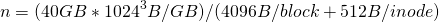
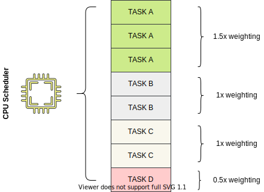
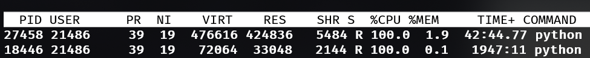
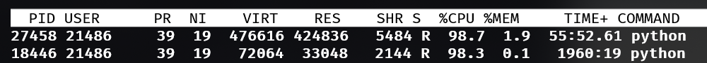
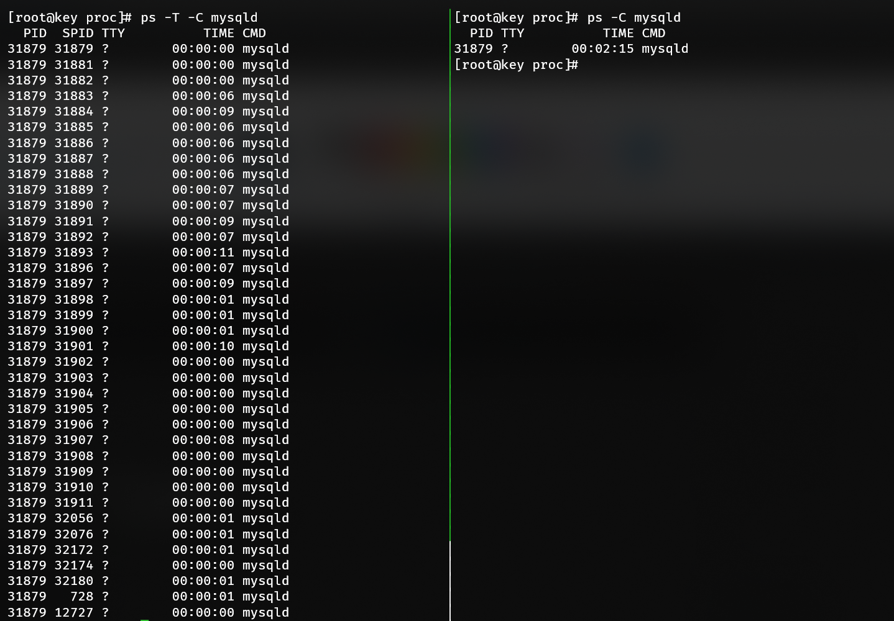

# Resource enforcement

Before discussing resource enforcement, a preface on **load average** is necessary, or more pedantically: *run-queue size* (both are used interchangeably). Run-queue size is the total amount of work parcels enqueued across all logical processors at any given instance. For example, if there are 4 logical processors bound to a server it means - assuming equal assignment - that each logical processor is processing 1 parcel of work and 3/4 have another parcel of work immediately behind it. Parcels compute on the microsecond scale, so momentary spikes - what's reported as a 1-minute load average - only indicate there's a spike and nothing more. A 15-minute load average paints a better picture of the typical server load, which can potentially hint at deeper issues such as insufficient hardware.

Logical processors are the number of processes listed in `/proc/cpuinfo`. ApisCP precomputes this number on start and applies it to any CPU calculations (as well as user hz).

::: tip
This section covers per-site aggregate resources. For per-process see [Process limits](Limits.md).
:::

## Storage

Storage is tracked using native quota facilities of the operating system. XFS and Ext4 [filesystems](Filesystem.md) are supported, which provide equivalent tracking abilities. This tracking facility is called a "quota". Quotas exist as **hard** and **soft**. 

An account may not exceed its **hard quota** whereas a **soft quota** disposition is at the discretion of the application: it may be simply advisory or fail.

File data is allocated in **blocks**. Each block is 4 KB. Files must always occupy the entire block size even if there is insufficient data to cover the 4 KB block. Thus a 7 KB file may appear as 7 KB on disk, but is charged for 8 KB of storage by the operating system.

::: details
`repquota -ua | sort -n --key=3` will show all files belonging to users ordered by size. Each number, with the exception of 0, is in KB and will always be perfectly divisible by the filesystem block size, 4 KB.
:::

::: tip
Storage quotas are controlled by *quota* service name in the *diskquota* [service class](Plans.md).
:::

### inode quotas

Before discussing inode quotas, let's talk about an inode. inodes provide metadata about files. They don't contain file data, but instead information about the file or directory or device. inodes have a fixed size, typically 256 or 512 bytes each. With XFS and cyclic redundancy checks - a blessing for ensuring data integrity - these inodes are always 512 bytes. Ext4 uses 256 byte inodes by default.

Large inode sizes means that more information about a file. File size, creation time, modification time, owner, group are mandatory attributes one would find in an inode. Additional attributes include access control lists, granular access rights to a file; extended attributes, arbitrary data about a file; and SELinux security contexts, used by a separate subsystem that defines unambiguous operational boundaries of a file. 

*File names are not included* in an inode, but instead a **dentry**, which is another storage block that contains information about what file names it contains as well as its inode structures. Each dentry is stored in multiples of 4 KB.

***Bringing this together:***

For a directory consisting of 2 files, a 4 KB and 7 KB file: the total size charged for these 3 storage items is 4 KB (directory) + 4 KB (file) + 8 KB (file). These would create 3 inodes that are not directly charged to the account's storage quota but are still stored in the filesystem responsible for approximately 1.5 KB of additional storage. These files would instead be charged to the **inode quota**.

:::tip
Inode quotas are controlled by *quota* service name in the *fquota* [service class](Plans.md).
:::

Doing some quick math, the maximum number of files a 40 GB would allow for is approximately 9,320,675 1 byte files - still quite a bit.  


::: details
A zero byte file doesn't generate a 4 KB block of file storage, but still generates an inode. This is why *1 byte* is intended instead of *0 bytes*.
:::

The maximum number of inodes on XFS is 2^64. The maximum number of Ext4 is 2^32. You could fill up an XFS server with 9.3 million 1 byte files every second for 62,000 years before reaching its limit!

Ext4 on the other hand wouldn't last 10 minutes, assuming you could find a process to generate 9.3 million files every second. 

In either situation you're liable to run out of storage before inodes. On XFS systems, 2^64 inodes would require 8,388,608 PB of storage. 

*If you're on XFS, don't worry counting inodes.* 


### XFS/Ext4 idiosyncrasies

On Ext4/Ext3 platforms, CAP_SYS_RESOURCE allows bypass of quota enforcement. XFS does not honor quota bypass if a user or process has CAP_SYS_RESOURCE capability set. Thus it is possible for services that require creation of a file and are either root or CAP_SYS_RESOURCE to fail upon creation of these files. Do not sgid or suid a directory that may cause an essential service to fail on boot if quotas prohibit it, such as Apache.

It is possible to disable quota enforcement on xfs while counting usage using `xfs_quota`:

```bash
# findmnt just resolves which block device /home/virtual resides on
xfs_quota -xc 'disable -ugv' "$(findmnt -n -o source --target /home/virtual)"
```

This affects quota enforcement globally, so use wisely. Likewise don't forget to enable,

```bash
xfs_quota -xc 'enable -ugv' "$(findmnt -n -o source --target /home/virtual)"
```

### Quota ghosting

Deleting, then recreating a site may refer to the old usage figures for a brief time. Flushing the filesystem cache immediately will allow for these quota values to update.

```bash
echo 3 > /proc/sys/vm/drop_caches
```

## Bandwidth

Bandwidth is tallied every night during logrotation. Logrotation runs via `/etc/cron.daily/logrotate`. Its start time may be adjusted using *cron.start-range* [Scope](Scopes.md). A secondary task, `bwcron.service` runs every night at 12 AM server time (see *system.timezone* Scope). Enforcement is carried out during this window. Disposition is configured by the **bandwidth** [Tuneable](Tuneables.md). The following table summarizes several options.

| Parameter  | Description                                                  |
| ---------- | ------------------------------------------------------------ |
| resolution | For archiving; bandwidth is rounded down and binned every n seconds. Smaller resolutions increase storage requirements. |
| stopgap    | Bandwidth stopgap expressed in percentage. 100 terminates a site when it's over allotted bandwidth. Default setting, 200, suspends the site when it has exceeded 200% its bandwidth. 95 would suspend a site when it's within 5% of its bandwidth quota. |
| notify     | Bandwidth notification threshold expressed in percentage. As a sanity check, bandwidth_notify <= bandwidth_stopgap. Setting 0 would effectively notify every night. |

An email is sent to the customer every night informing them of overage. This template located in `resources/views/email/bandwidth` may be customized using typical ApisCP [customization](Customizing.md) rules. 

## Memory

Memory is a misunderstood and complex topic. [linuxatemyram.com](https://www.linuxatemyram.com/) addresses many surface complaints with free memory in a healthy system that are unfounded. cgroup memory accounting doesn't stray from this complexity. Before discussing technical challenges in accounting (and CoW semantics), let's start with some basics.

```bash
# Set ceiling of 512 MB for all processes
EditDomain -c cgroup,memory=512 domain.com
# Switch to domain.com account
su domain.com
# Generate up to 512 MB, some memory is reserved by the shell
yes | tr \\n x | head -c $((512*1024*1024)) | grep n
# Once memory has been reached, process terminates with "Killed"
```

A site may consume up to 512 MB of memory before the OOM killer is invoked. When an OOM condition is reached, further memory allocation fails, event logged in the memory controller, and offending application ends abruptly. 

`dmesg` notes an OOM killer invocation on the process,

```{1,2,3}
[2486967.059804] grep invoked oom-killer: gfp_mask=0xd0, order=0, oom_score_adj=600
[2486967.059926] Task in /site133 killed as a result of limit of /site133
[2486967.059929] memory: usage 524288kB, limit 524288kB, failcnt 153
[2486967.059930] memory+swap: usage 525060kB, limit 9007199254740988kB, failcnt 0
[2486967.059932] kmem: usage 0kB, limit 9007199254740988kB, failcnt 0
[2486967.059933] Memory cgroup stats for /site133: cache:0KB rss:524288KB rss_huge:0KB mapped_file:0KB swap:772KB inactive_anon:31404KB active_anon:492884KB inactive_file:0KB active_file:0KB unevictable:0KB
[2486967.059957] [ pid ]   uid  tgid total_vm      rss nr_ptes swapents oom_score_adj name
[2486967.060381] [22040]     0 22040    51698     1729      57       10             0 su
[2486967.060384] [22041]  9730 22041    29616      971      14      322           600 bash
[2486967.060446] [25889]  9730 25889    27014       86      11        0           600 yes
[2486967.060449] [25890]  9730 25890    27020      154      11        0           600 tr
[2486967.060452] [25891]  9730 25891    27016      166      11        0           600 head
[2486967.060455] [25892]  9730 25892   224814   130523     268        0           600 grep
[2486967.060459] Memory cgroup out of memory: Kill process 25892 (grep) score 710 or sacrifice child
[2486967.067494] Killed process 25892 (grep), UID 9730, total-vm:899256kB, anon-rss:521228kB, file-rss:864kB, shmem-rss:0kB
```

::: tip
"OOM" is an initialism for "out of memory". Killer is... a killer. OOM killer is invoked by the kernel to judiciously terminate processes when it's out of memory either on the system or control group.
:::	

Using [Metrics](Metrics.md), OOM events can be easily tracked. `cpcmd -d domain.com telemetry:get c-memory-oom` reports the latest OOM value for a site. A free-form query is also available that provides similar information for all sites against the PostgreSQL database, normally `appldb`.

```sql
SELECT 
	domain, 
	value, 
	MAX(ts) 
FROM 
	metrics 
JOIN 
	siteinfo USING (site_id) 
JOIN 
	metric_attributes USING (attr_id) 
WHERE 
	name = 'c-memory-oom' 
	AND 
	value > 0 
	AND 
	ts > NOW() - INTERVAL '1 DAY' 
GROUP BY (domain, value);

```

As an alternative, range can be used to examine the sum over a window.

`cpcmd telemetry:range c-memory-oom -86400 null 12`

::: details
`c-memory-oom` attribute is summed over the last day (86400 seconds) for site ID 12. `false` may be specified after site ID to list per record.
:::

## CPU

CPU utilization comes in two forms: **user** and **system** (*real time* is the sum of user + system). User time is spent incrementing over a loop, adding numbers, or templating a theme. System time is when a process communicates with the kernel directly to perform a privileged function, such as opening a file, forking a process, or communicating over a network socket.

**User time** is raw processing, number crunching. In typical operation, user will always be an order of magnitude higher than system. 

`strace` (short for system trace) helps break down the **system calls** during a program's execution. Don't worry if it doesn't make sense yet, we'll walk through it. `time` allows us to see the proportion of user to system time during execution.

Let's look at a trivial example that checks filesystem attributes on / and increments a variable.

```bash
strace -c -- /bin/sh -c 'time  (let SUM=0; for i in $(seq 1 1000) ; do SUM+=$i ; stat / > /dev/null; done)'

real    0m2.231s
user    0m0.777s
sys     0m1.336s
% time     seconds  usecs/call     calls    errors syscall
------ ----------- ----------- --------- --------- ----------------
 99.96    1.335815      667908         2         1 wait4
  0.01    0.000152          11        14           mmap
  0.01    0.000080          10         8           mprotect
  0.01    0.000073           9         8           open
  0.00    0.000049          12         4           read
  0.00    0.000031           4         8           close
  0.00    0.000029           2        16           rt_sigprocmask
  0.00    0.000024           3         7           fstat
  0.00    0.000024           2        10           rt_sigaction
  0.00    0.000022          11         2           munmap
  0.00    0.000016           3         5           brk
  0.00    0.000016          16         1           execve
  0.00    0.000011           6         2           stat
  0.00    0.000007           7         1         1 access
  0.00    0.000004           4         1           getrlimit
  0.00    0.000004           4         1           getpgrp
  0.00    0.000003           3         1           getpid
  0.00    0.000003           3         1           uname
  0.00    0.000003           3         1           getuid
  0.00    0.000003           3         1           getgid
  0.00    0.000003           3         1           geteuid
  0.00    0.000003           3         1           getegid
  0.00    0.000003           3         1           getppid
  0.00    0.000003           3         1           arch_prctl
  0.00    0.000000           0         1           rt_sigreturn
  0.00    0.000000           0         1           clone
------ ----------- ----------- --------- --------- ----------------
100.00    1.336381                   100         2 total
```
Each **system call** corresponds to an escalation in code that interacts with the kernel. `wait4` for example asks the kernel to wait until a process exits then return its exit code. `mmap` maps a text file into memory preferring to read it from memory instead of disk if possible. `fstat` asks the kernel to ask the hard drive to return what metadata it knows about a file and so on. The remaining *user* time is spent incrementing SUM by 1 and the loop counter.

### Weighting usage

Usage may be apportioned based on demand using `cgroup`,`cpuweight`. Weighting works on a scale from [1, 1000] with the default value 100 representing equal value. CPU scheduling works on time slices with  *1 unit of time* split n ways between all competing tasks. Higher valued processes are given scheduling priority during this *unit of time*. A unit of time is completely arbitrary and dependent how quickly the CPU can process work.



*Given 1 unit of time, we see TASK A has a 1.5x weighting to TASK B + TASK C (independent). TASK D is weighted 0.5x. TASK A is weighted 3x more to TASK D.*

Let's convert this to `cgroup`,`cpuweight` parameters. TASK A comes from site1, TASK B from site2, TASK C from site3, and TASK D from site4:

```bash
EditDomain -c cgroup,cpuweight=150 site1
EditDomain -c cgroup,cpuweight=100 site2
EditDomain -c cgroup,cpuweight=100 site3
EditDomain -c cgroup,cpuweight=50 site4
```

That's it!

Impact can be evaluated real-time too. Take for example a pair of computationally intense processes. Its default cpuweight is 100. Evaluate the accumulated CPU time over 30 seconds. Decrease CPU weight, then re-evaluate.



Assuming these tasks are from `site1`. You can get the cgroup group by checking `/proc/PID/cgroup`.

```bash
cat /proc/18446/cgroup 
# Note the cpuacct,cpu group is /site1
let x1=$(cat /sys/fs/cgroup/cpuacct/site1/cpuacct.usage)
sleep 30
echo $(($(cat /sys/fs/cgroup/cpuacct/site1/cpuacct.usage) - $x1))
# Reports 58993202755

# Apply CPU weighting treatment to give it 0.5x weighting
let x1=$(cat /sys/fs/cgroup/cpuacct/site1/cpuacct.usage)
sleep 30
echo $(($(cat /sys/fs/cgroup/cpuacct/site1/cpuacct.usage) - $x1))
# Reports 57876992031, 1.89% reduction in CPU usage over 20 seconds
```

*Weighting doesn't always produce a proportional reduction in CPU usage* because there is still idle CPU that can be utilized by the process (cf. **load average** in the introduction). `cpuweight` does make a difference under heavy utilization with significant resource contention where multiple processes are vying for CPU timeslices by prioritizing cgroup tasks with heavier weighting. For cumulative usage, use `cgroup`,`cpu` to limit the maximal 24 hour consumption.



:::tip Bandwidth control
CPU bandwidth controls allow throttling as well as burstability, but is not yet a feature of ApisCP. These can be controlled via /sys/fs/cgroup/siteXX/cpu.cfs\_{period,quota}\_us
:::

### Limiting cumulative usage

`cgroup`,`cpuweight` balances CPU usage among a variety of tasks. If we want to restrict how much CPU can be used in a 24-hour period, then `cgroup`,`cpu` establishes this limit. [Metrics](./Metrics.md) must be enabled to accumulate this data over a rolling 24 hour window. Overages are not actively patrolled or enforced at this time. Periodic usage can be queried using `admin:get-usage`.

```bash
cpcmd admin:get-usage cgroup
# Or to restrict to a few sites
cpcmd admin:get-usage cgroup '[site1,site2,site3]'
```

#### Site Administrator glance

When [telemetry](Metrics.md) is enabled, Site Administrators have a 24-hour glance of both "user" and "system" time available in the Dashboard and **Account** > **Summary** > **CPU Usage**. As there are 86,400 seconds in a day per logical core, in theory the maximal CPU value would approach 86,400 seconds * \<n processors>, but as several hundred processes run on a server it would be impossible for any one task group to ever reach this total.

### Pinning

**New in 3.2.28**

In multi-core systems it may be desirable to segregate site tiers. For example tier 1 is allocated to CPU #0 whereas tier 2 sites are allocated to CPUs #1 and #2. `cgroup`,`cpupin` sets CPU affinity for all processes by a site.

```bash
# Set domain.com to use only CPU #0
EditDomain -c cgroup,cpupin=0 domain.com
# Set domain.com to use CPUs 0 + 1
EditDomain -c cgroup,cpupin='[0,1]' domain.com
```

Groups that are not explicitly pinned to processors will be balanced among cores as needed, including system processes.

## Process

A PID is a process ID. A process ID is any *thread*. A single-threaded application creates 1 process ID. A multithreaded application creates up to *n* process IDs. The nuance is important because **process enforcement affects thread counts, not process counts**. In the below example, MySQL is charged with 37 processes. In a typical view with `ps`, this may only appear as 1 process on the surface.



Let's set process limit to 100 and induce a [fork bomb](https://en.wikipedia.org/wiki/Fork_bomb), which rapidly spawns up to 100 processes before summarily exiting:

```bash
EditDomain -c cgroup,proclimit=100 -D site1
su site1
# Uncomment following line to run a fork bomb
# :(){ ; :|:& };:

# Output:
# bash: fork: retry: No child processes
# bash: fork: retry: No child processes
# bash: fork: retry: No child processes
```

And confirm the PID counter maxed out by investigating the contents of pids.max in the pids controller,

```bash
cat /sys/fs/cgroup/pids/site11/pids.max
```

Likewise if 100 threads were created using a tool such as [GNU Parallel](https://www.gnu.org/software/parallel/) a similar result would be seen once the thread count hits 100.

::: tip One of many layers
A secondary defense, in the event no such cgroup protection is applied, exists in `FST/siteinfo/etc/security/limits.d/10-apnscp-user.conf` that sets a generous limit of 2,048 processes. This can be adjusted by setting `limit_nproc` in Bootstrapper and running `system/limits` role.
:::

::: warning
Program behavior is often unspecified when it can no longer create additional threads or processes. proclimit should be used judiciously to prevent abuse, not act as a prod for users to upgrade to a more profitable package type.
:::

## IO

IO restrictions are classified by read and write operations. 

```bash
# Default weight is 100
# Halve IO priority, double CPU priority
EditDomain -c cgroup,ioweight=50 -c cgroup,cpuweight=200 domain.com
# Set a write bandwidth of 2 MB/s
EditDomain -c cgroup,writebw=2 domain.com
# Apply the minimum of blkio,writebw/blkio,writeiops
# Both are equivalent assuming 4 KB blocks and uniform throughput
EditDomain -c cgroup,writebw=2 -c cgroup,writeiops=512 domain.com
```

`ioweight` requires usage of the CFQ/[BFQ](https://www.kernel.org/doc/html/latest/block/bfq-iosched.html) IO elevators. ApisCP will ignore this value if [IO elevator](https://access.redhat.com/documentation/en-us/red_hat_enterprise_linux/8/html/monitoring_and_managing_system_status_and_performance/setting-the-disk-scheduler_monitoring-and-managing-system-status-and-performance) does not support proportional queueing (i.e. kyber, deadline, noop). `writebw` and `writeiops` are two means of quantifying IO activity. 

::: tip IO elevator
To find the current IO elevator in use query `/sys/block/DEVICE/queue/scheduler`. The following command will query all block devices on the server and will typically coincide to a single IO scheduler.

```bash
cat /sys/block/*/queue/scheduler
```
:::

`writebw` is a throughput limit whereas `writeiops` is an interval throughput limit measured every second. IOPS will fill up to the filesystem [block size](#storage), 4 KB. `writebw` is better suited for bursts and `writeiops` works better to sustain fairness. These two values may cooperate to provide quick bursts while shaping IO for a site.

```bash
# Allow for a quick burst in throughput up to 5 MB/s within 1,000 ms 
# but no more than 2 MB data sustained over 1,000 ms
EditDomain -c cgroup,writebw=5 -c cgroup,writeiops=512 domain.com
```

Then to confirm the changes work as intended.

```bash
su myadmin@domain.com -c 'dd if=/dev/zero of=/tmp/foo bs=4k count=1024 oflag=direct'
# 1024+0 records in
# 1024+0 records out
# 4194304 bytes (4.2 MB, 4.0 MiB) copied, 2.00011 s, 2.1 MB/s

su myadmin@domain.com -c 'dd if=/dev/zero of=/tmp/foo bs=1M count=1 oflag=direct'
# 1+0 records in
# 1+0 records out
# 1048576 bytes (1.0 MB, 1.0 MiB) copied, 0.209713 s, 5.0 MB/s
```

Note that the throughput in the second command matches `cgroup`,`writebw` because the sustained payload (1 MB) is less than the IOPS limit (2 MB/s).

## Freezer

All CPU processing may be suspended (frozen) when a site is enrolled into the freezer controller. A frozen site suspends all CPU cycles and will not process additional CPU until thawed. **Freezing a site is a temporary, emergency process** as suspended CPU processing can easily create jams: Apache (hot) → PHP-FPM (frozen) or MySQL (hot) → PHP-FPM (frozen).

Use `cgroup:freeze` to freeze a site and `cgroup:thaw` to unfreeze (thaw) the site.


## Troubleshooting

### Memory reported is different than application memory

cgroup reports all memory consumed within the OS by applications, which includes filesystem caches + network buffers. Cache can be automatically expunged when needed by the OS. To expunge the cache forcefully, write "1" to `/proc/sys/vm/drop_caches`. For example, working with "site1" or the first site created on the server:

```bash
cat /sys/fs/cgroup/memory/site1/memory.usage_in_bytes
# Value is total RSS + TCP buffer + FS cache
echo 1 > /proc/sys/vm/drop_caches
# Value is now RSS
cat /sys/fs/cgroup/memory/site1/memory.usage_in_bytes
```

This can be confirmed by examining `memory.stat` in the cgroup home. Likewise memory reported by a process may be higher than memory reported by cgroup, this is because cgroup only accounts for memory uniquely reserved by the application. A fork shares its parent's memory pages and copies-on-write at which point the newly claimed memory is charged to the cgroup.

## CloudLinux equivalences

Both ApisCP and CloudLinux utilize cgroups for resource enforcement. The table below summarizes the relationships between CloudLinux limit variables and ApisCP's equivalent settings.

| CloudLinux                                                   | ApisCP                                                       | Remarks                                                      |
| ------------------------------------------------------------ | ------------------------------------------------------------ | ------------------------------------------------------------ |
| [SPEED](https://docs.cloudlinux.com/limits/#speed-limit)     | [cgroup,cpuweight](#weighting-usage)                         |                                                              |
| —                                                            | [cgroup,cpupin](#pinning)                                    | Assign work to logical CPU(s).                               |
| —                                                            | [cgroup,cpu](#limiting-cumulative-usage)                     | 24 hour CPU limit (wall time, seconds). *Overage not presently enforced.* |
| [PMEM](https://docs.cloudlinux.com/limits/#physical-memory-limit) | [cgroup,memory](#memory)                                     |                                                              |
| [VMEM](https://docs.cloudlinux.com/limits/#virtual-memory-limit) | [limit_as_soft](https://gitlab.com/apisnetworks/apnscp/-/blob/master/resources/playbooks/roles/system/limits/templates/apnscp.conf.j2) | Does not affect active memory usage, results in undefined behavior in complex software such as [v8](https://github.com/nodejs/node/issues/25933). |
| [IO](https://docs.cloudlinux.com/limits/#io)                 | [cgroup,writebw](#io) + [cgroup,readbw](#io)                 | Write/read bandwidth separated to facilitate resource tracking on limited endurance disks. |
| [IOPS](https://docs.cloudlinux.com/limits/#iops)             | [cgroup,writeiops](#io) + [cgroup,readiops](#io)             | Write/read IOPS separated to facilitate resource tracking on limited endurance disks. |
| —                                                            | [cgroup,ioweight](#io)                                       | Controls IO priority similar to CPU weight. Requires CFQ/BFQ IO elevator (auto-detection). |
| [NPROC](https://docs.cloudlinux.com/limits/#number-of-processes) | [cgroup,proclimit](#process)                                 |                                                              |
| [EP](https://docs.cloudlinux.com/limits/#entry-processes)    | [workers](PHP-FPM.md#policy-maps)                            | Requires policy map usage.                                   |
| —                                                            | [cgroup:freeze](#freezer), cgroup:thaw                       | Immediately suspends all activity. Use cgroup:freeze, cgroup:thaw API commands. |


## See also

- [Linux Performance Tools](https://www.brendangregg.com/Slides/Velocity2015_LinuxPerfTools.pdf) by Brendan Gregg