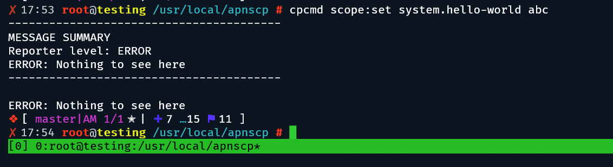

# Scopes

Scopes are configuration-specific entry points to ApisCP. They may tie into [config.ini](https://gitlab.com/apisnetworks/apnscp/blob/master/config/config.ini), [Bootstrapper](https://github.com/apisnetworks/apnscp-playbooks), or system configuration. A configuration scope abstracts a more complex operation that could be achieved with blood, sweat, tears, trial, and a bit of error.

## Listing scopes

A list of available scopes can be gathered with `cpcmd scope:list`. All scopes correspond to a concrete implementations in [`Opcenter\Admin\Settings`](https://gitlab.com/apisnetworks/apnscp/tree/master/lib/Opcenter/Admin/Settings).

`scope:get` retrieves the scope's configured value. A scope value is idempotent; if it's set value is the same as its input it will not rewrite its settings nor process any tasks associated with itself.

`scope:info` displays the configured value, default value, and description for the scope.

[Scopes-list.md](Scopes-list.md) contains a master list of all Scopes available to the platform.

## Setting scopes

`scope:set` reconfigures a scope and initiates any reconfiguration tasks associated with reassignment. Before altering a system value, check scopes first as these will be overwritten with `upcp -b` (run Bootstrapper).

### Append-only scopes

A couple scopes are append-only, which are intended to permanently set features. The following table summarizes the scopes and manual undo operation.

| Scope                             | Undo                                        |
| --------------------------------- | ------------------------------------------- |
| rampart.fail2ban-whitelist        | `ignoreip` entry in /etc/fail2ban/jail.conf |
| virus-scanner.signature-whitelist | /var/lib/clamav/custom-whitelist.ign2       |

## Adding new Scopes

Additional Scopes may be latched on at boot using the bootloader of ApisCP. Inside `config/custom`, create a file named `boot.php` if it does not exist already. We'll need to register two things, one an autoload path and second, the actual Scope association.

```bash
cd /usr/local/apnscp
./artisan make:scope system hello-world
```

And in `config/custom/boot.php`:

```php
<?php
apnscpFunctionInterceptor::register(
	\Opcenter\Admin\Settings\System\HelloWorld::class,
	'config/custom/scopes/Opcenter/Admin/Settings/System/HelloWorld.php'
);
\Opcenter\Admin\Settings\Setting::register(\Opcenter\Admin\Settings\System\HelloWorld::class);
```

In the above, we're creating a class mapping for **system.hello-world** to config/custom/scopes/Opcenter/Admin/Settings/System/HelloWorld.php. The Scope could just as easily be located in config/custom/scopes/system/hello-world.php.

Now edit the scope in config/custom/scopes/Opcenter/Admin/Settings/System/HelloWorld.php:

```php
<?php declare(strict_types=1);

	namespace Opcenter\Admin\Settings\System;

	use Opcenter\Admin\Settings\SettingsInterface;

	class HelloWorld implements SettingsInterface
	{
		public function set($val): bool
		{
			return error("Nothing to see here");
		}

		public function get()
		{
			return microtime(true);
		}

		public function getHelp(): string
		{
			return 'Dummy command example';
		}

		public function getValues()
		{
			return 'mixed';
		}

		public function getDefault()
		{
			return true;
		}

	}
```

Then run it!



Or access it from within the panel, the choice is yours.