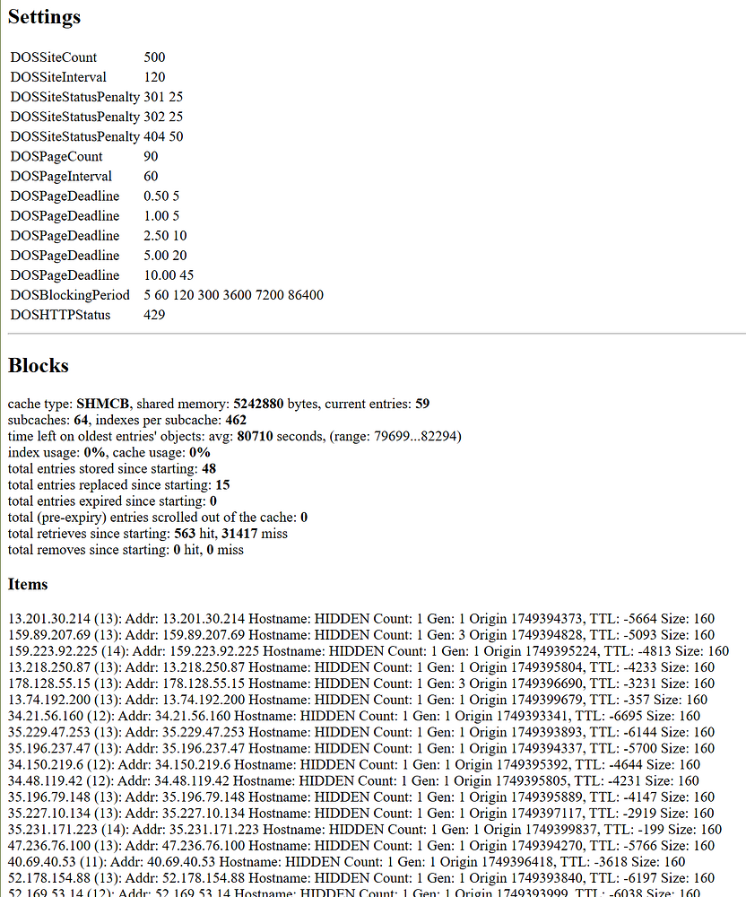

**New in 3.2.48**

mod_shield is an advanced bean counter that tracks HTTP requests, status codes, and response times over a large window to discriminate against malicious actors. When an IP address exceeds the point threshold within the duration, a configurable response is immediately returned and information is emitted from syslog to fail2ban, which allows [Rampart](../FIREWALL.md) to respond to to the incident. Additionally a file named */tmp/dos-IP* is created marking the event.

Requests are tracked by two methods: same URI and same site. An IP which exceeds either limit is blocked in the same manner.

## Configuration

`apache.shield` [Scope](Scopes.md) manages mod_shield parameters. This Scope interacts with /etc/httpd/conf.d/shield.conf and adds a 2 minute delay to reloading HTTP configuration. 

*Apache directives are parenthesized for each named directive.*

### Page tracking

Same URI tracks the full URI provided to Apache. When `canonical` (`DOSCanonical on|off`) is enabled (default), query strings are truncated from the request: */foo* is the same as */foo?bar=baz* and */foo?quu=qux&bar=baz*.

`page-count` (`DOSPageCount AMOUNT`) and `page-interval` (`DOSPageInterval SECONDS`) control hit count and window. Recommended settings are a low interval and count greater than interval.

```bash
cpcmd scope:set apache.shield page-count 20
cpcmd scope:set apache.shield page-interval 5
```

Above triggers protection if more than a score of 20 is reached on the same URI within 5 seconds.

### Page deadlines

Scoring may be adjusted if a response takes longer than *n* seconds using `shield-deadline` (`DOSPageDeadline DURATION SCORE|off`). Score may be any whole number, positive or negative. Deadlines are additive. Each page request always generates 1 point. Setting `off` disables this feature.

```bash
# Any page that loads below 250 ms receives a -2 score
cpcmd scope:set apache.shield-deadline 0 -2
# Ignore any page that loads under 500 ms
cpcmd scope:set apache.shield-deadline 0.250 0
# Any page that loads above 500 ms is scored 1 extra point
cpcmd scope:set apache.shield-deadline 0.500 1
# Alternative form
cpcmd scope:set apache.shield-deadline '[0:-2, 0.250:0, 0.500:1]'

# Cancel 250 ms score
cpcmd scope:set apache.shield-deadline 0.250 null
# Reset scoring to default
cpcmd scope:set apache.shield-deadline null
# Disable all deadline scoring
cpcmd scope:set apache.shield-deadline false
# Accepted for interoperability
cpcmd scope:set apache.shield-deadline off
```

### Site tracking

Site tracking ignores URI distinctions and looks at all requests originating from an IP against a HTTP hostname. */foo* and */bar* both accumulate hits.

`site-count` (`DOSSiteCount AMOUNT`) and `site-interval` (`DOSSiteInterval SECONDS`) control hit count and window. This ratio *must* be higher than page-based accumulation. Setting a high interval or low count will trigger false positives at a much higher rate, especially in plugin-dependent Web Applications, such as WordPress.

```bash
cpcmd scope:set apache.shield site-count 300
cpcmd scope:set apache.shield site-interval 2
```

Above triggers protection if more than 300 requests are made within 2 seconds.

### Status penalties

Scoring may be adjusted for any HTTP response code, such as a 304, 403, 404 or even a custom status like [418 I'm a teapot](https://en.wikipedia.org/wiki/Hyper_Text_Coffee_Pot_Control_Protocol) using `shield-status` (`DOSPageStatus STATUS SCORE|off`).. Status codes are evaluated from the *final* response in a processing pipeline. 

```bash
# Add 50 points if HTTP status code is 418
cpcmd scope:set apache.shield-status 418 50
# Remove penalty for 302, "0" works as well
cpcmd scope:set apache.shield-status 302 false
# Add a -5 point adjustment for 204, not modified
cpcmd scope:set apache.shield-status 204 -5
# Reset scoring to default
cpcmd scope:set apache.shield-status null
# Disable all deadline scoring
cpcmd scope:set apache.shield-status false
# Accepted for interoperability
cpcmd scope:set apache.shield-status off
```

For sites that are composed with best practices in mind, 404 and non-2xx status codes are rare; thus, default status penalties are optimal.

### Status handler

A separate status handler named `shield-status` is available. Settings, active blocks, and individual counters for same-page and site resources are provided. 

It may be activated with the following directives in `/etc/httpd/conf/httpd-custom.conf`:

```makefile
<Location /shield>
    SetHandler shield-handler
    # It's a good idea to limit traffic to your IP.
    # Accepts CIDR-style
    Require ip your.ip.address
</Location>
```



::: tip Whitelist 
HTTP blocks occur early in the pipeline before any overrides or per-directory processing to reduce CPU strain. It's a good idea to also whitelist these IP addresses that are permitted to view the status overview in case *they too* get blocked.

```bash
# Never block any address between 1.2.3.1 and 1.2.3.255
cpcmd scope:set apache.shield-whitelist 1.2.3.1/24
```

:::

### Disabling per site

Shield may be disabled directly with `DOSEnabled off` or indirectly by setting *apache*,*shield*=0 for the site.

#### Direct disablement
Create a file named `custom` in `/etc/httpd/conf/siteXX` where *siteXX* is the site ID for the domain. `get_site_id domain.com` from command-line will help you locate this value. Within `custom` add:

`DOSEnabled off`

Then rebuild and reload, `htrebuild && systemctl reload httpd`.

#### Indirect
```bash
EditDomain -c shield,shield=0 domain.com
```
### Empirical estimates

Running a site through webpagetest.org or using [DevTools](https://developers.google.com/web/tools/chrome-devtools) to see the average number of subrequests per page view can help you estimate a good baseline for your site. An ideal setting allows typical usage while disabling atypical extremes: bots don't adhere to netiquette when brute-forcing credentials. Some protection is necessary.


### Block metadata

Whenever a block occurs, a separate file is created in /tmp with the blocked address. File format is: `PID<NL>[site|page] GENERATION COUNT HOSTNAME ORIGIN-TIMESTAMP GROWTH-RATE<NL>URI`. `GROWTH-RATE` - points per second - is the scoring rate per second accumulated defined as *COUNT/(NOW - ORIGIN-TIMESTAMP)*.

## Filtering individual resources

mod_shield is context-aware using Apache directives. For example, Shield ships with a filter to restrict POST attempts to xmlrpc.php and wp-login.php. `cpcmd config:set apache.shield-wordpress-filter true` enables this filter with a very stringent post rate of 3 attempts in 2 seconds.

As an example, the following rule applies to files named "wp-login.php", *glob is quicker than regular expression patterns by a factor of 5-10x!* If the request method isn't a POST, disable bean counting. If more than 3 POST attempts to the same resource occur within a 2 second interval, then return a `DOSHTTPStatus` response (429 Too Many Requests) and log the message via syslog to /var/log/messages. fail2ban will pick up the request and place the IP address into the temporary ban list.

    # Block wp-login brute-force attempts
    <Files "wp-login.php">
        <If "%{REQUEST_METHOD} != 'POST'">
            DOSEnabled off
        </If>
        DOSPageCount 3
        DOSPageInterval 2
    </Files>

### Customizing

Copy `resources/templates/rampart/shield/wordpress-filter.blade.php` to `config/custom/resources/templates/rampart/shield/wordpress-filter.blade.php` creating parent directory structure as necessary:

```bash
cd /usr/local/apnscp
install -D -m 644 resources/templates/rampart/shield/wordpress-filter.blade.php config/custom/resources/templates/rampart/shield/wordpress-filter.blade.php
```

**First time** use requires regeneration of cache or restart of ApisCP,

```bash
cd /usr/local/apnscp
./artisan config:clear
```

## Adjusting cache size

Shield implements a cyclic shared buffer - default 512 KB - for each tracking criteria (site, page, and blocks). Each record is 176 bytes allowing for 2,978 unique entries that covers approximately 25 unique requests/second over a 2 minute tracking window.

Cache backend and size are both modifiable. [Redis](https://httpd.apache.org/docs/2.4/mod/mod_socache_redis.html) and [Memcached](https://httpd.apache.org/docs/2.4/mod/mod_socache_memcache.html) may be used to share hit data across servers. Latency spikes during locking may occur with either backend. 

`cpcmd config:set apache.shield cache-size N`  will adjust the cache size. If no unit is specified, KB is assumed. If a cache provider other than shmcb is active, this setting has no effect.

Cache size can also be set directly in `httpd-custom.conf`.

```
# Resize cache size to 1 MB
DOSCache shmcb:none(1048576)
```


## Proxy Compatibility

Shield may pierce a downstream proxy applying the block directly against the client IP. IPs blocked in this manner cannot be blocked by firewall but will continue to report an error code without further request processing.

### Cloudflare

mod_cloudflare updates the IP address of a request in `ap_hook_post_read_request()` before `ap_hook_access_checker()`; thus, at evaluation `rec->useragent_ip` reflects the upstream IP.


### Others

[mod_remoteip](https://httpd.apache.org/docs/2.4/mod/mod_remoteip.html) defines a set of trusted downstream proxies for which the forwarded IP is truthful. Support may be added in [httpd-custom.conf](Customizing.md#Apache).

```
LoadModule remoteip_module modules/mod_remoteip.so
# Header downstream sends connecting IP
RemoteIPHeader X-Client-IP
RemoteIPTrustedProxy 4.4.4.4
```

::: tip Trusting internal network addresses
`RemoteIPTrustedProxy` discards any internal network ranges (10/8, 172.16/12, 192.168/16, 169.254/16, 127/8 or outside IPv6 public 2000::/3 block). Specify [`RemoteIPInternalProxy`](https://httpd.apache.org/docs/2.4/mod/mod_remoteip.html#remoteipinternalproxy) instead if your network topology includes internal networks also subject to filtering. 
:::

