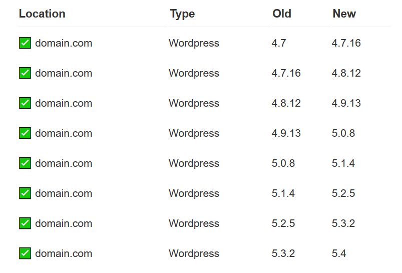

# Web Apps

ApisCP ships with native support for a variety of Web Apps. Module names are parenthesized.

- Discourse (discourse)
- Drupal (drupal)
- Ghost (ghost)
- Joomla! (joomla)
- Magento (magento)
- Laravel (laravel)
- [WordPress](webapps/WordPress.md) (wordpress)
- Ad hoc (webapp)

Additional web apps are available as third-party contributions. An "ad hoc" web app provides easily integration with the Web App facility.

## Installing

Web apps may be installed via **Web** > **Web Apps** within the panel. All web apps, with the exception of Joomla! and Magento, support unassisted updates. These updates run every Wednesday and Sunday during regular maintenance windows. Maintenance windows can be changed by altering the system timezone, `cpcmd scope:set system.timezone` as well as the [anacron](https://linux.die.net/man/8/anacron) window, `cron.start-range`, provide a calibration window for nightly tasks.

## Permissions

Web apps install under a separate system user with the least amount of permissions necessary. Permissions are discussed in detail in [Audit.md](Audit.md) and [Fortification.md](Fortification.md).

## Detection

All apps installed via **Web** > **Web Apps** are enrolled into ApisCP's automatic update facility unless disenrolled via **Web Apps** "enable auto-updates" option. Enrollment information is preserved as well when an account migrates from one ApisCP platform to another.

A site migrated over from a non-ApisCP platform or installed manually may be detected and enrolled automatically using `admin:locate-webapps`.

```bash
cpcmd admin:locate-webapps '[site:mydomain.com]'
INFO    : Searching on `site49' (mydomain.com)
INFO    : Searching docroot `/var/www/html' (mydomain.com) for webapps
INFO    : Detected `wordpress' under `/var/www/html'
----------------------------------------
MESSAGE SUMMARY
Reporter level: OK
----------------------------------------
Array
(
    [/var/www/html] => wordpress
)
```

## Updates

Core updates are checked every night. Packages are checked every Wednesday and Sunday night as defined by `cron.start-range` [Scope](Scopes.md) and consistent with all Web Apps. All non-suspended sites are checked for updates. *A core update triggers asset updates before the core update is applied.* A core update calls `XXX:update-all()`. A package update calls `XXX:update-plugins()` or `XXX:update-themes()` depending upon type.

A batch update can be processed immediately with `admin:update-webapps`.

```bash
cpcmd admin:update-webapps '[site:mydomain.com]'
# INFO    : ℹ️ site49 batch: new upgrade task - mydomain.com (wordpress)  3.9.1 -> 5.1
# ----------------------------------------
# MESSAGE SUMMARY
# Reporter level: OK
# ----------------------------------------
# INFO    : ✅ Upgrading mydomain.com, wordpress - 3.9.1 -> 5.1
```

While the actual upgrade path may look more like the following,

| ⭐ ✅ mydomain.com | Wordpress | 4.0    | 4.0.25 |
| -------------- | --------- | ------ | ------ |
| ⭐ ✅ mydomain.com | Wordpress | 4.0.25 | 4.1.25 |
| ⭐ ✅ mydomain.com | Wordpress | 4.1.25 | 4.2.22 |

### Update Assurance
Jobs marked by ⭐ are vetted by Update Assurance, a secondary validation system which creates a snapshot and logs key metrics: HTTP status and content length, prior to applying an update. After an update is processed, HTTP status and content length are re-evaluated for abberations. A non-2XX status code or content length that exceeds *[webapps]* => *[assurance_drift](Tuneables.md)* will force an automated rollback.

Update Assurance requires active participation by the site, which may be enabled by enabling snapshots at install time or at any time under **Web** > **Web Apps** > *Select Site* > **Actions** > **Enable Snapshots**. Snapshots may be enabled programatically by specifying `'[git:1]'` at install time.

```bash
# Enable UA + SSL at install time
cpcmd -d domain.com wordpress:install domain.com '' '[ssl:1,git:1]'
```

### Update algorithm

Updates work in batches adhering to the following rules:

1. Update to the largest **patch** release of current [MAJOR.MINOR](https://semver.org/) release.
2. Increment **minor** release by the smallest increment.
3. Repeat steps 1-2 until **minor** is at maximal version.
4. Increment **major** release by the smallest increment.
5. Repeat steps 3-4 until software is current.

If at any time an update fails, the Web App will left at this version. Moving incrementally with updates ensures that maximum compatibility is taken into account with older software thus achieving the highest success rate in updates. In the event of failure, better odds of failing on a higher version upgrade rather than lower ensure better security until the cause can be resolved.



### Setting version limits

Updates can be controlled to limit the maximal version of an upgrade. To do so,

* **Web** > **Web Apps** > *Select app*
* Under Options, **Update version Lock**
  * "None" process all updates
    * ✅ 5.0.1 -> 5.0.19
    * ✅ 5.0.1 -> 5.1.0
    * ✅ 5.0.1 -> 6.0.0
  * "Major" process all updates up to the major version
    * ✅ 5.0.1 -> 5.0.19
    * ✅ 5.0.1 -> 5.1.0
    * ❌ 5.0.1 -> 6.0.0
  * "Minor" process all updates to the minor version
    * ✅ 5.0.1 -> 5.0.19
    * ❌5.0.1 -> 5.1.0
    * ❌5.0.1 -> 6.0.0
  * Version lock is honored by themes/plugins as well

### Failures

Failure during a core update marks an app installed as **failed**. **Failures will not be retried** without intervention. An email will be dispatched informing the user a failure has occurred. If *[crm] => copy_admin* is set, then a copy of this failure will be sent to the named admin.

| ❌ my.bad.site                                                | Wordpress | 3.4.2 | 3.8.28 |
| ------------------------------------------------------------ | --------- | ----- | ------ |
| **ERROR:**  Wordpress_Module::theme_status: failed to get theme status: Error:  WP-CLI needs WordPress 3.7 or later to work properly. The version  currently installed is 3.4.2. Try running `wp core download --force`. |           |       |        |
| **ERROR:** Wordpress_Module::update_all: failed to update all components |           |       |        |

**To reset a failure**, login to ApisCP as the user, then navigate to **Web** > **Web Apps** > *Select dropdown* > **Reset Failed** or as admin use `admin:reset-webapp-failure()`.

`admin:list-failed-webapps` provides a list of all web apps that have failed.

`admin:reset-webapp-failure(array $constraints = [])` where `$constraints` is of the conjunctive set of the following parameters: `[site: <anything>, version: <operator> <version>, type: <type>]`.  For example, to reset only apps belonging to debug.com or reset all failures for WordPress > 4.0, use the following commands:

```bash
cpcmd admin:reset-webapp-failure '[site:debug.com]'
cpcmd admin:reset-webapp-failure '[version:"> 4.0", type:wordpress]'
```

::: tip
When working with the version parameter, spacing is significant between the operator and version.
:::

```bash
cpcmd admin:reset-webapp-failure '[type:ghost]'
# ----------------------------------------
# MESSAGE SUMMARY
# Reporter level: OK
# ----------------------------------------
# INFO: Reset failed status on `hq.apiscp.com/'
# 1
```

Resetting failed will attempt another update during nightly updates. A web app may be updated immediately by select **Update** under <u>App Meta</u> from the Web App view in ApisCP.

### Reports

Update reports are sent to the email associated with the account. If *[crm] => copy_admin* is also set in [config.ini](Tuneables.md), then a report is sent to this address as well. 

### Debugging

Debugging is available in two places, first if *[core] => bug_report* is enabled, any unhandled exceptions/errors will be sent to that address (see [DEBUGGING.md](../DEBUGGING.md)).

Second, the API command may be issued manually with debugging mode enabled to generate additional output.

To reapply a failed Ghost core update on blog.domain.com with additional diagnostics:

```bash
env DEBUG=1 cpcmd -d domain.com ghost:update-all blog.domain.com
```

Currently the following apps generate additional information in debug mode:

- Drupal
- Ghost
- Joomla!
- Laravel
- WordPress

## Screenshots
ApisCP ships with a chromium driver for screenshot acquisition of all hosted websites. Screenshots are automatically enabled when `has_low_memory` is disabled in Bootstrapper or `has_screenshots` is enabled. `cp.screenshots` is a [Scope](Scopes.md) wrapper for this setting.

```bash
cpcmd scope:set cp.screenshots true
# Wait until Bootstrapper finishes reconfiguring server ...
cpcmd web:capture-inventory
```

chromium runs when screenshot updates are required. Setting a large TTL in *[screenshots]* => *ttl* allows these screenshots to remain cached for long periods of time until `web:capture-inventory()` is run.

## Ad hoc apps

Ad hoc types are defined by a manifest called `.webapp.yml` within the document root for the site. Manifests may be created by selecting the "Ad hoc" app type in **Web** > **Web Apps** or by copying the skeleton from `resources/storehouse/webapp-adhoc.yml `to the designated document root.

