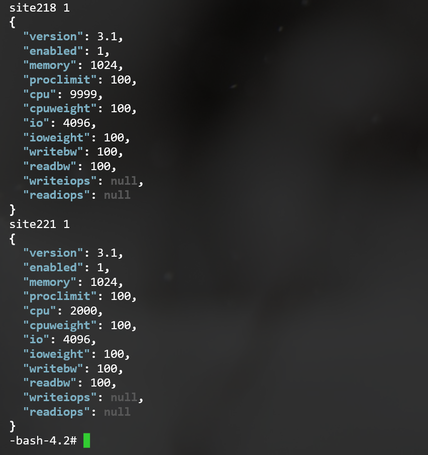

# cpcmd examples

[cpcmd](CLI.md#cpcmd) is a local API tool for interfacing ApisCP. It provides:

- Full access to API catalog
- Site and user masquerading
- Site enumeration
- Site filtering
- Command introspection

## Collections
`admin:collect()` is a powerful command that aggregates and filters accounts. When iterating over a collection, use `-o json` to force JSON output and `jq` to reliably parse results. `jq` may be installed with Yum:

```bash
yum install -y jq
```
Let's look at admin:collect() using `cpcmd misc:i admin:collect`

```php
  /**
  * Collect account info
  *
  * "active" is a special $query param that picks active/inactive (true/false) sites
  *
  * @param array|null $params null cherry-picks all services, [] uses default service list
  * @param array|null $query  pull sites that possess these service values
  * @param array      $sites  restrict selection to sites
  * @return array
  */
```

```yaml
parameters:
  - 'Parameter #0 [ <optional> array or NULL $params = Array ]'
  - 'Parameter #1 [ <optional> array or NULL $query = NULL ]'
  - 'Parameter #2 [ <optional> array $sites = Array ]'
min: 0
max: 3
return: array
signature: 'admin_collect([array $params,[array $query,[array $sites]]])'
```

`admin:collect([?array $params, [array $query, [array $sites]]])` where 

- `$params` is the fields to fetch. `null` may be specified to retrieve all service metadata while `[]` returns *siteinfo,email*, *siteinfo,admin_user*, *aliases,aliases*, *billing,invoice*, and *billing,parent_invoice*
- `$query` are the fields, in dot-notation, to match against. Matches are inclusive of all $query parameters.
- `$sites` allows you to restrict the match to a collection of sites, domains, or invoices. 

All results, keyed by site, contain **domain** and **active** fields that represent *siteinfo,domain* and whether the account is in a suspended state. These may also be queried in the `$query` parameter. 

For example, to filter all sites that have SSH enabled,

```bash
cpcmd admin:collect null '[ssh.enabled:1]'
```

Or fetch *cgroup,** + *apache,jail* results for accounts that have SSH enabled *and* cgroup enabled:

```bash
cpcmd admin:collect '[cgroup,apache.jail]' '[ssh.enabled:1,cgroup.enabled:1]'
```

And so on. `admin:collect()` allows you to build arbitrary collections on any service metadata that can be processed by jq, a powerful tool that allows us to build pipelines of input => output using JavaScript.

`--output=json` or `-o json` is necessary to format output as JavaScript. By default it formats as Yaml for readability. For the above command, we rewrite it as,

```bash
cpcmd -o json admin:collect '[cgroup,apache.jail]' '[ssh.enabled:1,cgroup.enabled:1]' | jq -r '[]keys' 
```

Which will allow is to loop over each site that has both ssh,enabled=1 and cgroup,enabled=1. Or a more convoluted example that we'll touch on shortly.

```bash
cpcmd -o json admin:collect '[cgroup,apache.jail]' '[ssh.enabled:1,cgroup.enabled:1]' | jq -r 'to_entries[] | (.key + " " + (.value.apache.jail | tostring), .value.cgroup)
```

This renders an output similar to the following.



Let's talk about this command briefly,

**to_entries[]** takes the input from `admin:collect` and converts it to an array of key/value pairs for each match. This allows referencing **.key** and **.value** in the next pipeline phase. **+ " " +** allows us to conconatenate parts of the data into one string and while **| tostring** is a filter that converts the number (*1* or *0*) into a string that may be concatenated onto the result. Comma ("**,**") separates output records so that all values in **.value.cgroup** may be printed.

::: tip
If none of the above made sense, don't worry! Seldom do you ever go off into such a complex pipeline. Besides, most queries can be rewritten by either masquerading as a site in `cpcmd` as in *Blanket grants* example below or by piping the site as the third parameter (`$sites`) to another  `admin:collect()` call.

jq has a [rich manual](https://stedolan.github.io/jq/manual/) to explore if you are of the masochist variety.
:::

The following list is not an exaustive list of things that can be done using admin:collect(), but rather serve as a starting point for ideas.

### Database
#### Blanket grants
Apply read/write access to all databases to all users for an account. 
```bash
cpcmd -o json admin:collect '[mysql.enabled:1]' | jq -r 'keys[]' | while read SITE ; do 
	cpcmd -o json -d $SITE mysql:list-databases | jq -r 'values[]' | while read DB ; do 
		cpcmd -d $SITE -o json mysql:list-users | jq -r 'keys[]' | while read USER ; do 
			echo "$SITE $DB $USER"
			echo cpcmd -d $SITE mysql:set-privileges "$USER" "localhost" "$DB" '[read:true,write:true]'
		done
	done
done
```

### DNS
#### Add zones for all domains
Something went awry in your PowerDNS implementation and need to reapply DNS for all domains and all addon domains?
```bash
cpcmd -o json admin:collect '[]'  | jq -r 'values[].domain' | while read DOMAIN ; do 
	IP="$(cpcmd -d $DOMAIN site:ip-address)"
	echo "$DOMAIN $IP"
	cpcmd dns:add-zone "$DOMAIN" "$IP"
	cpcmd -o json -d $DOMAIN common:get-service-value aliases aliases | jq -r '.[]' | while read ALIAS ; do 
		echo "$DOMAIN $IP - $ALIAS"
		echo cpcmd dns:add-zone "$ALIAS" "$IP"
    done
done
```

#### Update IP address for all namebased sites
Useful if changing server IPs.

```bash
cpcmd -o json admin:collect null '[ipinfo.namebased:1]' | jq -r 'keys[]' | while read SITE ; do 
	EditDomain -c ipinfo,nbaddrs=['new.ip.add.ress'] $i
done
```

### Migration
#### Migrating all sites off server
Specify "active:true" to filter suspended sites.

```bash
cpcmd -o json admin:collect '[]' '[active:true]' | jq -r 'keys[]' | while read -r SITE ; do 
    echo "Migrating $SITE"
    apnscp_php /usr/local/apnscp/bin/scripts/transfersite.php -s new.server.name $SITE
done
```

### Opcenter

#### Update PHP-FPM configuration
PHP-FPM templates can be customized (see [Customizing.md](Customizing.md)), but must be updated by explictly reconfiguring the service. Use `--reconfig` to force a reconfiguration on all services for the site (see [Plans.md](Plans.md#editdomain)).
```bash
cpcmd -o json admin:collect null '[apache.jail:1]' | jq -r 'keys[]' | while read -r SITE ; do   
	echo "Editing $(get_config "$SITE" siteinfo domain)"
	EditDomain --reconfig "$SITE"
done
```
::: tip
PHP-FPM is enabled by default unless `has_low_memory` is set. You can force PHP-FPM and remove mod_php from the server by running, `cpcmd scope:set cp.bootstrapper php_has_isapi false; upcp`.
:::

#### Enable bandwidth on sites
```bash
cpcmd -o json admin:collect null '[bandwidth.enabled:null]' | jq -r 'keys[]' | while read -r site ; do
  echo "Editing $(get_config "$SITE" siteinfo domain)"
  EditDomain -c bandwidth,enabled=1 "$site"
done
```

### Web Apps
#### Set fortification for all WordPress sites
The following restricts the selection to "example.com", but it could be just as easily wrapped around `admin:collect()` as above examples illustrate.

```bash
SITE=example.com
cpcmd -o json -d $SITE common:load-preferences | jq -r '.webapps.paths[] | select(.type=="wordpress") | .hostname' | xargs -I {} cpcmd -d $SITE wordpress:fortify "{}";
```

## Non-collect commands
The following commands are powerful oversimplifications in ApisCP that are a starting point to explore more complex tasks in ApisCP. [Programming.md](Programming.md) covers advanced topics.

1. **letsencrypt:append** *array $names*, *bool $verifyip = true*  
   *Example:* `cpcmd -d domain.com letsencrypt:append '[newdomain.com,www.newdomain.com]'`  
   Unlike letsencrypt:request, append does not replace the certificate with members with the named set. $verifyip confirms the IP address matches the account before proceeding. Disable if behind a proxy such as CloudFlare.

2. **rampart:whitelist** *string $ip*, *string $mode = 'add'*  
   *Example:* `cpcmd rampart:whitelist '64.22.68.1'`  
   Whitelisting grants brute-force immunity to the specified IP address. Specify 'remove' as $mode to remove the entry.
   
3. **admin:locate-webapps** *array $sites = null*  
   *Example:* `cpcmd admin:locate-webapps '[site12,mydomain.com,site1]'`  
   Scour all sites or just the sites specified in $specifier for known webapps. Any detected apps will be associated with the account.
   
4. **admin:update-webapps** *array $specifier = null*  
   *Example:* `cpcmd admin:update-webapps '[type:ghost]'`  
   A complementary method to locate-webapps, update-webapps will perform an update on the set of known apps that matches the specified criteria (mutually inclusive).
   
5. **admin:reset-webapp-failure** *array $specifier = null*  
   *Example:* `cpcmd admin:reset-webapp-failure '[site:mydomain.com,type:drupal]'`  
   Reset all failures across one or more sites. $specifier is an inclusive list of site, type, and version. For example, if WordPress 5.1.2 to 5.2.0 was a bad update for all, specify *type: wordpress* and *version: 5.1.2*.
   
6. **rampart:blacklist** *string $ip, string $mode = 'add'*  
   Another complementary method, this works similar to rampart:whitelist except that it drops any packets from the specified IP address or range to the server, useful if for example you need to block a range of countries from accessing a server. blacklist works great with country bans too, just feed it a list as input from [IPdeny](http://www.ipdeny.com/ipblocks/):
   *Example:* `curl -o- http://www.ipdeny.com/ipblocks/data/countries/cn.zone | while read -r IP ; do cpcmd rampart:blacklist "$IP" ; done`

7. **rampart:ban** *string $ip, string $jail*  
   *Example:* `cpcmd rampart:ban '103.89.228.0/22' 'recidive'`  
   A sibling method with a few differences: (1) ban rejects the packet indicating the machine actively denied the request, (2) has an expiry (10 days if jail is "recidive"), (3) users may also unban themselves from the service if their IP address matches the banned IP.

8. **scope:list**  
   *Example:* `cpcmd scope:list`  
   scope:list is part of a broader, powerful set of system abstraction called [Scopes](https://gitlab.com/apisnetworks/apnscp/blob/master/docs/admin/Scopes.md). Scopes allow you to quickly reconfigure a server in a structured, fail-safe way. config:list lists all known Scopes. `scope:info`, `scope:set` and `scope:get` are accessory helpers to this. Important scopes are covered in the [ApisCP Cheatsheet](https://github.com/apisnetworks/apnscp-cheatsheet/blob/master/README.md#scopes).
   
9. **file:audit** *string $path, array $requirements = [], bool $union = true*  
   *Example:* `file:audit '/var/www/html' '[user:apache,perm:666] false`  
   "audit" is an accessory method to [Fortification](Fortification.md), which is a security feature that places the web user for PHP applications under a separate UID than the account holder. Running audit on an account generates a list of matching files for further inspection, such as files created by the web server or have permissions that allow write-access by the web server. \$requirements is a set user, perm, mtime, ctime, regex, and name options passed directly to [find(1)](http://man7.org/linux/man-pages/man1/find.1.html). \$union affects whether requirements are mutually inclusive or independent.
   
10. **common:load-preferences** *string $user = null*  
   *Example:* `env YAML_INLINE=4 cpcmd -d mydomain.com -u newuser -o yaml common:load-preferences`  
   Preferences are user-specific settings, including panel settings and known web apps. This can be mixed with *-d domain* or *-u user* in `cpcmd` to get preferences for the primary account holder or a secondary user on a domain. Specifying both -d and -u to cpcmd would be the same as *cpcmd -d domain common:load-preferences user*. `YAML_INLINE` controls output folding.

11. **misc:list-commands** *string $filter = null*  
    *Example:* `misc:list-commands 'wordpress*'`  
    Display all commands available to the user. Every role has different commands, try them out with everyone!