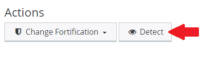

## Overview

Supported web applications installed under your account may be detected by first selecting the subdomain or domain under **Web** > **Web Apps** within the [control panel](https://kb.apiscp.com/control-panel/logging-into-the-control-panel/). Select **Detect** from the _Actions_ heading. If detected successfully, the app name will be present along with supported options.

## See Also

- [Understanding Fortification](https://kb.apiscp.com/control-panel/understanding-fortification/)
