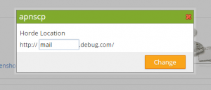

Webmail locations may be changed from their default settings within the [control panel](https://kb.apiscp.com/control-panel/logging-into-the-control-panel/ "Logging into the control panel") under **Mail** > **Webmail**. Click _Change Link_ to enter a new subdomain. This subdomain must not be present under **Web** > **Subdomains** > **List Subdomains**. Once changed, this will affect all users that access webmail for the given domain.

\[caption id="attachment\_184" align="alignnone" width="300"\] Confirmation dialog to change webmail URLs.\[/caption\]
