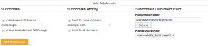

## Overview

[Meteor](https://www.meteor.com/) is a web framework written on top of Node.js. Meteor hooks into [Passenger](https://www.phusionpassenger.com/) for seamless process launching and flexible, agile scalability. Meteor requires [terminal access](https://kb.apiscp.com/terminal/is-terminal-access-available/ "Is terminal access available?") to use. This guide covers launching Meteor on a [v6+ platform](https://kb.apiscp.com/platform/determining-platform-version/ "Determining platform version").

## Quickstart

1. PREREQUISITE: follow the [MongoDB tutorial](https://kb.apiscp.com/guides/running-mongodb/ "Running MongoDB") to setup MongoDB.
2. Install Meteor from the [terminal](https://kb.apiscp.com/terminal/accessing-terminal/ "Accessing terminal"):
    - cd ~
        curl https://install.meteor.com/ | sh
        
    - Once done, you'll see a confirmation that it has been installed:
        
        Meteor 1.0.3.1 has been installed in your home directory (~/.meteor).
        Writing a launcher script to /usr/local/bin/meteor for your convenience.
        
        To get started fast:
        
        $ meteor create ~/my\_cool\_app
        $ cd ~/my\_cool\_app
        $ meteor
        
    - **Note: **tempting as it may be, do not install the `meteor` package from npm. The package available is an [unofficial fork](https://github.com/meteor/meteor/issues/1721) and has not been removed by the repository custodian.
3. Change directories to `/var/www` to create a new Meteor app that will, in this example, be called `meteorapp` and connected to a subdomain accessible via `http://meteorapp.example.com`:
    - cd /var/www
        meteor create meteorapp
        
4. Next, connect `public/` to a [subdomain](https://kb.apiscp.com/web-content/creating-subdomain/ "Creating a subdomain") within the [control panel](https://kb.apiscp.com/control-panel/logging-into-the-control-panel/ "Logging into the control panel") via **Web** > ****Subdomains****
    
    \[caption id="attachment\_758" align="alignnone" width="300"\] Connecting Meteor to a subdomain in the control panel\[/caption\]
5. Now for the most difficult and daring step: adding 6 directives and substituting variables! Meteor requires a few environment variables to run reliably. These variables are handed off from Apache to Passenger and passed onto Meteor. You will need to know your [home directory](https://kb.apiscp.com/platform/home-directory-location/ "Home directory location"), because this location stores a few additional Meteor system files. Create a [.htaccess](https://kb.apiscp.com/guides/htaccess-guide/ ".htaccess Guide") control file in `public/`
    - PassengerNodejs /usr/bin/node
        PassengerStickySessions On
        SetEnv HOME /home/<USERNAME>
        SetEnv MONGO\_URL mongodb://127.0.0.1:<PORT>/meteor
        SetEnv MONGO\_OPLOG\_URL mongodb://127.0.0.1:<PORT>/local
        SetEnv ROOT\_URL http://<HOSTNAME>
        
    - Substitute _<HOSTNAME>_ for your fully-qualified domain created within the control panel. In our example, taking into account the domain _example.com_ and subdomain _meteorapp_, it is _meteorapp.example.com_.
    - Substitute _<PORT>_ for the MongoDB port chosen from the PREREQUISITE MongoDB tutorial at the start.
    - Substitute _<USERNAME>_ for the username that you logged into the control panel with and where Meteor was installed. This is your home directory.
6. Access your Meteor install through the web site. The first request will take several seconds to initialize and connect to the database. Once initialized, subsequent requests will be much faster (and have a 95% chance of vaporizing from exceeding terminal velocity).
7. __**Enjoy!**__
    
    \[caption id="attachment\_759" align="alignnone" width="300"\] Meteor confirmation page after installation\[/caption\]

## Odds and Ends

### Restarting

Meteor piggybacks Passenger, and in doing so, can be easily restarted using the `tmp/` control directory. Follow the general [guide to restarting](https://kb.apiscp.com/ruby/restarting-passenger-processes/ "Restarting Passenger processes") a Passenger-backed application.

## See also

- [Official Meteor tutorial](https://www.meteor.com/try/2) - skip install steps!
- [Meteor documentation](https://www.meteor.com/learn)
- [Discover Meteor](https://book.discovermeteor.com) ($) - an excellent eBook on developing using Meteor
- [Meteor demo install on a v6 platform](http://meteor.futz.net/)
