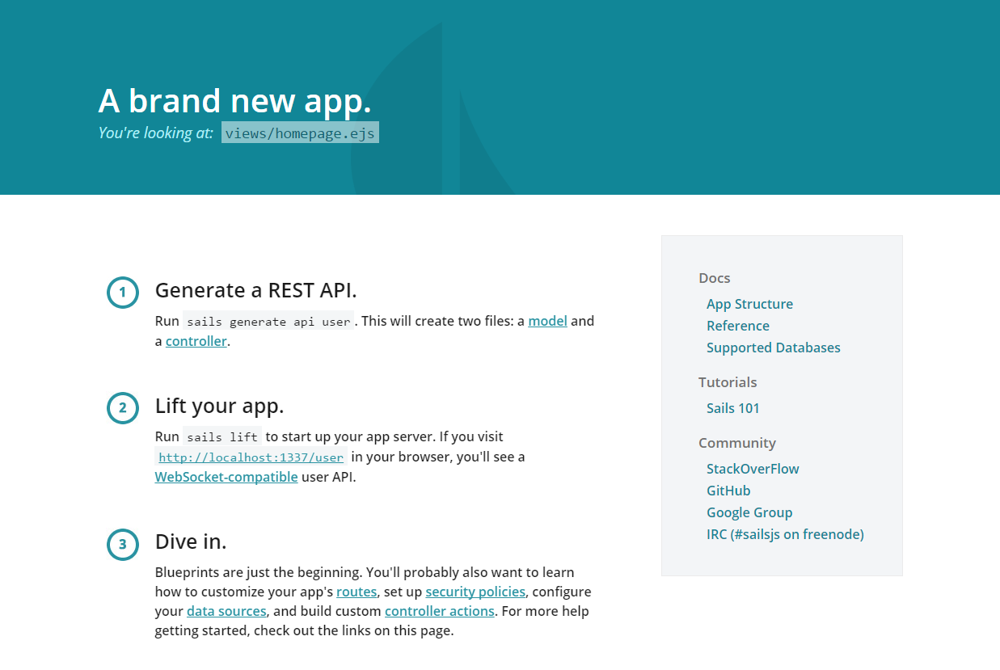

## Quickstart

1. **Prerequisite:** ensure local npm bin paths are in your search path (see KB: [Adding npm bin/ path to command search path](https://kb.apiscp.com/node/adding-npm-bin-path-to-command-search-path/))
2. Login to [terminal](https://kb.apiscp.com/terminal/accessing-terminal/)
3. Create a folder for your Sails application, in this example, we will use `/var/www/sails`:
    
    cd /var/www
    mkdir sails
    cd sails
    
4. Install Sails from npm:
    
    npm install sails
    
5. Create a new application called app
    
    sails new app
    
6. Switch to the new directory, app/, and create a Passenger-compatible [filesystem layout](https://kb.apiscp.com/cgi-passenger/passenger-application-layout/):
    
    cd app
    mkdir public tmp log
    
7. Designate this as a Node [application](https://kb.apiscp.com/guides/running-node-js/) by adding the necessary [htaccess directive](https://kb.apiscp.com/guides/htaccess-guide/) to public/.htaccess:
    
    echo 'PassengerNodejs /usr/bin/node' > public/.htaccess
    
8. Connect /var/www/sails/app/public to a [subdomain](https://kb.apiscp.com/web-content/creating-subdomain/) or [addon domain](https://kb.apiscp.com/control-panel/creating-addon-domain/) within the [control panel](https://kb.apiscp.com/control-panel/logging-into-the-control-panel/)
    - The subdomain `sails.sandbox.apiscp.com` is connected to the filesystem path `/var/www/sails/app/public` via **Web** > **Subdomains**
9. Access Sails, done!
    
    \[caption id="attachment\_1181" align="aligncenter" width="1237"\] Default welcome screen for a newly minted Sails application\[/caption\]

## See also

- [Sails demo](http://sails.sandbox.apiscp.com/) running on Sol, a [v6 platform](https://kb.apiscp.com/platform/determining-platform-version/)
- [Sails documentation](http://sailsjs.org/documentation/concepts/) (sails.org)
